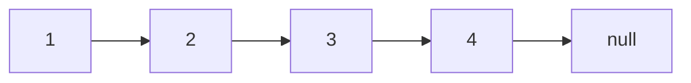
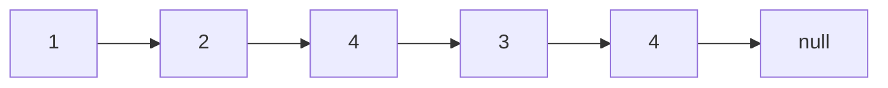
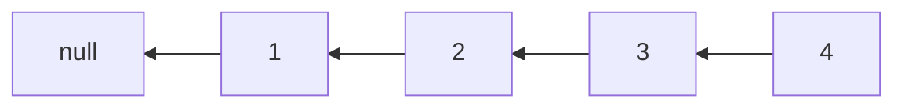

## Single Linked list

### Theory
A linked list is a linear data structure where elements, called nodes, are not stored in contiguous memory locations. Each node contains two parts:
- **Data:** The actual value to be stored.
- **Next:** A pointer/reference to the next node in the sequence.

There are different types of linked lists:
1. **Singly Linked List:** Each node points to the next node and the last node points to `null`.
2. **Doubly Linked List:** Each node points to both its next and previous nodes.
3. **Circular Linked List:** The last node points back to the first node.

### Example
Let's consider a simple singly linked list with the elements `1 -> 2 -> 3 -> null`.

### Code

#### Singly Linked List Implementation in Java

```java
// Java
class Node {
    int data;  // Data stored in the node
    Node next; // Pointer to the next node in the list

    // Constructor to create a new node
    // Next is by default initialized as null
    public Node(int data) {
        this.data = data;
        this.next = null;
    }
}

class SinglyLinkedList {
    Node head; // Head (or first node) of the linked list

    // Method to append a new node at the end
    public void append(int data) {
        if (head == null) {
            // If the list is empty, create a new node and make it the head
            head = new Node(data);
            return;
        }
        // Traverse to the last node
        Node current = head;
        while (current.next != null) {
            current = current.next;
        }
        // Create a new node at the end and set the next of the last node to this new node
        current.next = new Node(data);
    }

    // Method to print the entire linked list
    public void printList() {
        Node current = head;
        while (current != null) {
            // Print the data at the current node
            System.out.print(current.data + " -> ");
            // Move to the next node
            current = current.next;
        }
        // Print null to indicate the end of the list
        System.out.println("null");
    }

    // Method to insert a new node after a given node
    public void insertAfterNode(int prevNodeData, int data) {
        Node current = head;
        // Traverse the list to find the node with prevNodeData
        while (current != null && current.data != prevNodeData) {
            current = current.next;
        }
        // If the previous node is not found
        if (current == null) {
            System.out.println("The given previous node is not in the list.");
            return;
        }
        // Create a new node with the given data
        Node newNode = new Node(data);
        // Make the next of the new node as the next of the current node
        newNode.next = current.next;
        // Make the next of the current node as the new node
        current.next = newNode;
    }

    // Method to delete a node by key
    public void deleteNode(int key) {
        Node current = head, prev = null;

        // If the head node itself holds the key to be deleted
        if (current != null && current.data == key) {
            // Change the head to point to the next node
            head = current.next;
            return;
        }

        // Search for the key to be deleted, keep track of the previous node
        while (current != null && current.data != key) {
            prev = current;
            current = current.next;
        }

        // If the key is not present in the list
        if (current == null) {
            System.out.println("The key is not present in the list.");
            return;
        }

        // Unlink the node from the linked list
        prev.next = current.next;
    }

    public static void main(String[] args) {
        SinglyLinkedList list = new SinglyLinkedList();
        // Append nodes to the list
        list.append(1);
        list.append(2);
        list.append(3);
        list.printList();  // Output: 1 -> 2 -> 3 -> null

        // Insert a node with value 4 after the node with value 2
        list.insertAfterNode(2, 4);
        list.printList();  // Output: 1 -> 2 -> 4 -> 3 -> null

        // Delete the node with value 2
        list.deleteNode(2);
        list.printList();  // Output: 1 -> 4 -> 3 -> null
    }
}
```

### Explanation
1. **Node Class:** Represents a single node in the linked list.
2. **SinglyLinkedList Class:** Manages the linked list operations.
    - **append(int data):** Adds a new node with the specified data at the end of the list.
    - **printList():** Prints the entire linked list.
    - **insertAfterNode(int prevNodeData, int data):** Inserts a new node with the specified data after a node with the given `prevNodeData`.
    - **deleteNode(int key):** Deletes the first node that contains the specified `key`.
  

### Real-World Examples of Linked Lists

1. **Implementing Undo/Redo Functionality:**
   - Many applications like text editors use linked lists to implement undo and redo functionality. Each state change can be stored in a node, and traversing through these nodes allows for easy undoing or redoing of actions.

2. **Browser History Management:**
   - Browsers maintain a history of visited websites using a doubly linked list. Each web page is a node, and users can navigate back and forth through their browsing history.

3. **Music Playlists:**
   - Linked lists can be used to manage music playlists where each song is a node. Users can easily add, remove, or reorder songs.

4. **Implementing LRU (Least Recently Used) Cache:**
   - An LRU cache can be implemented using a combination of a doubly linked list and a hash map. The linked list maintains the order of usage, and the hash map allows for quick access to cache entries.

### Problem-Solving Examples Involving Linked Lists

Here are a few common problems that involve linked lists, along with brief descriptions:

1. **Reversing a Linked List:**
   - Given a linked list, reverse the nodes in place and return the new head.
   - **Example:**
     - Input: `1 -> 2 -> 3 -> 4 -> null`
     - Output: `4 -> 3 -> 2 -> 1 -> null`

2. **Detecting a Cycle in a Linked List:**
   - Determine if a linked list has a cycle in it.
   - **Example:**
     - Input: `3 -> 2 -> 0 -> -4`, where the last node points back to the second node.
     - Output: `true` (there is a cycle)

3. **Merging Two Sorted Linked Lists:**
   - Merge two sorted linked lists into a single sorted linked list.
   - **Example:**
     - Input: `1 -> 2 -> 4` and `1 -> 3 -> 4`
     - Output: `1 -> 1 -> 2 -> 3 -> 4 -> 4`

4. **Finding the Middle of a Linked List:**
   - Find the middle node of a linked list.
   - **Example:**
     - Input: `1 -> 2 -> 3 -> 4 -> 5 -> null`
     - Output: `3`

### Example Problem and Solution: Reversing a Linked List in Java

Here’s an example problem and solution to reverse a linked list:

#### Problem
Reverse a singly linked list.

#### Solution

```java
class Node {
    int data;
    Node next;

    public Node(int data) {
        this.data = data;
        this.next = null;
    }
}

class SinglyLinkedList {
    Node head;

    // Method to append a new node at the end
    public void append(int data) {
        if (head == null) {
            head = new Node(data);
            return;
        }
        Node current = head;
        while (current.next != null) {
            current = current.next;
        }
        current.next = new Node(data);
    }

    // Method to print the entire linked list
    public void printList() {
        Node current = head;
        while (current != null) {
            System.out.print(current.data + " -> ");
            current = current.next;
        }
        System.out.println("null");
    }

    // Method to reverse the linked list
    public void reverse() {
        Node previous = null;
        Node current = head;
        Node next = null;
        while (current != null) {
            next = current.next;  // Store next
            current.next = previous;  // Reverse current node's pointer
            previous = current;  // Move pointers one position ahead
            current = next;
        }
        head = previous;  // Update head to the new first node
    }

    public static void main(String[] args) {
        SinglyLinkedList list = new SinglyLinkedList();
        list.append(1);
        list.append(2);
        list.append(3);
        list.append(4);
        list.printList();  // Output: 1 -> 2 -> 3 -> 4 -> null

        list.reverse();
        list.printList();  // Output: 4 -> 3 -> 2 -> 1 -> null
    }
}
```

## Visual linked list

### Singly Linked List Diagram


### Inserting a Node (4 after 2)


### Deleting a Node (2)


### Reversing the Linked List


### Explanation of the Reverse Method
- **Previous, Current, Next:** Three pointers are used to reverse the linked list. `Previous` starts as `null`, `Current` starts at the head, and `Next` is used to temporarily store the next node.
- **While Loop:** The loop runs until `Current` becomes `null`.
  - `next = current.next`: Store the next node.
  - `current.next = previous`: Reverse the `current` node's pointer to point to `previous`.
  - `previous = current`: Move `previous` one step forward.
  - `current = next`: Move `current` one step forward.
- **Update Head:** Finally, update the head to `previous` (which will be the new head after the reversal).

### Summary
To crack SDE 1 or SDE 2 interviews, understanding the theory and basic implementation of linked lists is essential, but you also need to practice solving various problems involving linked lists. Make sure to understand how to apply linked lists in real-world scenarios and be comfortable with different types of problems you might encounter during the interviews. Practice regularly and try solving problems on platforms like LeetCode, HackerRank, and GeeksforGeeks to enhance your problem-solving skills.

# What is a Double Linked List?

A double linked list is a linear data structure similar to a singly linked list, but with each node containing an additional pointer to the previous node as well as the next node. This allows traversal in both directions: forward and backward.

### Double Linked List Implementation

In Java, a double linked list can be implemented using a custom `Node` class to represent each node and a `DoublyLinkedList` class to manage the list. Here's a basic implementation:

```java
class Node {
    int data;
    Node prev;
    Node next;

    public Node(int data) {
        this.data = data;
        this.prev = null;
        this.next = null;
    }
}

class DoublyLinkedList {
    Node head;
    Node tail;

    // Implementation of common operations will go here
}
```

### Visual Representation of a Double Linked List

```
null ⇐ [ 1 ] ⇐⇒ [ 2 ] ⇐⇒ [ 3 ] ⇐⇒ [ 4 ] ⇒ null
```

In this visual representation:
- Each number represents the `data` stored in a node.
- The double arrow `⇐⇒` indicates both forward and backward links.
- `null` represents the absence of a previous or next node.

### Common Operations on Double Linked Lists

1. **Insertion**:
   - **Insert at Beginning**: Add a new node at the beginning of the list.
   - **Insert at End**: Add a new node at the end of the list.
   - **Insert after a Node**: Add a new node after a specified node.
   - **Insert before a Node**: Add a new node before a specified node.

2. **Deletion**:
   - **Delete from Beginning**: Remove the first node from the list.
   - **Delete from End**: Remove the last node from the list.
   - **Delete a Node**: Remove a specified node from the list.

3. **Traversal**:
   - Traverse the list forwards or backwards to access or manipulate elements.

4. **Search**:
   - Search for a specific node based on its data value.

### Time and Space Complexity of Double Linked List Operations

1. **Insertion**:
   - Time Complexity: O(1) for insertion at the beginning or end, O(n) for insertion after or before a specific node.
   - Space Complexity: O(1)

2. **Deletion**:
   - Time Complexity: O(1) for deletion from the beginning or end, O(n) for deletion of a specific node.
   - Space Complexity: O(1)

3. **Traversal**:
   - Time Complexity: O(n)
   - Space Complexity: O(1)

4. **Search**:
   - Time Complexity: O(n)
   - Space Complexity: O(1)

Double linked lists provide efficient insertion and deletion at both ends of the list compared to singly linked lists. However, they require more memory due to the additional `prev` pointers.

### Example Use Cases of Double Linked Lists

1. **Text Editors**: Undo and redo functionality can be implemented using double linked lists to maintain a list of previous states.
2. **LRU Cache**: Least Recently Used (LRU) caches often use double linked lists to quickly remove and rearrange elements based on usage.
3. **Music Player**: Maintain a playlist with the ability to move forwards and backwards through songs efficiently.

Let me know if you need further information or examples regarding double linked lists!
