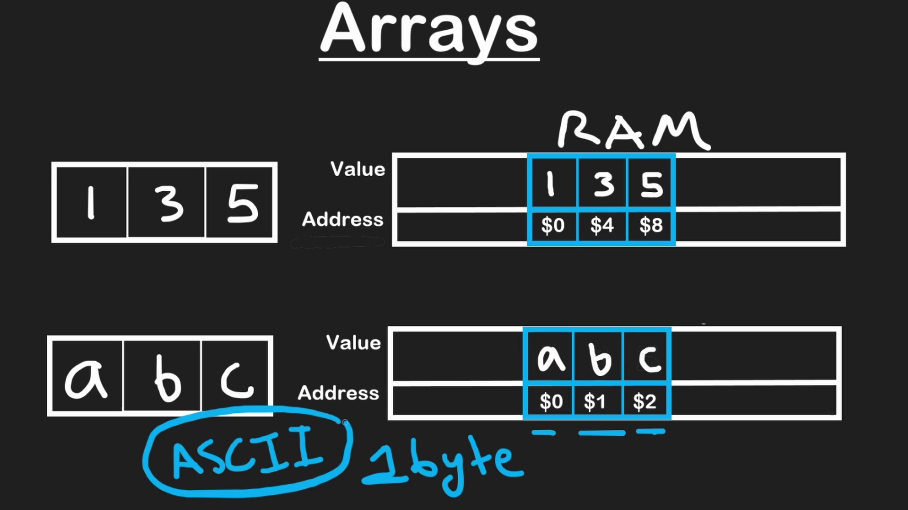
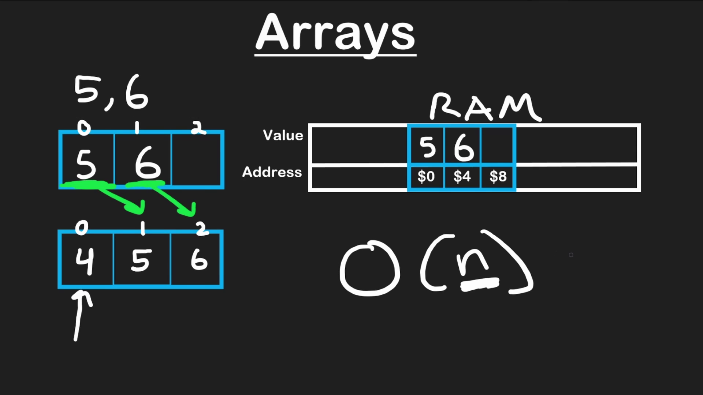

# Data Structure

> 1 Byte = 8 bits

Individual bits -> 8 bits -> 1 Byte -> RAM used to store advanced data structure.


## RAM


### Integer

Suppose we have an Array `a = [1, 3, 6]` and we want to store in RAM.

So an Integer takes `4 Bytes` in RAM.
> 4 x 3 = 12 Bytes

RAM has **Value** and **Address**(Distinct location of value in RAM)

Address has Unique and continigues value, integer increases `+4` value to the address


### Character

Suppose we have an Array `a = [a, b, c]` and we want to store in RAM.

So a character takes `1 Bytes` in RAM.
> 1 x 3 = 3 Bytes




## Static Arrays

An array is a contiguous block of data. 

Two most common operations are **Reading** and **Writing** the data in RAM

### Reading the data

As a programmer we don't know and can't remember the address of the value in RAM.

So in array we use `index` to access the value.

1. First value at index at `0` Zero and next one is `1` and next one is `2` etc.
2. Suppose we have `myArray = [1, 3, 4]` and we want to access the **1**, so index at `0` is automatically redirected to RAM location and access the value.
3. If want to access *third position* in an array, then we write index at `2`. It will just add `+2` at the address to get the value.
4. To `Read` the value from the RAM of an array is `O(1)`

| i | myArray[i] | value |
|---|---|---|
| 0 | myArray[0] | 1 |
| 1 | myArray[1] | 3 |
| 2 | myArray[2] | 5 |

### Writing the data

> There are limitations in array when you want to write some values in an array.
1. We have to specify the size of an array.
   1. In Java, default array size is `10`.
2. Fixed size array.
3. Its a contiguous array.
4. Same data type array.
5. RAM writes the data randomly, we don't know where our data value is which address in RAM.
6. Array address is in equal offset of it's data type.
   1. `char` occupy `1 byte` in RAM, so it's offset is $1, $2, $3,.....
   2. `int`  occupy `4 bytes` in RAM, so it's offset would be $1, $5, $9,.....
7. We can't occupy data value in randam address.
8. To `Write` the value to the RAM of an array is `O(n)`.
9.  To `Remove` the value from the RAM of an array is `O(1)`. Actually we not deleting array, we are overwriting of it.




| operation | Big-O time |
|---|---|
| r / w i-th element | O(1) |
| insert / remove End | O(1) |
| Insert / remove Middle (shifting every value in the array) | O(n) |


```java
// Java
public class StaticArray {

    /** Insert n into arr at the next open position.
    * @param arr is the Array
    * @param n is the index number to be insert in the array.
    * @param Length is the number of 'real' values in arr,
    * @param capacity is the size (aka memory allocated for the fixed size array).
    */
    public void insertEnd(int[] arr, int n, int length, int capacity) {
        if (length < capacity) {
            arr[length] = n;
        }
    }    
            
    // Remove from the last position in the array if the array
    // is not empty (i.e. length is non-zero).
    public void removeEnd(int[] arr, int length) {
        if (length > 0) {
            // Overwrite last element with some default value.
            // We would also the length to decreased by 1.
            arr[length - 1] = 0;
            length--;
        }
    }        

    // Insert n into index i after shifting elements to the right.
    // Assuming i is a valid index and arr is not full.
    public void insertMiddle(int[] arr, int i, int n, int length) {
        // Shift starting from the end to i.
        for (int index = length - 1; index > i - 1; index--) {
            arr[index + 1] = arr[index];
        }
        //Insert at i
        arr[i] = n;
    }

    // Remove value at index i before shifting elements to the left.
    // Assuming i is a valid index.
    public void removeMiddle(int[] arr, int i, int length) {
        // Shift starting from i + 1 to end.
        for (int index = i + 1; index < length; index++) {
            arr[index - 1] = arr[index];
        } 
        // No need to 'remove' arr[i], since we already shifted
    }

    public void printArr(int[] arr, int length) {
        for (int i = 0; i < length; i++) {
            System.out.print(arr[i] + " ");
        }      
        System.out.println();
    }
}    
```

```javascript
// javascript
class StaticArray {

    // Insert n into arr at the next open position.
    // Length is the number of 'real' values in arr, and capacity
    // is the size (aka memory allocated for the fixed size array).
    insertEnd(arr, n, length,  capacity) {
        if (length < capacity) {
            arr[length] = n;
        }
    }  

    // Remove from the last position in the array if the array
    // is not empty (i.e. length is non-zero).
    removeEnd(arr, length) {
        if (length > 0) {
            // Overwrite last element with some default value.
            // We would also the length to decreased by 1.
            arr[length - 1] = 0;
            length--;
        }
    }  

    // Insert n into index i after shifting elements to the right.
    // Assuming i is a valid index and arr is not full.
    insertMiddle(arr, i, n, length) {
        // Shift starting from the end to i.
        for (let index = length - 1; index > i - 1; index--) {
            arr[index + 1] = arr[index];
        }
        //Insert at i
        arr[i] = n;
    }

    // Remove value at index i before shifting elements to the left.
    // Assuming i is a valid index.
    removeMiddle(arr, i, length) {
        // Shift starting from i + 1 to end.
        for (let index = i + 1; index < length; index++) {
            arr[index - 1] = arr[index];
        } 
        // No need to 'remove' arr[i], since we already shifted
    }

    printArr(arr, length) {
        let s = "";
        for (let i = 0; i < length; i++) {
            s+= arr[i] + " ";
        }      
        console.log(s);
    }
}
```

SUGGESTED PROBLEMS

[https://leetcode.com/problems/remove-duplicates-from-sorted-array/](https://leetcode.com/problems/remove-duplicates-from-sorted-array/)

[https://leetcode.com/problems/remove-element/](https://leetcode.com/problems/remove-element/)

[https://leetcode.com/problems/shuffle-the-array/](https://leetcode.com/problems/shuffle-the-array/)

## Dynamic Arrays

- **Concept**: An alternative to static arrays that can automatically adjust its size to hold the data you need.
- **Benefits**:
  - **Flexibility**: You don't need to know the exact size of the data beforehand.
  - **Efficiency**: You only allocate memory for the data you actually store.
**Implementation**:
- Create a `DynamicArray` class with methods for:
  - **Initialization**: Takes an initial capacity (size) for the array.
  - **append(element)**: Adds an element to the end of the array. If the array is full, it resizes (explained below).
  - **get(index)**: Returns the element at a specific index.
  - **set(index, element)**: Updates the element at a specific index.
  - **size()**: Returns the current number of elements in the array.
- **Resizing**: When the `append` method is called and the array is full, it needs to resize:
  - **Common strategy**: Double the current capacity.
  - **Alternative strategy**: Use a growth factor slightly larger than 1 (e.g., 1.5) to avoid too frequent resizing.
  - Resizing involves creating a new array with the increased capacity, copying existing elements, and then updating the internal pointer to the new array.
- **Trade-offs**:
**Flexibility comes with a cost**: Resizing operations can introduce overhead compared to fixed-size arrays.
Additional Notes:
Dynamic arrays are often implemented using underlying fixed-size arrays for memory efficiency.
The specific implementation details (e.g., resizing logic) might vary depending on the programming language.

| operation | Big-O time |
|---|---|
| r / w i-th element | O(1) |
| insert / remove End | O(1) |
| Insert / remove Middle (shifting every value in the array) | O(n) |

```java
// Java
public class DynamicArray {
    int capacity;
    int length;;
    int[] arr;

    public DynamicArray() {
        capacity = 2;
        length = 0;
        arr = new int[2];
    }

    // Insert n in the last position of the array
    public void pushback(int n) {
        if (length == capacity) {
            this.resize();
        }
               
        // insert at next empty position
        arr[length] = n;
        length++;
    }

    public void resize() {
        // Create new array of double capacity
        capacity = 2 * capacity;
        int[] newArr = new int[capacity]; 
        
        // Copy elements to newArr
        for (int i = 0; i < length; i++) {
            newArr[i] = arr[i];
        }
        arr = newArr;
    }  

    // Remove the last element in the array
    public void popback() {
        if (length > 0) {
            length--;
        }  
    }     

    // Get value at i-th index
    public int get(int i) {
        if (i < length) {
            return arr[i];
        }    
        // Here we would throw an out of bounds exception
        return -1;
    }    

    // Insert n at i-th index
    public void insert(int i, int n) {
        if (i < length) {
            arr[i] = n;
            return;
        }    
        return;
        // Here we would throw an out of bounds exception  
    }        

    public void print() {
        for (int i = 0; i < length; i++) {
            System.out.println(arr[i]);
        }
    }
} 

```

```js
// Javascript
class DynamicArray {
    constructor() {
        this.capacity = 2;
        this.length = 0;
        this.arr = new Array(2);
    }

    // Insert n in the last position of the array
    pushback(n) {
        if (this.length == this.capacity) {
            this.resize();
        }
               
        // insert at next empty position
        this.arr[this.length] = n;
        this.length++;
    }

    resize() {
        // Create new array of double capacity
        this.capacity = 2 * this.capacity;
        const newArr = new Array(this.capacity); 
        
        // Copy elements to newArr
        for (let i = 0; i < this.length; i++) {
            newArr[i] = this.arr[i];
        }
        this.arr = newArr;
    } 

    // Remove the last element in the array
    popback() {
        if (this.length > 0) {
            this.length--;
        }  
    }    

    // Get value at i-th index
    get(i) {
        if (i < this.length) {
            return this.arr[i];
        }    
        // Here we would throw an out of bounds exception
        return;
    }    

    // Insert n at i-th index
    insert(i, n) {
        if (i < this.length) {
            this.arr[i] = n;
            return;
        }    
        return;
        // Here we would throw an out of bounds exception  
    } 

    print() {
        let s = "";
        for (let i = 0; i < this.length; i++) {
            s+= this.arr[i] + " ";
        }      
        console.log(s);
    }
}
```

```python
# Python arrays are dynamic by default, but this is an example of resizing.
class Array:
    def __init__(self):
        self.capacity = 2
        self.length = 0
        self.arr = [0] * 2 # Array of capacity = 2

    # Insert n in the last position of the array
    def pushback(self, n):
        if self.length == self.capacity:
            self.resize()
            
        # insert at next empty position
        self.arr[self.length] = n
        self.length += 1

    def resize(self):
        # Create new array of double capacity
        self.capacity = 2 * self.capacity
        newArr = [0] * self.capacity 
        
        # Copy elements to newArr
        for i in range(self.length):
            newArr[i] = self.arr[i]
        self.arr = newArr
        
    # Remove the last element in the array
    def popback(self):
        if self.length > 0:
            self.length -= 1
    
    # Get value at i-th index
    def get(self, i):
        if i < self.length:
            return self.arr[i]
        # Here we would throw an out of bounds exception

    # Insert n at i-th index
    def insert(self, i, n):
        if i < self.length:
            self.arr[i] = n
            return
        # Here we would throw an out of bounds exception       

    def print(self):
        for i in range(self.length):
            print(self.arr[i])
        print()
```


[https://leetcode.com/problems/concatenation-of-array/](https://leetcode.com/problems/concatenation-of-array/)

## Stacks


[https://leetcode.com/problems/baseball-game/](https://leetcode.com/problems/baseball-game/)

[https://leetcode.com/problems/valid-parentheses/](https://leetcode.com/problems/valid-parentheses/)

[https://leetcode.com/problems/min-stack/](https://leetcode.com/problems/min-stack/)


