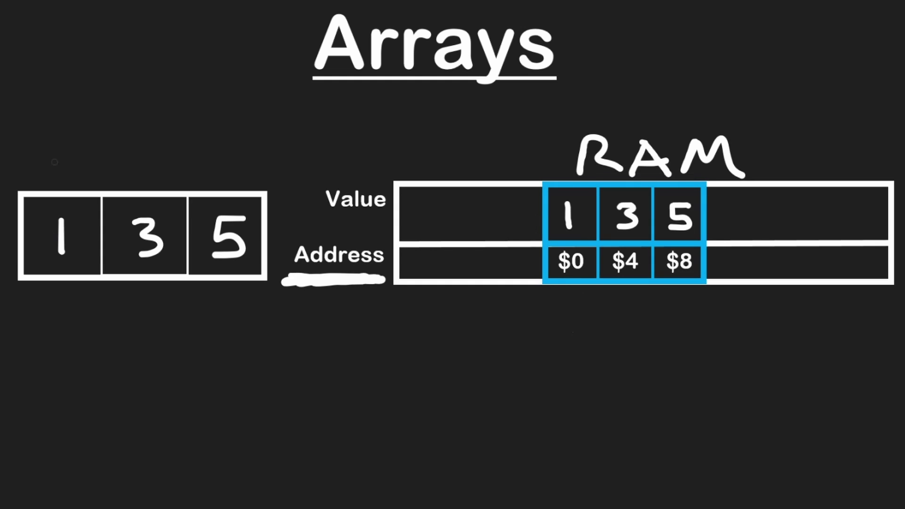

# Data Structure

> 1 Byte = 8 bits

Individual bits -> 8 bits -> 1 Byte -> RAM used to store advanced data structure.

## RAM

### Integer

Suppose we have an Array `a = [1, 3, 6]` and we want to store in RAM.

So an Integer takes `4 Bytes` in RAM.
> 4 x 3 = 12 Bytes

RAM has **Value** and **Address**(Distinct location of value in RAM)

Address has Unique and continigues value, integer increases `+4` value to the address

### Character

Suppose we have an Array `a = [a, b, c]` and we want to store in RAM.

So a character takes `1 Bytes` in RAM.
> 1 x 3 = 3 Bytes

## Static Arrays

An array is a contiguous block of data. 

Two most common operations are **Reading** and **Writing** the data in RAM

### Reading the data

As a programmer we don't know and can't remember the address of the value in RAM.

So in array we use `index` to access the value.

1. First value at index at `0` Zero and next one is `1` and next one is `2` etc.
2. Suppose we have `myArray = [1, 3, 4]` and we want to access the **1**, so index at `0` is automatically redirected to RAM location and access the value.
3. If want to access *third position* in an array, then we write index at `2`. It will just add `+2` at the address to get the value.
4. To `Read` the value from the RAM of an array is `O(1)`

| i | myArray[i] | value |
|---|---|---|
| 0 | myArray[0] | 1 |
| 1 | myArray[1] | 3 |
| 2 | myArray[2] | 5 |

### Writing the data

1. There are limitations in array when you want to write some values in an array.
2. Due to its contiguous array or Fixed size array and same data type array.
3. 

