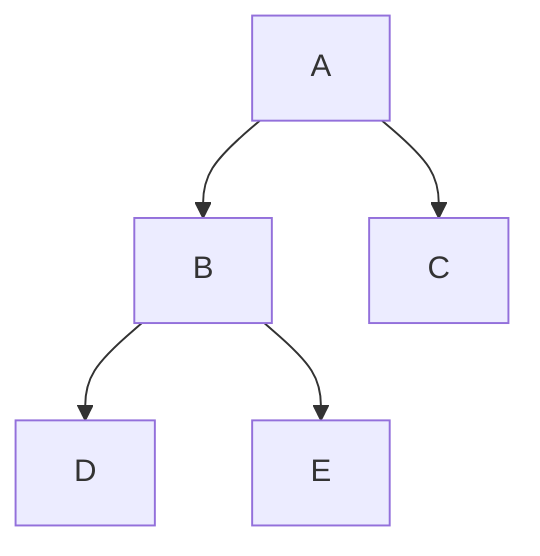
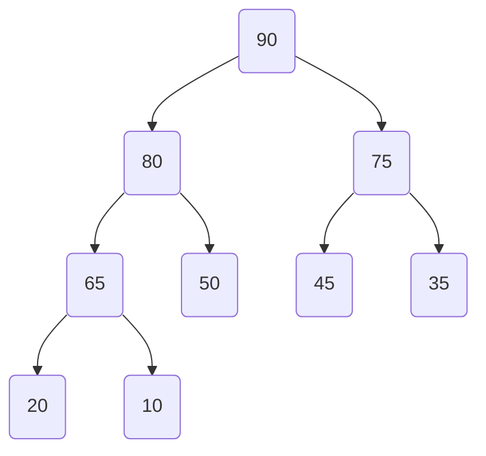

# Data Structures

# Array

Array is a collection of items that are stored conductively in the memory.

[Array Video](https://youtu.be/QJNwK2uJyGs?si=RWzgyHQgNtZ2iO_D)

1. What the address are how they work?

1. what are some of the limitations?
1. different operations you can perform on an array
1. the complexity of those operations


# Stack

1. Linear collection of items, are inserted and removed in a specific order.
1. It follows LIFO principles

Uses of Stack

1. Undo / Redo operations
1. Back tracking(puzzle maze)

```js
const stack = new Stack();
// stack = []
stack.isEmpty();    // returns boolean value
stack.push(1);      // add value in stack [1]
stack.push(3);      // add value in stack [1, 3]
stack.push(6);      // add value in stack [1, 3, 6]
stack.peek();       // give last value (6) from the stack 
stack.pop();        // remove value from stack
```

# Queue
1. Linear collection of items, are inserted and removed in a specific order.
1. It follows FIFO principles


```js
const queue = new Queue();

queue.isEmpty();    // returns boolean value
queue.enqueue(1);   // add value in queue
queue.enqueue(5);   // add value in queue
queue.enqueue(7);   // add value in queue
quere.peek();       // give top first value (1) from the queue 
queue.dequeue();    // remove value from queue

```

# Data Structure: Tree

## Introduction
A **tree** is a hierarchical data structure that consists of nodes connected by edges. It resembles an upside-down tree, where each node has a parent-child relationship. The topmost node is called the **root**, and nodes with no children are called **leaves**.

## Basic Concepts

### 1. Node
A **node** is a fundamental unit of a tree that contains data and may have zero or more children nodes.

### 2. Root
The **root** is the topmost node of a tree, from which all other nodes are descended.

### 3. Leaf
A **leaf** is a node with no children, i.e., it is at the end of a branch.

### 4. Parent and Child
A **parent** is a node that has one or more children, and a **child** is a node connected to a parent.

### 5. Sibling
Nodes that share the same parent are called **siblings**.

## Types of Trees

### 1. Binary Tree
A **binary tree** is a tree in which each node has at most two children: a left child and a right child.



### 2. Binary Search Tree (BST)
In a **binary search tree**, the left child of a node contains values less than the node, and the right child contains values greater than the node.

# Heap Data Structures

A heap is a specialized tree-based data structure that satisfies the heap property. It is commonly used to implement priority queues.

## Types of Heaps

### 1. Max Heap
In a max heap, the value of each node is greater than or equal to the values of its children. The maximum element is at the root.



## 2. Min Heap
In a min heap, the value of each node is less than or equal to the values of its children. The minimum element is at the root.


## Heap Operations
### 1. Insertion
Insert a new element at the next available position in the heap and then heapify to maintain the heap property.

### 2. Deletion
Remove the root element (maximum in a max heap, minimum in a min heap), replace it with the last element, and then heapify.

### 3. Heapify
Adjust the elements of the heap to maintain the heap property after an insertion or deletion operation.

### Applications
- Priority queues
- Heap sort algorithm
- Dijkstra's shortest path algorithm