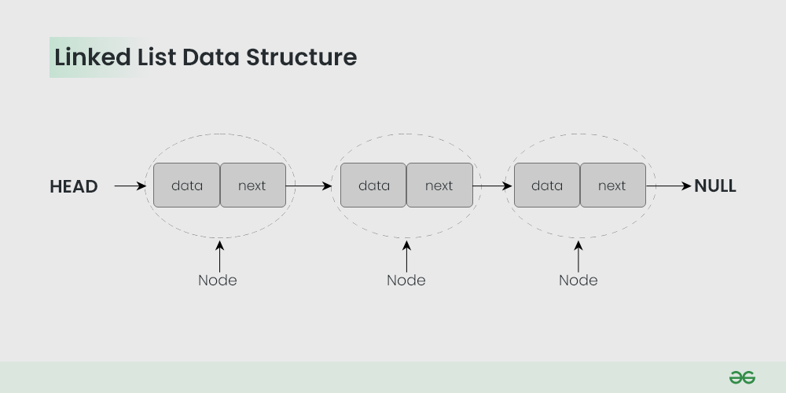
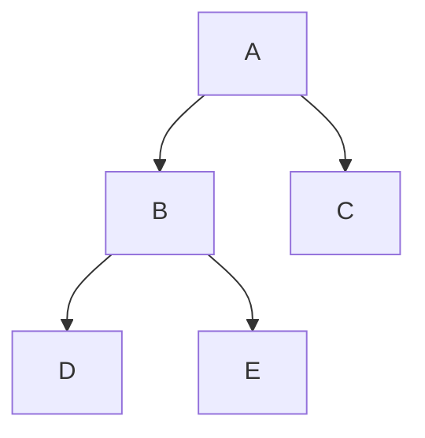
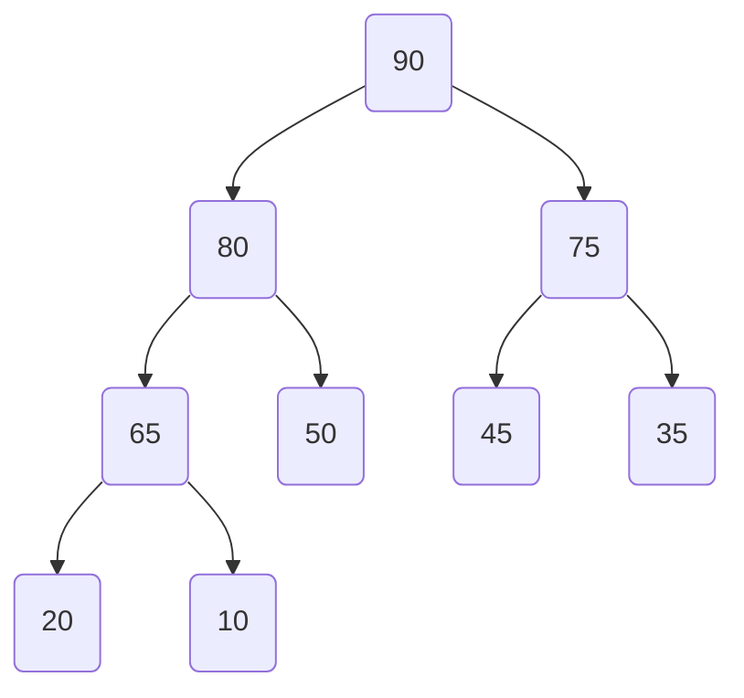

# Data Structures
- [Data Structures](#data-structures)
  - [What is need of Data structures](#what-is-need-of-data-structures)
  - [Types of Data Structures](#types-of-data-structures)
    - [1. Linear Data Structures](#1-linear-data-structures)
    - [2. Non-Linear Data Structures](#2-non-linear-data-structures)
- [Array](#array)
  - [Basic terminologies of array](#basic-terminologies-of-array)
  - [Why Array Data Structures is needed?](#why-array-data-structures-is-needed)
  - [Types of Array operations:](#types-of-array-operations)
- [Linked List](#linked-list)
- [Stack](#stack)
- [Queue](#queue)
- [Data Structure: Tree](#data-structure-tree)
  - [Introduction](#introduction)
  - [Basic Concepts](#basic-concepts)
    - [1. Node](#1-node)
    - [2. Root](#2-root)
    - [3. Leaf](#3-leaf)
    - [4. Parent and Child](#4-parent-and-child)
    - [5. Sibling](#5-sibling)
  - [Types of Trees](#types-of-trees)
    - [1. Binary Tree](#1-binary-tree)
    - [2. Binary Search Tree (BST)](#2-binary-search-tree-bst)
- [Heap Data Structures](#heap-data-structures)
  - [Types of Heaps](#types-of-heaps)
    - [1. Max Heap](#1-max-heap)
  - [2. Min Heap](#2-min-heap)
  - [Heap Operations](#heap-operations)
    - [1. Insertion](#1-insertion)
    - [2. Deletion](#2-deletion)
    - [3. Heapify](#3-heapify)
    - [Applications](#applications)


## What is need of Data structures
Data structures provide an easy way of organising, retrieving, managing, and storing data.


## Types of Data Structures
1. [Linear Data Structures](#linear-data-structures)
2. [Non-linear Data structures](#non-linear-data-structures)

### 1. Linear Data Structures

- Elements are arranged in one dimension ,also known as linear dimension.
- Example: lists, stack, queue, linked List etc.

### 2. Non-Linear Data Structures

- Elements are arranged in one-many, many-one and many-many dimensions.
- Example: tree, graph, table, etc.


  
# Array

- Array is a collection of items that are stored conductively in the memory.
- The idea is to store multiple items of the same type together.
- This makes it easier to calculate the position of each element by simply adding an offset to a base value, i.e., the memory location of the first element of the array (generally denoted by the name of the array). 

[Array Video](https://youtu.be/QJNwK2uJyGs?si=RWzgyHQgNtZ2iO_D)

## Basic terminologies of array

- Array Index: In an array, elements are identified by their indexes. Array index starts from 0.
- Array element: Elements are items stored in an array and can be accessed by their index.
- Array Length: The length of an array is determined by the number of elements it can contain. 

```java
// The syntax of declaring a static array is: 
<data type><variable name>[] 
    = {<data1>, <data2>,…..<dataN> }; 
  
// Example: 
int arr[] = { 2, 5, 6, 9, 7, 4, 3 }; // Static or compile time memory allocation - Static Array
int dyArr[10]; // Dynamic Arrya
```

## Why Array Data Structures is needed?

Assume there is a class of five students and if we have to keep records of their marks in examination then, we can do this by declaring five variables individual and keeping track of records but what if the number of students becomes very large, it would be challenging to manipulate and maintain the data.


## Types of Array operations:

- **Traversal**: Traverse through the elements of an array.
- **Insertion**: Inserting a new element in an array.
- **Deletion**: Deleting element from the array.
- **Searching**:  Search for an element in the array.
- **Sorting**: Maintaining the order of elements in the array.


1. What the address are how they work?
2. what are some of the limitations?
3. different operations you can perform on an array
4. the complexity of those operations

# Linked List

- A linked list is a fundamental data structure in computer science.
- It consists of **nodes** where each node contains *data* and a *reference* (link) to the next node in the sequence. This allows for dynamic memory allocation and efficient insertion and deletion operations compared to arrays.




# Stack

1. Linear collection of items, are inserted and removed in a specific order.
1. It follows LIFO principles

Uses of Stack

1. Undo / Redo operations
1. Back tracking(puzzle maze)

```js
const stack = new Stack();
// stack = []
stack.isEmpty();    // returns boolean value
stack.push(1);      // add value in stack [1]
stack.push(3);      // add value in stack [1, 3]
stack.push(6);      // add value in stack [1, 3, 6]
stack.peek();       // give last value (6) from the stack 
stack.pop();        // remove value from stack
```

# Queue
1. Linear collection of items, are inserted and removed in a specific order.
1. It follows FIFO principles


```js
const queue = new Queue();

queue.isEmpty();    // returns boolean value
queue.enqueue(1);   // add value in queue
queue.enqueue(5);   // add value in queue
queue.enqueue(7);   // add value in queue
quere.peek();       // give top first value (1) from the queue 
queue.dequeue();    // remove value from queue

```

# Data Structure: Tree

## Introduction
A **tree** is a hierarchical data structure that consists of nodes connected by edges. It resembles an upside-down tree, where each node has a parent-child relationship. The topmost node is called the **root**, and nodes with no children are called **leaves**.

## Basic Concepts

### 1. Node
A **node** is a fundamental unit of a tree that contains data and may have zero or more children nodes.

### 2. Root
The **root** is the topmost node of a tree, from which all other nodes are descended.

### 3. Leaf
A **leaf** is a node with no children, i.e., it is at the end of a branch.

### 4. Parent and Child
A **parent** is a node that has one or more children, and a **child** is a node connected to a parent.

### 5. Sibling
Nodes that share the same parent are called **siblings**.

## Types of Trees

### 1. Binary Tree
A **binary tree** is a tree in which each node has at most two children: a left child and a right child.



### 2. Binary Search Tree (BST)
In a **binary search tree**, the left child of a node contains values less than the node, and the right child contains values greater than the node.

# Heap Data Structures

A heap is a specialized tree-based data structure that satisfies the heap property. It is commonly used to implement priority queues.

## Types of Heaps

### 1. Max Heap
In a max heap, the value of each node is greater than or equal to the values of its children. The maximum element is at the root.



## 2. Min Heap
In a min heap, the value of each node is less than or equal to the values of its children. The minimum element is at the root.


## Heap Operations
### 1. Insertion
Insert a new element at the next available position in the heap and then heapify to maintain the heap property.

### 2. Deletion
Remove the root element (maximum in a max heap, minimum in a min heap), replace it with the last element, and then heapify.

### 3. Heapify
Adjust the elements of the heap to maintain the heap property after an insertion or deletion operation.

### Applications
- Priority queues
- Heap sort algorithm
- Dijkstra's shortest path algorithm