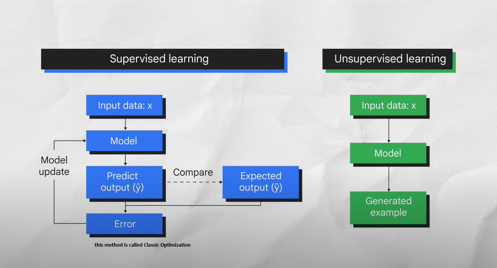
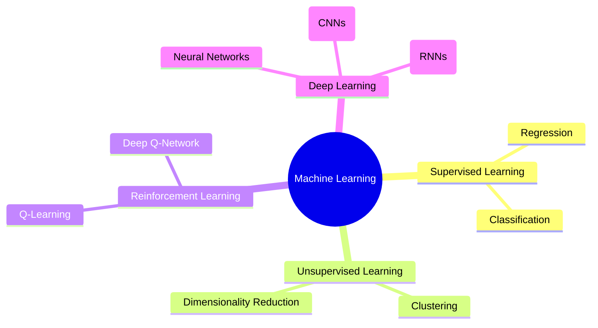
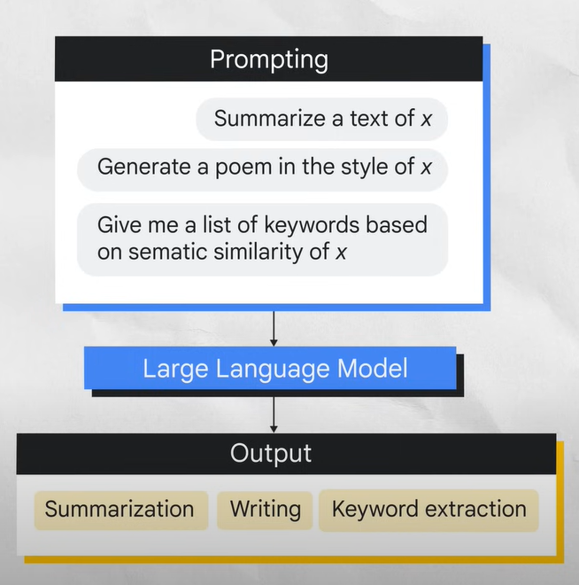
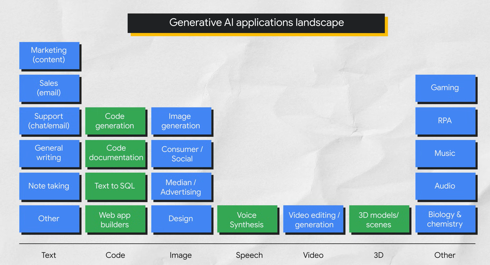

This notes from Google cloud Boost of [Introduction to GenAI](https://www.cloudskillsboost.google/paths/118/course_templates/536)

1. Generative AI is a type of *Artificial Intelligence* technology that can produce various types of content including text, imagery, audio and synthetic data.

## What is AI?

-  AI is a discipline, like how physics is a discipline of science.
-  AI is a branch of computer science that deals with the creation of intelligent agents and our system that can listen, learn and act autonomously.
   -  Essentially AI has to do with the theory and methods to build machines that think and act like humans.

## What is Machine Learning?

- Machine Learning is a subfield of AI. It is a program or system that trains a model from input data.
- The trained model can make useful predictions from new never-before seen data drawn from the same one used to train the model.
- Machine learning gives the computer the ability to learn without explicit programming.

## Types of Machine Leaning Model

- **Unsupervised** (Unlabeled data) - Unlabeled data
- **Supervisd** (Labeled data) - Labeled data is Data comes from tag like *Name*, *type* or *number*.

## Classification of Machine learning

**Deep Learning**: deep learning is a type of machine learning that uses artificial neural networks allowing them to process more complex patterns

Neural Network can use both labeled and unlabeled data, is called *semi-supervised learning*

**Semi-Supervised Learning**: a neural network is trained on a small amount of labeled data and a large amount of unlabeled data. The labeled data helps the neural network to learn the basic concepts of the tasks while the unlabeled data helps the neural network to generalize to new examples.

**GenAI**:  GenAI is a subset of Deep Learning which means it uses artificial neural networks can process both labeled and unlabeled data using supervised, unsupervised and semi-supervised methods.

> LLM (Large Learning Models) are also subset of Deep learning

## Types of Deep learning or Machine learning Models

1. Generative model
2. Discriminative model

#### 1. Generative Models
- A generative model, generates new data instances based on a learned probability distribution of existing data. Generative models generate new contents 

**Definition**: Generative models are types of models that learn to generate new data points that resemble the training data. They model the joint probability distribution \( P(X, Y) \) of the features \( X \) and labels \( Y \).

**Purpose**: They can generate new instances of data, simulate scenarios, or model the underlying distribution of the data.

**Training**: Generative models learn from both the features and the labels in the training data, understanding how the data is distributed.

**Examples**:
- **Naive Bayes**: Uses Bayes' theorem to predict the probability of different outcomes.
- **Hidden Markov Models (HMMs)**: Used for modeling sequential data, like speech or text.
- **Generative Adversarial Networks (GANs)**: Consist of two networks, a generator and a discriminator, which compete to create realistic data.
- **Variational Autoencoders (VAEs)**: Used for generating new data points similar to the training data.

**Applications**:
- Data augmentation: Creating additional data for training models.
- Image generation: Creating realistic images from random noise.
- Text generation: Creating coherent and contextually accurate text.

**Visual Example**:

#### 2. Discriminative Models

- A discriminative model is a type of model that is used to classify or predict labels for data points.
- Discriminative models are typically trained on the data set of labeled data points and they learn the relationship between the features of the data points and the labels. Once a discriminative model is trained, it can be used to predict the label for new data points.
**Definition**: Discriminative models are used to classify data points by learning the decision boundary between different classes. They model the conditional probability \( P(Y|X) \), which is the probability of a label \( Y \) given the features \( X \).

**Purpose**: They focus on distinguishing between different classes based on the features.

**Training**: Discriminative models learn from labeled data, focusing on the relationship between the input features and the output labels.

**Examples**:
- **Logistic Regression**: A linear model used for binary classification.
- **Support Vector Machines (SVMs)**: Find the optimal hyperplane that separates different classes.
- **Neural Networks**: Complex models that can learn non-linear decision boundaries.
- **Random Forests**: Ensemble learning methods that combine multiple decision trees.

**Applications**:
- Classification: Spam detection, image recognition, medical diagnosis.
- Regression: Predicting continuous values like house prices or stock prices.
- Anomaly detection: Identifying outliers in data.

**Visual Example**:

### Key Differences

| Aspect                     | Generative Models                                | Discriminative Models                          |
|----------------------------|--------------------------------------------------|------------------------------------------------|
| Objective                  | Model joint probability \( P(X, Y) \)            | Model conditional probability \( P(Y|X) \)     |
| Data Usage                 | Learn distribution of data and labels            | Learn decision boundary between classes        |
| Examples                   | Naive Bayes, GANs, VAEs                          | Logistic Regression, SVMs, Neural Networks     |
| Applications               | Data generation, augmentation                    | Classification, regression, anomaly detection  |
| Training Complexity        | Often more complex due to joint distribution     | Often simpler as they focus on decision boundary|

### Examples and Intuition

- **Generative Model Example**:
  - Suppose we have images of cats and dogs. A generative model would learn how cats and dogs look and generate new images that resemble them. For instance, GANs can create realistic images of cats and dogs that do not exist in the real world.

- **Discriminative Model Example**:
  - Using the same dataset of cat and dog images, a discriminative model would learn the features that distinguish cats from dogs. Given a new image, it would classify it as either a cat or a dog based on learned features. For example, a neural network trained on labeled images could accurately predict whether a new image is a cat or a dog.

By understanding both generative and discriminative models, you can choose the appropriate approach for your specific machine learning task, whether it's generating new data or classifying existing data.

## Which one is GenAI?

## Define GenAI

- GenAI is a type of artificial intelligence that creates new content based on what it has learned from existing content.
- The process of learning from existing content is called training and results in the creation of a statistical mode.
- It analysis the structure and patterns of the input data and thus learn.

> The GenAI power comes from the Transformer

**Transformer**: At high level, transformer consist of
                - Encoder: It encodes the input sequences and passes to the decoder
                - Decoder: Which learns how to decode the representations for a relevant task.

## Hallucinations (bad output)
- hallucinations refer to erroneous or unrealistic outputs generated by a model. These outputs can occur when a model, especially a generative model, produces data that does not accurately reflect the patterns or characteristics of the training data it has been exposed to. Hallucinations can manifest in various forms depending on the type of data the model is generating:

## Prompt design:

- Prompt Design is the process of creating a prompt that will generate the desired output from an LLM.

## Types of Models based on the input as Text

### 1. Text-to-Image Models

**Purpose**: These models generate images based on textual descriptions. They are particularly useful in creative applications where visual content needs to be generated from textual prompts.

**Approaches**:
- **GANs (Generative Adversarial Networks)**: A popular choice for text-to-image generation. The generator creates images based on textual descriptions, while the discriminator evaluates the realism of these images compared to real-world examples.

**Applications**:
- **Creative Design**: Generating artwork, product design concepts, and virtual environments.
- **Content Generation**: Creating illustrations for stories or articles based on descriptive text.

### 2. Text-to-Video Models

**Purpose**: These models synthesize videos based on textual input. They are valuable in scenarios where video content needs to be automatically created from textual descriptions, such as in animation or video editing.

**Approaches**:
- **GANs and Variants**: Similar to text-to-image models, GANs can also be adapted for generating video sequences from text by predicting frames and sequences that align with the given description.

**Applications**:
- **Animation**: Creating animated scenes and characters based on scripts.
- **Video Synthesis**: Generating educational videos, promotional content, or simulations.

### 3. Text-to-Text Models

**Purpose**: These models generate textual outputs based on textual inputs. They are versatile and can be used for tasks such as text summarization, translation, dialogue generation, and more.

**Approaches**:
- **Transformers**: Especially powerful for capturing context and relationships within textual data. Models like GPT (Generative Pre-trained Transformer) and T5 (Text-to-Text Transfer Transformer) are widely used for various text-to-text tasks.

**Applications**:
- **Language Translation**: Translating text from one language to another.
- **Summarization**: Creating concise summaries of long texts.
- **Dialogue Generation**: Generating responses in natural language based on conversational context.

### Key Considerations

- **Data Quality and Quantity**: Effective text-to-X models require large, diverse datasets to learn robust representations and generate high-quality outputs.
  
- **Model Complexity**: Depending on the task, models may vary in complexity and computational requirements. Transformer-based architectures often provide state-of-the-art performance but require substantial computational resources.

- **Application Specificity**: Choosing the right model depends on the specific application requirements and desired output quality. Experimentation and fine-tuning are often necessary to achieve optimal results.

### 4. Text-to-3D Models

**Purpose**: These models generate three-dimensional (3D) models or scenes based on textual descriptions. They are crucial in applications where physical or virtual 3D representations need to be created from textual prompts.

**Approaches**:
- **GANs (Generative Adversarial Networks)**: Similar to text-to-image models, GANs can be adapted for generating 3D shapes or scenes from textual descriptions. They involve a generator network that creates 3D models and a discriminator network that evaluates the realism and coherence of these models.

**Applications**:
- **Virtual Environments**: Creating virtual worlds, architectural designs, and simulations.
- **Product Design**: Generating prototypes and visualizations based on textual specifications.

### 5. Text-to-Task Models

**Purpose**: These models perform specific tasks or actions based on textual instructions. They are designed to interpret and execute commands or requests expressed in natural language.

**Approaches**:
- **Natural Language Processing (NLP) Techniques**: Models typically use NLP techniques to understand and process textual commands or instructions. This involves parsing the text, extracting key information, and executing corresponding actions.

**Applications**:
- **Task Automation**: Performing automated tasks based on user instructions.
- **Personal Assistants**: Responding to voice commands or text inputs to execute tasks like setting reminders, scheduling appointments, or controlling smart devices.

### Key Considerations

- **Data Representation**: Effective text-to-3D and text-to-task models require clear and structured textual inputs that can be easily interpreted and executed.
  
- **Model Integration**: Integrating these models with existing systems or platforms often involves developing interfaces and APIs that facilitate seamless interaction between textual inputs and desired outputs.

- **Domain Specificity**: Tailoring models to specific domains or tasks may require domain-specific knowledge and training data to ensure accurate interpretation and execution of textual inputs.

## Foundation Model

## What is Temperature in NLP (Natural Language Processing)

[https://lukesalamone.github.io/posts/what-is-temperature/](https://lukesalamone.github.io/posts/what-is-temperature/)
Higher temperatures make the model more **creative** which can be useful when generating prose, for example. Lower temperatures make the model more “confident” which can be useful in applications like question answering.

