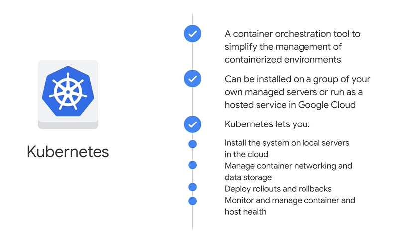

## Objectives

- Explore the role of compute options in the cloud.
- Learn about building and managing virtual machines.
- Examine building elastic applications using autoscaling.
- Explore PaaS options by leveraging App Engine.
- Examine building event-driven services using Cloud Functions.
- Identify containerizing and orchestrating applications with Google Kubernetes Engine.
- Identify developing and deploying scalable containerized applications with Cloud Run.


# 01. Compute Options in the cloud


# 02. Explore IaaS with Compute Engine

- In compute engine, users can **create** and **run** virtual machines in Google's Innovative data centers and on its Global fiber Network.
  - No upfront investments: it's configured much like physical server
  - Thousands of virtual CPUs can run on a system that's designed to be fast and offer consistent performance
  - Each VM contains the power and functionality of a full-fledged operating system
  - Run any computing workload such as web-server hosting, application hosting, and/or application backends


# 03. **Lab** - Creating a Virtual Machine

1. Open **Cloud shell** 
   - Cloud Shell is a virtual machine that is loaded with development tools.
2. Type `gcloud auth list` and click on `Authorize`
3. To see project ID: `gcloud config list project`


### 3.1.1 Understanding Regions and Zones

- Certain Compute Engine resources live in regions or zones. A region is a specific geographical location where you can run your resources. Each region has one or more zones.

| Regions |	Zones |
|---|---|
| Western US  |	us-west1-a,  us-west1-b |
| Central US |	us-central1-a, us-central1-b, us-central1-d, us-central1-f |
| Eastern US |	us-east1-b, us-east1-c, us-east1-d |
| Western Europe	| europe-west1-b, europe-west1-c, europe-west1-d |
| Eastern Asia |	asia-east1-a, asia-east1-b, asia-east1-c |

- Resources that live in a zone are referred to as zonal resources. 
- Virtual machine Instances and persistent disks live in a zone.
- To attach a persistent disk to a virtual machine instance, both resources must be in the same zone.
- Similarly, if you want to assign a static IP address to an instance, the instance must be in the same region as the static IP.

### 3.1.2 Set the region and zone


1. Set the REGION name: `gcloud config set compute/region <REGION>`
2. Create the **REGION** variable: `export REGION=<REGION>`
3. Create a **ZONE** variable: `export ZONE=<Zone>`


## 3.1 Task 1 Create a new instance from the Cloud console

1. In the Cloud console, on the **Navigation menu** (Navigation menu icon), click **Compute Engine** > **VM Instances**.
2. To create a new instance, click **CREATE INSTANCE**.
3. There are many parameters you can configure when creating a **new instance**. Use the following for this lab:

| Field |	Value | Additional Information |
|---|---|---|
| Name |	gcelab |	Name for the VM instance | 
| Region	| us-central1 |	For more information about regions, see the Compute Engine guide, Regions and Zones. |
| Zone	| us-central1-a |	Note: Remember the zone that you selected to use later. For more information about zones, see the Compute Engine guide, Regions and Zones. |
| Series	| E2	| Name of the series |
| Machine Type |	2 vCPU |	This is an (e2-medium), 2-CPU, 4GB RAM instance. Several machine types are available, ranging from micro instance types to 32-core/208GB RAM instance types. For more information, see the Compute Engine guide, About machine families. Note: A new project has a default resource quota, which may limit the number of CPU cores. You can request more when you work on projects outside this lab. |
| Boot Disk |	New 10 GB balanced persistent disk OS Image: Debian GNU/Linux 11 (bullseye) |	Several images are available, including Debian, Ubuntu, CoreOS, and premium images such as Red Hat Enterprise Linux and Windows Server. For more information, see Operating System documentation. |
| Firewall |	Allow HTTP traffic	| Select this option in order to access a web server that you install later. Note: This automatically creates a firewall rule to allow HTTP traffic on port 80. |

4. Click **Create**.
5. To use **SSH** to connect to the VM, click **SSH** to the right of the instance name, `gcelab`

## 3.2 Task 2. Install an NGINX web server

1. Update the OS: `sudo apt-get update`
2. Install **NGINX:** `sudo apt-get install -y nginx`
3. Confirm that **NGINX** is running: `ps auwx | grep nginx`
4. Return to the Cloud console and click the **External IP** link in the row for your machine.
5. 


## 3.3 Task 3. Create a new instance with gcloud

- Cloud Shell is an interactive shell environment for Google Cloud loaded with all the development tools you need (`gcloud`, `git`, and others) and offers a persistent 5-GB home directory. [Gcloud command line tool](https://cloud.google.com/sdk/gcloud/)

1. In the Cloud Shell, use `gcloud` to create a new VM instance from the command line: `gcloud compute instances create gcelab2 --machine-type e2-medium --zone=$ZONE`
2. You can also use SSH to connect to your instance via gcloud. Make sure to add your zone, or omit the --zone flag if you've set the option globally:
   1. `gcloud compute ssh gcelab2 --zone=$ZONE`
3. Type **Y** to continue.
4. Press ENTER through the passphrase section to leave the passphrase empty.
5. Type ` exit` to exit from shell.

<table style="width:70%">
<tr>
<td>

**Note**: You can set the default region and zones that gcloud uses if you are always working within one region/zone and you don't want to append the --zone flag every time.
To do this, run these commands:

`gcloud config set compute/zone ...`

`gcloud config set compute/region ...`


</td>
</tr>
</table>
Through which of the following ways can you create a VM instance in Compute Engine?

- [x] The Cloud console
- [x] The gcloud command line tool

# 04. Configuring Elastic apps with Autoscaling


# 05. Exploring Paas with App Engine

- App engine lets you build highly scalable applications on a fully managed serverless platform


- App Engine offers software development kits (SDKs)
- Each SDK's include:
  - APIs and libraries
  - Sandbox environment
  - Deployment tools

## 5.1 Two types of App Engine environments

1. Standard
2. Flexible

### 5.1.1 App Engine standard runs preconfigured containers

- Persistent storage with queries, sorting, and transactions
- Automatic scaling and load balancing
- Asynchronous task queues for performing work outside the scope of a request
- Scheduled tasks for triggering events at specified times or regular intervals
- Integration with other Google Cloud services and APls

- **The standard environment has two requirements**
  - Use specified versions of Java, Python, PHP, Go, Node js, and Ruby
  - Application must conform to sandbox constraints that are dependent on runtime


### 5.1.2 App Engine flexible environment uses custom containers

- Instances are health-checked, healed, and co-located
- Critical, backward-compatible updates are automatically applied to the underlying operating system
- VM instances are automatically located by geographical region according to the settings in your project
- VM instances are restarted on a weekly basis

- **The flexible environment features**
   - Microservices
   - Authorization
   - SQL & NoSQL databases
   - Traffic splitting
   - Logging
   - Search
   - Versioning
   - Security scanning
   - Mencache
   - Content delivery networks
 
- **Flexible environment advantages** 

- Take advantage of custom configurations and libraries, while focusing on writing code
- Customize the runtime and the operating system of your virtual machine. Standard runtimes include Python, Java, Go, Node.js, PHP, NET, and Ruby
- Customize or provide runtimes by supplying a custom Docker image or Dockerfile

- Compaing App engine environments

|                                | The Standard environment                                                  | The flexible environment                                       |
|--------------------------------|---------------------------------------------------------------------------|----------------------------------------------------------------|
| Instance startup               | Seconds                                                                   | Minutes                                                        |
| SSH access                     | No                                                                        | Yes (although not by default)                                  |
| Write to local disk            | No (some runtinmes have read and<br>write access to the `/tmp` directory) | Yes, ephemeral(disk initialized on each VM startup)            |
| Support for 3rd-party binaries | For certain languages                                                     | Yes                                                            |
| Network access                 | Via App Engine services                                                   | Yes                                                            |
| Pricing model                  | After free tier usage, pay per instance<br>class, with automatic shutdown | Pay for resource allocated per hour,<br>no automatic shutdown. |


# 06. **LAB** -  App Engine: Qwik Start - Python

- App Engine allows developers to focus on doing what they do best, writing code, and not what it runs on.
- Developers upload their apps to App Engine, and Google Cloud takes care of the rest.
- The notion of servers, virtual machines, and instances have been abstracted away, with App Engine providing all the compute necessary.
- Developers don't have to worry about operating systems, web servers, logging, monitoring, load-balancing, system administration, or scaling, as App Engine takes care of all that.
- Developers only need to focus on building solutions for their organizations or their users.
- the following languages: `Python`, `Java`, `PHP`, `Go`, `Node.js`, and `Ruby`)

## 6.1 Basic fundamental authentication

```bash
gcloud auth list
# activate the cloud shell

gcloud config list project

gcloud config set compute/region europe-west4
```

## 6.2 App Engine apps can access numerous additional Cloud or other Google services for use in their applications:

- **NoSQL database**: Cloud Datastore, Cloud Firestore, Cloud BigTable
- **Relational database**: Cloud SQL or Cloud AlloyDB, Cloud Spanner
- **File/object storage:** Cloud Storage, Cloud Filestore, Google Drive
- **Caching**: Cloud Memorystore (Redis or memcached)
- **Task execution**: Cloud Tasks, Cloud Pub/Sub, Cloud Scheduler, Cloud Workflows
- **User authentication:** Cloud Identity Platform, Firebase Auth, Google Identity Services

## 6.3 Task 1. Enable Google App Engine Admin API

- The App Engine Admin API enables developers to provision and manage their App Engine Applications.

- In the left **Navigation menu**, click **APIs & Services** > **Library**.
- Type "App Engine Admin API" in the search box.
- Click the **App Engine Admin API** card.
- Click **Enable**. If there is no prompt to enable the API, then it is already enabled and no action is needed.

## 6.4 Task 2. Download the Hello World app

1. Clone the Python app:  `git clone https://github.com/GoogleCloudPlatform/python-docs-samples.git`
2. Go to dir: `cd python-docs-samples/appengine/standard_python3/hello_world`
3. Setup python environment:
```bash
sudo apt install python3 -y
sudo apt install python3.11-venv
python3 -m venv create myvenv
source myvenv/bin/activate
```

## 6.5 Task 3. Test the application

- Test the application using the Google Cloud development server (dev_appserver.py), which is included with the preinstalled App Engine SDK.
  - `dev_appserver.py app.yaml`
- View the results by clicking the **Web preview** > **Preview on port 8080.**

## 6.6 Task 4. Deploy your app

1. Deploy the app: `gcloud app deploy`
2. Enter the number that represents your region: `<REGION>`
3. Enter `Y` when prompted to confirm the details and begin the deployment of service.

### 6.6.1 Quiz

- **Q: What are other serverless platforms from Google Cloud that are similar to App Engine?**

- [x] Cloud Functions
- [ ] All of them
- [x] Cloud Run
- [ ] Compute Engine
- [ ] GKE/Kubernetes Engine
- [ ] BigQuery

- **Q: With Google App Engine, what do developers need to focus on?**

- [ ] Web servers
- [ ] Virtual machines
- [ ] Operating systems
- [ ] All of them
- [ ] System administration
- [x] Application code

# 07. Event-Driven Programs with Cloud Functions

- Cloud Functions - Serverless logic
  - A lightweight fully managed serverless execution environment for building and connecting cloud services

- Integrated cloud functions handle application events
  - Like **Converting Image thumbnail** files or **convert format** and **save into the cloud** repos.

## 7.1 Cloud Functions allows your code to respond to events

- Lightweight, event-based, asynchronous compute solution
- Allows you to create small, single-purpose functions that respond to cloud events without the need to manage a server or a runtime environment
- Use these functions to construct applications from bite-sized business logic and connect and extend cloud services
- Billed to the nearest 100 milliseconds, and only while your code is running
- Written in Javascript (Node.js), Python or Go, and execute in a managed
- Node js environment on Google Cloud

# 08. LAB - Cloud Functions: Qwik Start - Command Line

- Authorize the cloud shell: `gcloud auth list`

## 8.1 Task 1. Create a function

- To create a cloud function:

1. `gcloud config set run/region REGION`
2. `mkdir gcf_hello_world && cd $_`
3. `nano index.js`
4. Copy the following into the `index.js` file:
   1. ```js
      const functions = require('@google-cloud/functions-framework');
      // Register a CloudEvent callback with the Functions Framework that will
      // be executed when the Pub/Sub trigger topic receives a message.
      functions.cloudEvent('helloPubSub', cloudEvent => {
        // The Pub/Sub message is passed as the CloudEvent's data payload.
        const base64name = cloudEvent.data.message.data;

        const name = base64name
          ? Buffer.from(base64name, 'base64').toString()
          : 'World';

        console.log(`Hello, ${name}!`);
      });
      ```
5. Exit nano (Ctrl+x) and save (Y) the file.
6. Create and open package.json to edit:
7. Copy the following into the package.json file:
   1. ```js
      {
        "name": "gcf_hello_world",
        "version": "1.0.0",
        "main": "index.js",
        "scripts": {
          "start": "node index.js",
          "test": "echo \"Error: no test specified\" && exit 1"
        },
        "dependencies": {
          "@google-cloud/functions-framework": "^3.0.0"
        }
      }
      ```
8. Install the package dependencies
   1. `npm install`

## 8.2 Task 2. Deploy your function

- For this lab, you'll set the `--trigger-topic` as `cf_demo`.

<table style="width: 70%">
<tr>
<td>

**Note:** Cloud Functions are event driven, meaning a trigger type must be specified. When deploying a new function, `--trigger-topic`, `--trigger-bucket`, or `--trigger-http` are common trigger events. When deploying an update to an existing function, the function keeps the existing trigger unless otherwise specified.

</td>
</tr>
</table>

1. Deploy the helloPubSub function to a pub/sub topic named cf-demo
   1. ```bash
      gcloud functions deploy nodejs-pubsub-function \
        --gen2 \
        --runtime=nodejs20 \
        --region=REGION \
        --source=. \
        --entry-point=helloPubSub \
        --trigger-topic cf-demo \
        --stage-bucket PROJECT_ID-bucket \
        --service-account cloudfunctionsa@PROJECT_ID.iam.gserviceaccount.com \
        --allow-unauthenticated
      ```
<table style="width: 70%">
<tr>
<td>

Note: If you get a service account **serviceAccountTokenCreator** notification select "n".

</td>
</tr>
</table>

2. Verify the status of the function:
   1. `gcloud functions describe nodejs-pubsub-function --region=REGION`

## 8.3 Task 3. Test the function

1. After you deploy the function and know that it's active, test that the function writes a message to the cloud log after detecting an event.
   1. `gcloud pubsub topics publish cf-demo --message="Cloud Function Gen2"`

## 8.4 Task 4. View logs

1. Check logs
   1. `gcloud functions logs read nodejs-pubsub-function --region=us-east1`

### 8.4.1 Q Test

**Serverless lets you write and deploy code without the hassle of managing the underlying infrastructure.**

- [x] True
- [ ] False

# 09. Containerizing and orchestrating Apps with GKE

- Google Kubernates Engine - Hybrid
  - Cluster manager and orchestration engine built on Google's container experience.
  - 
- 

## 9.1 Containers
- Think of a container as a lightweight, standalone, executable package of software that includes everything needed to run an application: code, runtime, system tools, system libraries, and settings. It's like a self-contained bubble for your application.   

### 9.1.1 Key benefits of containers:

- Isolation: Containers isolate applications from each other, ensuring consistency and preventing conflicts.
- Efficiency: They share the host OS kernel, making them lightweight and efficient.
- Portability: Containers can run consistently across different environments (development, testing, production).

## 9.2 Docker

- Docker is a popular tool that makes it easy to create, ship, and run containers. It provides a platform for developing, testing, and deploying applications rapidly.

### 9.2.1 Key roles of Docker:

- Containerization: Packages applications into containers.
- Image creation: Creates container images, which are snapshots of the container's file system.
- Container runtime: Runs containers based on these images.

## 9.3 Kubernetes
 
- Kubernetes, often abbreviated as K8s, is an open-source platform designed to automate deployment, scaling, and management of containerized applications. It orchestrates and manages containerized workloads and services.

### 9.3.1 Key functions of Kubernetes:
 
- Orchestration: Manages multiple containers across different hosts.
- Scheduling: Decides where to run containers based on resource availability and other factors.
- Scaling: Automatically adjusts the number of containers based on demand.
- Load balancing: Distributes traffic across multiple containers.
- Self-healing: Restarts failed containers and replaces them with healthy ones.
- Relationship between the three
- Docker creates and manages individual containers.
- Kubernetes manages and orchestrates multiple containers across clusters of hosts.


In essence:

Containers are the packaging format.
Docker is the tool to create and manage containers.
Kubernetes is the platform to manage and orchestrate clusters of containers.


