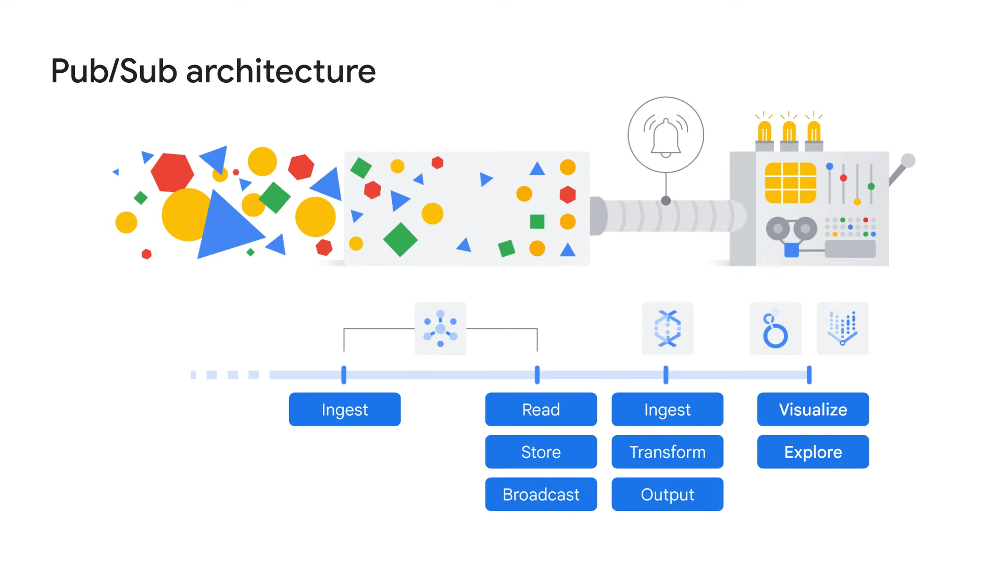

# There's an API for that!

# CHAPTERS

1. The purpose of APls
1. Cloud Endpoints
1. Lab: Cloud Endpoints: Qwik Start
1. Apigee API Management
1. Pub/Sub
1. Lab: Pub/Sub: Qwik Start - Python
1. Quiz
1. Summary

# 1. The Purpose of APIs

# What is an API?

- Application Programming Interface
- A software service’s implementation can be complex and changeable.

- If other software services had to be explicitly coded in detail in order to use that service, the result would be brittle and error-prone.
- So instead, application developers structure the software they write so that it presents **a clean, well-defined interface** that hides unnecessary detail, and then they document that interface.
- That’s an application programming interface.

```s
A clean, well-defined interface
Underlying implementation can change
Changes to the API are made with versions
```

## What is REST?

- **RE**presentational **S**tate **T**ransfer, or `REST`, is currently the most popular architectural style for services.

1. A set of constraints a service must comply with.
2. An API that uses HTTP requests to GET, PUT, POST, and DELETE data.
3. Designed to set up a format for applications to communicate.
4. Great for cloud applications because they are stateless.
   1. One of the main reasons REST APIs work well with the cloud is due to their **stateless nature**.
   2. State information does not need to be **stored** or **referenced** for the API to run.
5. Authentication via Auth and security by leveraging tokens.

## Deploying and managing APIs can be difficult

- Interface definition
- Authentication and authorization
- Management and scalability
- Logging and monitoring

# Cloud Endpoints

- Distributed API management system
  - Cloud Endpoints is a distributed API management system that uses a distributed Extensible Service Proxy, which is a service proxy that runs in its own Docker container.
- Provides an API Console, hosting, logging, monitoring, and other features
- Use with any APis that support the OpenAPI Specification
- Supports applications running in App Engine, Google Kubernetes Engine, and Compute Engine
- Clients include Android, iOS, and Javascript

## Deploy and manage APls easily with Cloud Endpoints

1. Cloud Endpoints supports the Open API specification and gRPC API specification.
2. Cloud Endpoints also supports service-to-service authentication and user authentication with Firebase, Auth0, and Google authentication.
3. The Extensible Service Proxy, Service Management, and Service Control together validate requests, log data, and handle high volumes of traffic Logging and
4. Trace allow you to view detailed logs, trace lists, and metrics related to traffic volume, latency, size of requests and responses, and errors.

# Lab Cloud Endpoints: Qwik Start

During this lab, you'll:
1. Deploy the Cloud Endpoints configuration.
2. Deploy the API backend.
3. Send requests to the API.
4. Track API activity.
5. Add a quota to the API.

## Task 1. Getting the sample code


1. Enter the following command in Cloud Shell to get the sample API and scripts:
    - ```bash
      gsutil cp gs://spls/gsp164/endpoints-quickstart.zip .
      unzip endpoints-quickstart.zip
      ```
2. Change to the directory that contains the sample code:
    - ```bash
      cd endpoints-quickstart
      ```

## Task 2. Deploying the Endpoints configuration

- To publish a REST API to Endpoints, an OpenAPI configuration file that describes the API is required. The lab's sample API comes with a pre-configured OpenAPI file called `openapi.yaml`.
- Endpoints uses Google `Service Management`, an infrastructure service of Google Cloud, to create and manage APIs and services. To use Endpoints to manage an API, you deploy the API's OpenAPI configuration to Service Management.
- To deploy the Endpoints configuration...
  1) In the endpoints-qwikstart directory, enter the following:
     - `cd scripts`
  2) Run the following script, which is included in the sample:
     - `./deploy_api.sh`

- Cloud Endpoints uses the `host` field in the OpenAPI configuration file to identify the service. The `deploy_api.sh` script sets the ID of your Cloud project as part of the name configured in the `host` field. (When you prepare an OpenAPI configuration file for your own service, you will need to do this manually.)
- The script then deploys the OpenAPI configuration to Service Management using the command: `gcloud endpoints services deploy openapi.yaml`
- Ignore the warnings

## Task 3. Deploying the API backend

- So far you have deployed the OpenAPI configuration to Service Management, but you have not yet deployed the code that will serve the API backend. The `deploy_app.sh` script included in the lab sample creates an App Engine flexible environment to host the API backend, and then the script deploys the API to App Engine.

- To deploy the API backend, make sure you are in the `endpoints-quickstart/scripts` directory. Then, run the following script:
  - ```bash
    ./deploy_app.sh ../app/app_template.yaml 
    ```
- The script runs the following command to create an App Engine flexible environment in the `<REGION>` region: `gcloud app create --region="$REGION"`

> Note: If you get an `ERROR: NOT_FOUND: Unable to retrieve P4SA: from GAIA` message, **rerun** the `deploy_app.sh` script.

## Task 4. Sending requests to the API

- After deploying the sample API, you can send requests to it by running the following script:
  - `./query_api.sh`
- The script echoes the curl command that it uses to send a request to the API, and then displays the result. You'll see something like the following in Cloud
- ```bash
  curl "https://example-project.appspot.com/airportName?iataCode=SFO"

  San Francisco International 
  ```
- The API expects one query parameter, `iataCode`, that is set to a valid IATA airport code such as SEA or JFK.
- To test, run this example in Cloud Shell:
  - `./query_api.sh JFK`
  
## Task 5. Tracking API activity

- With APIs deployed with Cloud Endpoints, you can monitor critical operations metrics in the Cloud Console and gain insight into your users and usage with Cloud Logging:
1. Run this traffic generation script in Cloud Shell to populate the graphs and logs:
  - `./generate_traffic.sh`

> Note: This script generates requests in a loop and automatically times out in 5 minutes. To end the script sooner, enter CTRL+C in Cloud Shell.

2. In the Console, go to **Navigation menu** > **Endpoints** > **Services** and click **Airport Codes** service to look at the activity graphs for your service. It may take a few moments for the requests to be reflected in the graphs. You can do this while you wait for data to be displayed:

If the Permissions side panel is not open, click Show Permissions Panel. The Permissions panel allows you to control who has access to your API and the level of access.

Click the Deployment history tab. This tab displays a history of your API deployments, including the deployment time and who deployed the change.

Click the Overview tab. Here you'll see the traffic coming in. After the traffic generation script has been running for a minute, scroll down to see the three lines on the Total latency graph (50th, 95th, and 99th percentiles). This data provides a quick estimate of response times.

## Task 6. Add a quota to the API

> Note: This is a beta release of Quotas. This feature might be changed in backward-incompatible ways and is not subject to any SLA or deprecation policy.

- Cloud Endpoints lets you set quotas so you can control the rate at which applications can call your API. Quotas can be used to protect your API from excessive usage by a single client.
1. Deploy the Endpoints configuration that has a quota:
   1. `./deploy_api.sh ../openapi_with_ratelimit.yaml`
2. Redeploy your app to use the new Endpoints configuration (this may take a few minutes):
   1. `./deploy_app.sh ../app/app_template.yaml `
3. In the Console, navigate to **Navigation menu** > **APIs & Services** > **Credentials**.
4. Click **Create credentials** and choose **API key**. A new API key is displayed on the screen.
5. Click the **Copy to clipboard** icon to copy it to your clipboard.
6. In Cloud Shell, type the following. Replace **YOUR-API-KEY** with the API key you just created:
   1. `export API_KEY=YOUR-API-KEY`
7. Send your API a request using the API key variable you just created:
   1. `./query_api_with_key.sh $API_KEY`
8. The API now has a limit of 5 requests per second. Run the following command to send traffic to the API and trigger the quota limit:
   1. `./generate_traffic_with_key.sh $API_KEY`
9. After running the script for 5-10 seconds, enter CTRL+C in Cloud Shell to stop the script.
10. Send another authenticated request to the API:
    1.  `./query_api_with_key.sh $API_KEY`
- You'll see message like this:
- ```json
  {
    "code": 8,
    "message": "Insufficient tokens for quota 'airport_requests' and limit 'limit-on-airport-requests' of service 'example-project.appspot.com' for consumer 'api_key:AIzeSyDbdQdaSdhPMdiAuddd_FALbY7JevoMzAB'.",
      "details": [
        {
          "@type": "type.googleapis.com/google.rpc.DebugInfo",
          "stackEntries": [],
          "detail": "internal"
        }
      ]
  }
  ```

  # Apigee API Management

- Specific focus on business problems, like rate limiting, quotas, and analytics
- Many Apigee API Management users provide a software service to other companies
- Backend services for Apigee API Management don't need to be in Google Cloud

# Pub/Sub

-  Pub/Sub, a Google Cloud **asynchronous messaging service** and API that supports distributed message-oriented architectures at scale.
-  Data may **not** always come from a single, structured database.
-  Instead, the data might stream from a thousand, or even a million, different events that are all happening asynchronously.
-  Eg: IoT devices like:
   -  include sensors on taxis that send out location data every 30 seconds.
   -  temperature sensors around a data center to help optimize heating and cooling.

##  challenges to data ingestion

1. **The first** is that data can be streamed from many different methods and devices, many of which might not talk to each other and might be sending bad or delayed data.
2. **The second** is that it can be hard to distribute event messages to the right subscribers.
   1. Event messages are notifications.
   2. A method is needed to collect the streaming messages that come from IoT sensors and broadcast them to the subscribers as needed.
3.  **The third** is that data can arrive quickly and at high volumes.
    1.  Services must be able to support this.
4. **The fourth** challenge is ensuring that services are reliable and secure, and perform as expected.

## Pub/Sub is a distributed messaging service

- The name Pub/Sub is short for Publisher/Subscriber, or Publish messages to Subscribers.
- **Features**:
  - Ensures at-least-once delivery
  - No provisioning is required
  - APls are open
  - Global by default
  - Offers end-to-end encryption

## Pub/Sub architecture



1. Data is ingested from devices all over the globe into **Pub/Sub**, which is the first point of contact within the system.
2. Pub/Sub reads, stores, and broadcasts to any subscribers of this data topic that new messages are available.
3. As a subscriber of Pub/Sub, Dataflow can ingest and transform those messages in an elastic streaming pipeline and output the results into an analytics data warehouse like BigQuery.
4. Finally, you can connect a data visualization tool, like Looker or Looker Studio, to visualize and monitor the results of a pipeline, or an AI or ML tool such as Vertex AI to explore the data to uncover business insights or help with predictions.

## Topics

- A topic is a central element of Pub/Sub.
- Topics and subscribers are decoupled.
  - Like a radio antena, broadcasting no matter the subscribers.
  - Topics and subscribers can be O..M to O..M relationship.
    - This means there can be zero, one, or more publishers, and zero, one or more subscribers related to a topic.

**Example:**

- A new employee joins your company, and several applications across the company need to be updated.
- Adding a new employee can be an event that generates a notification to the other applications that are subscribed to the topic, and they’ll receive the message about the new employee starting.
- Now, let’s assume that there are two different types of employees:
  - a full-time employee
  - a contractor.
- Both sources of employee data could have no knowledge of the other but still publish their events saying “this employee joined” into the Pub/Sub HR topic.
- After Pub/Sub receives the message, downstream applications like the directory service, facilities system, account provisioning, and badge activation systems can all listen and process their own next steps independent of one another.


- Pub/Sub is a good solution to buffer changes for lightly coupled architectures, like this one, that have many different sources and sinks
- Pub/Sub supports many different inputs and outputs, and you can even publish a Pub/Sub event from one topic to another.


# Lab: Intro to Pub/Sub - Python

During this lab, you'll:
1. Learn the basics of Pub/Sub.
2. Create and list a Pub/Sub topic.
3. Create and list a Pub/Sub subscription.
4. Publish messages to a topic.
5. Use a pull subscriber to output individual topic messages.


## Task 1. Create a virtual environment

> Python virtual environments are used to isolate package installation from the system.

1. Install the virtualenv environment:
   1. `sudo apt-get install -y virtualenv`
2. Build the virtual environment: 
   1. `python3 -m venv myenv`
3. Activate the virtual environment.
   1. `source myenv/bin/activate`
  
## Task 2. Install the client library

1. Run the following to install the client library:
   1. `pip install --upgrade google-cloud-pubsub`
2. Get the sample code by cloning a GitHub repository:
   1. `git clone https://github.com/googleapis/python-pubsub.git`
3. Navigate to the directory:
   1. `cd python-pubsub/samples/snippets`

## Task 3. Pub/Sub - the Basics

- Pub/Sub is an asynchronous global messaging service.
- There are three terms in Pub/Sub that appear often:
  - topics
  - publishing
  - subscribing.
- A topic is a shared string that allows applications to connect with one another through a common thread.
- Publishers push (or publish) a message to a Pub/Sub topic.
- Subscribers will then make a subscription to that thread, where they will either pull messages from the topic or configure webhooks for push subscriptions.
- Every subscriber must acknowledge each message within a configurable window of time.
- In sum, a publisher creates and sends messages to a topic and a subscriber creates a subscription to a topic to receive messages from it.

### Pub/Sub in Google CLoud

- Pub/Sub comes preinstalled in Cloud Shell, so there are no installations or configurations required to get started with this service.
- In this lab, you use Python to create the topic, subscriber, and then view the message. You use a gcloud command to publish the message to the topic.

## Task 4. Create a topic

- To publish data to Pub/Sub you create a topic and then configure a publisher to the topic.

1. In Cloud Shell, your Project ID should automatically be stored in the environment variable `GOOGLE_CLOUD_PROJECT`
   1. `echo $GOOGLE_CLOUD_PROJECT`
2. Ensure the output is the same as the Project ID in your CONNECTION DETAILS.
   1. `publisher.py` is a script that demonstrates how to perform basic operations on topics with the Cloud Pub/Sub API. View the content of publisher script:
   2. `cat publisher.py`

> Note: Alternatively, you can use the shell editors that are installed on Cloud Shell, such as nano or vim or use the Cloud Shell code editor to view `python-pubsub/samples/snippets/publisher.py`.

3. For information about the publisher script:
   1. `python publisher.py -h`
4. Run the publisher script to create Pub/Sub Topic:
   1. `python publisher.py $GOOGLE_CLOUD_PROJECT create MyTopic`

-------------**you have successfully created a Cloud Pub/Sub topic**-----------

1. This command returns a list of all Pub/Sub topics in a given project:
   1. `python publisher.py $GOOGLE_CLOUD_PROJECT list`
2. Navigate to **Navigation menu** > **Pub/Sub** > **Topics**.
   1. You should see `MyTopic`.
  
## Task 5. Create a subscription

1. Create a Pub/Sub subscription for topic with subscriber.py script:
   1. `python subscriber.py $GOOGLE_CLOUD_PROJECT create MyTopic MySub`
**you have successfully created a Cloud Pub/Sub subscription**
2. This command returns a list of subscribers in given project:
   1. `python subscriber.py $GOOGLE_CLOUD_PROJECT list-in-project`
3. For information about the subscriber script:
   1. `python subscriber.py -h`

## Task 6. Publish messages

- Now that you've set up `MyTopic` (the topic) and a subscription to `MyTopic` (`MySub`), use `gcloud` commands to publish a message to `MyTopic`.

1. Publish the message "Hello" to MyTopic:
   1. `gcloud pubsub topics publish MyTopic --message "Hello"`
2. Publish a few more messages to `MyTopic`—run the following commands
   1. (replacing <YOUR NAME> with your name and <FOOD> with a food you like to eat):
   2. `gcloud pubsub topics publish MyTopic --message "Publisher's name is <YOUR NAME>"`
   3. `gcloud pubsub topics publish MyTopic --message "Publisher likes to eat <FOOD>"`
   4. `gcloud pubsub topics publish MyTopic --message "Publisher thinks Pub/Sub is awesome"`

## Task 7. View messages

- Now that you've published messages to MyTopic, pull and view the messages using MySub.

1. Use MySub to pull the message from MyTopic:
   1. `python subscriber.py $GOOGLE_CLOUD_PROJECT receive MySub`
2. Click `Ctrl+c` to stop listening.

# QUIZ

1. **Q. Which statement about Pub/Sub is true?**

- [X] Pub/Sub’s APIs are open.
- [ ] Pub/Sub requires provisioning.
- [ ] Pub/Sub is regional by default.
- [ ] Pub/Sub is unencrypted.

2. **Q. Which platform for developing and managing API proxies has a specific focus on business problems, like rate limiting, quotas, and analytics?**

- [ ] Cloud Endpoints
- [ ] Pub/Sub
- [x] Apigee API Management
- [ ] REST API

3. **Q. Which API management system supports applications running in App Engine, Google Kubernetes Engine, and Compute Engine?**

- [ ] Apigee
- [x] Cloud Endpoints
- [ ] REST API
- [ ] Pub/Sub

4. **Q. What does API stand for?**

- [ ] Artificial Programming Interface
- [ ] Asynchronous Programming Interfac
- [ ] Applied Programming Interface
- [x] Application Programming Interface