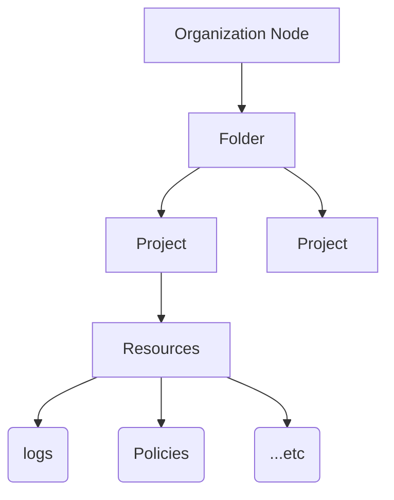
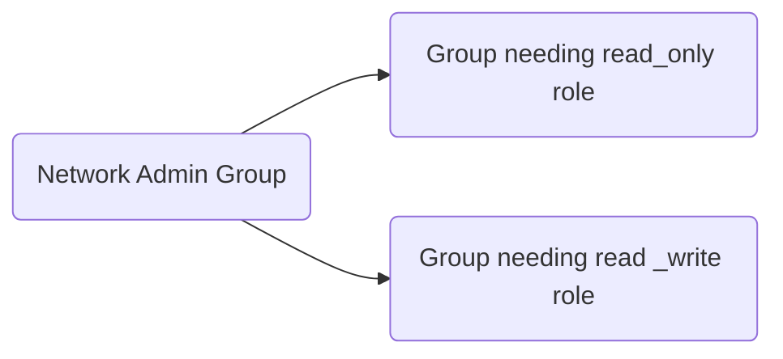

# You can't secure the cloud, right?

|                                             |                                          |                                                     |                                      |                                    |
|---------------------------------------------|------------------------------------------|-----------------------------------------------------|--------------------------------------|------------------------------------|
| 01 ---<br>So, What is the<br>cloud Anyway   | 02 ---<br>Start with a<br>solid platform | 03 ---<br>Use Google<br>Cloud to build<br>your apps | 04 ---<br>Where do i<br>Store stuff? | 05 ---<br>There An API<br>for that |
| **06 ---<br>You can't secure<br>cloud, right?** |                                          |                                                     |                                      |                                    |

## Objectives

- Outline how security is administered in Google Cloud.
- Explore the different encryption options with Google Cloud.
- Identify best practices when you configure authentication and authorization with Identity and Access Management (IAM).

## Agenda

- [You can't secure the cloud, right?](#you-cant-secure-the-cloud-right)
  - [Objectives](#objectives)
  - [Agenda](#agenda)
- [1. Security in the Cloud](#1-security-in-the-cloud)
  - [Why security](#why-security)
    - [1. Hardware Infrastructure Layer](#1-hardware-infrastructure-layer)
    - [2. Service Deployment](#2-service-deployment)
    - [3. Storage Services](#3-storage-services)
    - [4. Internet communication layer](#4-internet-communication-layer)
    - [5. Operational security layer](#5-operational-security-layer)
- [2. The shared security model](#2-the-shared-security-model)
  - [Data access is usually the customer’s responsibility.](#data-access-is-usually-the-customers-responsibility)
- [3. Encryption options](#3-encryption-options)
    - [1. Simple default encryption](#1-simple-default-encryption)
    - [2. Customer-managed encryption keys (CMEK)](#2-customer-managed-encryption-keys-cmek)
    - [3. Customer-supplied encryption keys (CSEK)](#3-customer-supplied-encryption-keys-csek)
      - [3.1 Persistant disk with CSEK](#31-persistant-disk-with-csek)
    - [4. Other encryption options](#4-other-encryption-options)
- [4. Authentication and authorization with IAM](#4-authentication-and-authorization-with-iam)
  - [Role Hierarchy](#role-hierarchy)
  - [Cloud Identity](#cloud-identity)
  - [Types of Roles in IAM](#types-of-roles-in-iam)
    - [1. Basic IAM Role](#1-basic-iam-role)
    - [2. Predefined IAM Role](#2-predefined-iam-role)
    - [3. Custom IAM Role](#3-custom-iam-role)
  - [Service Accounts](#service-accounts)
- [5. Lab: User Authentication: Identity-Aware Proxy](#5-lab-user-authentication-identity-aware-proxy)
  - [Lab overview](#lab-overview)
  - [Introduction to Identity-Aware Proxy](#introduction-to-identity-aware-proxy)
    - [Q What is Identity-Aware Proxy?](#q-what-is-identity-aware-proxy)
  - [Task 1. Deploy the application and protect it with IAP](#task-1-deploy-the-application-and-protect-it-with-iap)
    - [Restrict access with IAP](#restrict-access-with-iap)
    - [Test that IAP is turned on](#test-that-iap-is-turned-on)
  - [Task 2. Access user identity information](#task-2-access-user-identity-information)
    - [Deploy to App Engine](#deploy-to-app-engine)
    - [Test the updated IAP](#test-the-updated-iap)
    - [Turn off IAP](#turn-off-iap)
  - [Task 3. Use Cryptographic Verification](#task-3-use-cryptographic-verification)
    - [Deploy to App Engine](#deploy-to-app-engine-1)
- [6. IAM authorization best practices](#6-iam-authorization-best-practices)
    - [Grant roles to groups instead of individuals](#grant-roles-to-groups-instead-of-individuals)
    - [Best practices to consider when you use service accounts](#best-practices-to-consider-when-you-use-service-accounts)
    - [Grant Roles to groups instead of individuals](#grant-roles-to-groups-instead-of-individuals-1)
- [7. Lab: IAM: Qwik Start](#7-lab-iam-qwik-start)
  - [Objectives](#objectives-1)
  - [Task 1. Explore the IAM console and project level roles](#task-1-explore-the-iam-console-and-project-level-roles)
      - [Explore the editor role](#explore-the-editor-role)
  - [Task 2. Prepare a Cloud Storage bucket for access testing](#task-2-prepare-a-cloud-storage-bucket-for-access-testing)
    - [Create a bucket](#create-a-bucket)
- [8. QUIZ](#8-quiz)

# 1. Security in the Cloud

## Why security

- Google has nine* services with more than a billion users, security is always on the minds of Google's employees.

- Five layers of protection Google provides to keep customers' data safe:
  1. [Hardware infrastructure](#1-hardware-infrastructure-layer)
  2. Service deployment
  3. Storage services
  4. Internet communication
  5. Operational security

### 1. Hardware Infrastructure Layer

- **Hardware design and provenance**
  - Both the server boards and the networking equipment in Google data centers are custom designed by Google. Google also designs custom chips, including a hardware security chip.
- **Secure boot stack**
  - Google's server machines use a variety of technologies to ensure that they are booting the correct software stack.
- **Premises security**
  - Google designs and builds its own data centers, which incorporate multiple layers of physical security protections.
  - *Premises means lano or buildings owned by someone espicially by orgnization or company.*

### 2. Service Deployment

- **Encryption of inter-service communication**
  - Google's services communicate with each other using remote procedure calls ("RPCs").
  - Google's infrastructure provides cryptographic privacy and integrity by automatically encrypting all infrastructure RPC traffic between data centers.
- **User identity**
  - Google's central identity service intelligently challenges users for additional information based on certain risk factors.
  - Users can use secondary factors when signing in, including devices based on the Universal 2nd Factor (U2F) open standard.

### 3. Storage Services

- **Encryption at rest**
  - Most Google applications access file storage indirectly via storage services and encryption. 
  - Using centrally managed keys, encryption is applied at the layer of these storage services. 
  - Google also enables hardware encryption support in hard drives and SSDs.

### 4. Internet communication layer

- **Google Front End ("GFE")**
  - Google Front End ensures that all registered services use TLS connections incorporating the correct certificates and following best practices.
- **Denial of Service ("DoS") protection**
  - Google has multi-tier, multi-layer DoS protections that reduce the risk of any DoS impact on a service running behind a GFE

### 5. Operational security layer

- **Intrusion detection**
  - Rules and machine intelligence give operational security engineers warnings of possible incidents.
- **Reducing insider risk**
  - Google limits and monitors the activities of employees who have access to the infrastructure.
- **Employee Universal Second Factor (U2F) use** 
  - All Google employee accounts require use of U2F-compatible Security Keys.
- **Software development practices**
  - Google employs central source control and requires two-party review of any new code.

# 2. The shared security model


## Data access is usually the customer’s responsibility.

- They control who or what has access to their data.
- Google Cloud provides tools that help them control this access, such as Identity and Access Management, but they must be properly configured to protect your data.

# 3. Encryption options

- Google Cloud offers to encrypt data:
  1. The **simplest option** is Google Cloud default encryption.
  2. **Customer-managed encryption keys** (CMEK)
  3. Most control: **customer-supplied encryption keys** (CSEK)
  4. Encrypt your data locally before you store it in the cloud. ( **client-side encryption.**)
  
### 1. Simple default encryption


### 2. Customer-managed encryption keys (CMEK)

- Manage keys in a cloud-hosted solution
- Encrypt and decrypt via API
- Automated and at-will key rotation
- Symmetric and asymmetric key support

### 3. Customer-supplied encryption keys (CSEK)

- Gives users more control over their keys, but with greater management complexity.
- Users use their own AES-256-bit encryption keys and are responsible for generating them.
- Users are responsible for storing the keys and providing them as part of Google Cloud API calls.
- Google Cloud will use the provided key to encrypt the data before saving it.

#### 3.1 Persistant disk with CSEK

- Data is encrypted before it leaves the instance.
- System defined or customer supplied keys.
- When a persistent disk is deleted, the keys are discarded, and the data is rendered irrecoverable by traditional means.
- Even without **CSEK** or **CMEK**, persistent disks are still encrypted.

### 4. Other encryption options

- Disk encryption
- Client-side encryption

# 4. Authentication and authorization with IAM

> IAM -> Identity and Access Management
- When an organization node contains lots of folders, projects, and resources, it’s likely that a workforce might need to restrict access.
- With **IAM**, administrators can apply policies that define `who` can do `what` on `which` resources.
  1. `Who` - IAM policy can be a **Google Account**, a **Google group**, a **service account**, or **Cloud Identity domain**.
  2. `What` - part of an IAM policy is defined by a role. An IAM role is a collection of permissions.
     1. **Eg**:To manage virtual machines, you need specific permissions like create, delete, start, stop, and change.
     2. These permissions are grouped into a role for easier management.
  3. `Which` - **Eg**: To be applied IAM policy on Virtual machine to manage services

## Role Hierarchy

- When a user, group, or service account is given a role on a specific element of the resource hierarchy, the resulting policy applies to the chosen element and to all the elements below it in the hierarchy.
- 
- **Bad Approach**
  - 
- **Good Approach**
  - With a tool called `Cloud Identity`, organizations can **define policies** and manage their **users** and groups by using the **Google Admin console**.

## Cloud Identity

- Log in and manage resources using the same credentials used in existing Active Directory or LDAP systems
- Google Admin console can be used to disable user accounts and remove them from groups when they leave
- Available in free and premium editions
- Already available to Google Workspace customers in the Google Admin console

## Types of Roles in IAM

- There are three kinds of roles in IAM: 
  1. [Basic](#1-basic-iam-role)
  2. Predefined
  3. Custom

### 1. Basic IAM Role

- Basic roles are broad in scope.
- Basic roles include **owner**, **editor**, **viewer**, and **billing administrator**.
- When applied to a Google Cloud project, they affect all resources in that project.
  - Project **viewers** can *examine* resources, but *can’t modify* them.
  - Project **editors** can *examine* and *modify* a resource.
  - Project **owners** can also *examine* and *modify* a resource. And also manage the associate *roles* and *permissions*, and *set up billing*.

### 2. Predefined IAM Role

- If user need to control only *Billing* for a project, then Basic role is **not suitable**.
- It offer sets of **predefined** **roles**, and they even define where those roles can be applied.

- Examples:
- Let’s take **Compute Engine**, a Google Cloud product that offers *virtual machines* as a service.
- With **Compute Engine**, you can apply specific **predefined** roles—such as `instanceAdmin`—to Compute Engine resources in a given project, a given folder, or an entire organization.
- This then allows whoever has these roles to perform a specific set of predefined actions.
- 

### 3. Custom IAM Role

- Many companies use a **least-privilege** model, in which each person in your organization is given the **minimal** amount of **privilege** needed to do their job.
- **Eg**: maybe you want to define an `instanceOperator` role to allow some users to **stop** and **start** Compute Engine virtual machines, but **NOT** **reconfigure** them.
- 

> NOTE:  
> 1. **Custom roles** are applied to **projects** and **organizational** level and **NOT** a **folder** level.
> 2. You must manage the permissions that comprise the custom role you’ve created.

## Service Accounts

- Let’s say you have an application running in a virtual machine that needs to store data in Cloud Storage, but you don’t want just anyone on the internet to have access to that data, just that particular virtual machine.
- You can create a service account to authenticate that VM to Cloud Storage.
- Service accounts are named with an email address, but instead of passwords, they use cryptographic keys to access resources.
- So, if a service account has been granted Compute Engine’s Instance Admin role, this would allow an application that runs in a VM with that service account to create, modify, and delete other VMs.
- Service accounts must be managed.
- **Eg**: maybe Alice needs to manage which Google Accounts can act as service accounts, but Bob just needs to view a list of service accounts.
  - Fortunately, in addition to being an identity (a user), a service account is also a resource!
  - So it can have IAM policies of its own attached to it.
  - This means that Alice can have the editor role on a service account, and Bob can have the viewer role.


# 5. Lab: User Authentication: Identity-Aware Proxy

- `Identity-Aware Proxy`, or **IAP**, is a resource that can be used to set up authentication to https-based applications without the use of VPNs.
- **IAP** lets you establish a central authorization layer for applications over TLS, so you can use an application-level access control model instead of relying on network-level firewalls.
- Only users and groups can access applications and resources protected by IAP through the proxy with the correct IAM role.
- Uses IAM roles to grant access to specific applications and resources.
- Protects against unauthorized external access to applications.
- IAP doesn't protect against activities inside your VM, such as if someone uses SSH to access the VM.
- IAP also doesn’t protect against activities within a project, such as VM-to-VM communication within your project over the local network.


## Lab overview

- In this lab, you build a minimal web application with Google App Engine, then explore various ways to use Identity-Aware Proxy (IAP) to restrict access to the application and provide user identity information to it.
- Your app will:
  - Display a welcome page
  - Access user identity information provided by IAP
  - Use cryptographic verification to prevent spoofing of user identity information

- What you'll learn
  - How to write and deploy a simple App Engine app using Python
  - How to enable and disable IAP to restrict access to your app
  - How to get user identity information from IAP into your app
  - How to cryptographically verify information from IAP to protect against spoofing

## Introduction to Identity-Aware Proxy

- Authenticating users of your web app is often necessary, and usually requires special programming in your app.
- For Google Cloud apps you can hand those responsibilities off to the Identity-Aware Proxy service.
- If you only need to restrict access to selected users there are no changes necessary to the application.
- Should the application need to know the user's identity (such as for keeping user preferences server-side) Identity-Aware Proxy can provide that with minimal application code.

### Q What is Identity-Aware Proxy?

- Identity-Aware Proxy (IAP) is a Google Cloud service that intercepts web requests sent to your application, authenticates the user making the request using the Google Identity Service, and only lets the requests through if they come from a user you authorize.
- In addition, it can modify the request headers to include information about the authenticated user.

**Download the code**  
- `gsutil cp gs://spls/gsp499/user-authentication-with-iap.zip .`  
- `unzip user-authentication-with-iap.zip`
- `cd user-authentication-with-iap`

## Task 1. Deploy the application and protect it with IAP

- **Review the application code**
  - Change from the main project folder to the `1-HelloWorld` subfolder that contains code for this step.

- **Deploy to App Engine**
  1. Update python runtime to python39.
      - ```bash
        sed -i 's/python37/python39/g' app.yaml
        ```
  2. Deploy the app to the App Engine Standard environment for Python.
      - ```bash
          gcloud app deploy
          ```
1. Select a region `<REGION>`.
2. When you are asked if you want to continue, enter `Y` for yes.
3. Run this command: `gcloud app browse`


### Restrict access with IAP

1. In the cloud console window, click the **Navigation menu** > **Security** > **Identity-Aware Proxy.**
2. Click **ENABLE API**.
3. Click **GO TO IDENTITY-AWARE PROXY**.
4. Click **CONFIGURE CONSENT SCREEN**.
5. Select **Internal** under User Type and click **Create**.


6. **Fill in the required blanks with appropriate values:**
| Field | Value |
|---|---|
| App name | IAP Example |
| User support email| Select your lab student email address from the dropdown.|
| Application home page | The URL you used to view your app. You can find this again by running the gcloud app browse command in cloud shell again. |
| Application privacy Policy link | The privacy page link in the app, same as the homepage link with /privacy added to the end| 
| Authorized domains | Click + **ADD DOMAINT** he hostname portion of the application's URL, e.g. iap-example-999999.appspot.com. You can see this in the address bar of the Hello World web page you previously opened. Do not include the starting https:// or trailing / from that URL. |
| Developer Contact Information | Enter at least one email |


7. Click Save and Continue.
8. For Scopes, click Save and Continue.
9. For Summary, click Back to Dashboard.
   1. Do not need to create credentials for this lab, so you can simply close this browser tab.
10. Run this command: `gcloud services disable appengineflex.googleapis.com`

> **Note:** App Engine has its standard and flexible environments which are optimized for different application architectures. Currently, when enabling IAP for App Engine, if the Flex API is enabled, Google Cloud will look for a Flex Service Account. Your lab project comes with a multitude of APIs already enabled for the purpose of convenience. However, this creates a unique situation where the Flex API is enabled without a Service Account created.

11. Return to the Identity-Aware Proxy page and refresh it. You should now see a list of resources you can protect.
    1.  Click the toggle button in the IAP column in the App Engine app row to turn IAP on.
12. The domain will be protected by IAP. Click Turn On.

### Test that IAP is turned on

1. Open a browser tab and navigate to the URL for your app. A Sign in with Google screen opens and requires you to log in to access the app.
2. Sign in with the account you used to log into the console. You will see a screen denying you access.
- You have successfully protected your app with IAP, but you have not yet told IAP which accounts to allow through.
3. Return to the Identity-Aware Proxy page of the console, select the checkbox next to App Engine app, and see the App Engine sidebar to the right.
   - Each email address (or Google Group address, or Workspace domain name) that should be allowed access needs to be added as a Member.
4. Click **Add Principal**.
5. Enter your **Student** email address.
6. Then, pick the **Cloud IAP** > **IAP-Secured Web App User** role to assign to that address.
- You may enter more addresses or Workspace domains in the same way.
7. Click **Save**.

<div style="display: flex; justify-content: center">
<table style="width:70%">
<tr>
<td>

**Test access**<br/>

Navigate back to your app and reload the page. You should now see your web app, since you already logged in with a user you authorized.

If you still see the "You don't have access" page, IAP did not recheck your authorization. In that case, do the following steps:

1. Open your web browser to the home page address with /_gcp_iap/clear_login_cookie added to the end of the URL, as in https://iap-example-999999.appspot.com/_gcp_iap/clear_login_cookie.
2. You will see a new Sign in with Google screen, with your account already showing. Do not click the account. Instead, click Use another account, and re-enter your credentials.

> Note: It takes a minute for the role change to take effect. If the page still shows the "You don't have access" message after following the previous steps, wait a minute and try refreshing the page.

These steps cause IAP to recheck your access and you should now see your application's home screen.

If you have access to another browser or can use Incognito Mode in your browser, and have another valid Gmail or Workspace account, you can use that browser to navigate to your app page and log in with the other account. Since that account has not been authorized, it will see the "You Don't Have Access" screen instead of your app.

</td>
</tr>
</table>
</div>


## Task 2. Access user identity information

- In Cloud Shell, change to the folder for this step:
   1. `cd ~/user-authentication-with-iap/2-HelloUser`

### Deploy to App Engine

1. Update python runtime to `python39`.
   1. `sed -i 's/python37/python39/g' app.yaml`
2. Since deployment takes a few minutes, start by deploying the app to the App Engine Standard environment for Python:
   1. `gcloud app deploy`
3. When you are asked if you want to continue, enter `Y` for yes.

### Test the updated IAP

1. Run the command: `gcloud app browse`
2. If a new tab does not open on your browser, copy the displayed link and open it in a new tab normally. You should see a page similar to the following:
   1. 

### Turn off IAP
What happens to this app if IAP is disabled, or somehow bypassed (such as by other applications running in your same cloud project)? Turn off IAP to see.

1. In the cloud console window, click **Navigation menu** > **Security** > **Identity-Aware Proxy**.
2. Click the **IAP** toggle switch next to App Engine app to turn **IAP** off. Click **TURN OFF**.
3. Refresh the application web page. You should see the same page, but without any user information:
   1. 


## Task 3. Use Cryptographic Verification

- If there is a risk of IAP being turned off or bypassed, your app can check to make sure the identity information it receives is valid.
- This uses a third web request header added by IAP, called `X-Goog-IAP-JWT-Assertion`.
- The value of the header is a cryptographically signed object that also contains the user identity data.
- Your application can verify the digital signature and use the data provided in this object to be certain that it was provided by IAP without alteration.

- Digital signature verification requires several extra steps, such as retrieving the latest set of Google public keys.
- You can decide whether your application needs these extra steps based on the risk that someone might be able to turn off or bypass IAP, and the sensitivity of the application.


- Run this command in cloud shell:
  - `cd ~/user-authentication-with-iap/3-HelloVerifiedUser`

### Deploy to App Engine

1. Update python runtime to `python39`.
   1. `sed -i 's/python37/python39/g' app.yaml`
2. Deploy the app to the App Engine Standard environment for Python:
   1. `gcloud app deploy`
3. When you are asked if you want to continue, enter `Y` for yes.

- Test the Cryptographic Verification:
  - `gcloud app browse`
- 
- Since IAP is disabled, no user information is available. Now turn IAP back on.
  - In the cloud console window, click the **Navigation menu** > **Security** > I**dentity-Aware Proxy**.
  - Click the **IAP** toggle switch next to App Engine app to turn IAP on again. Click **TURN ON**.
  - Refresh the page. The page should look like the following:
- 
- Notice that the email address provided by the verified method does not have the `accounts.google.com`: prefix.

- If IAP is turned off or bypassed, the verified data would either be missing, or invalid, since it cannot have a valid signature unless it was created by the holder of Google's private keys.


# 6. IAM authorization best practices

<table>
<tr>
<td>



</td>
<td>

- Leverage and understand the resource hierarchy
  - Use projects to group resources
  - Check the policy granted on each resource
  - Use "principle of least privilege"
  - Audit policies using Cloud Audit Logs
  - Audit memberships of groups used in policies

</td>

</tr>
</table>


### Grant roles to groups instead of individuals



### Best practices to consider when you use service accounts

1. Use caution when you grant the Service Account Users role, because it provides access to all the resources for which the service account has access.
2. When you create a service account, give it a display name that clearly identifies its purpose.
3. Ideally use an established naming convention for your organization.
4. Establish key rotation policies and methods.

### Grant Roles to groups instead of individuals

# 7. Lab: IAM: Qwik Start

## Objectives

1. Explore editor roles.
2. Prepare a resource for access testing.
3. Remove project access.
4. Add storage permissions.
5. Verify access.


## Task 1. Explore the IAM console and project level roles

1. Return to the Username 1 Cloud Console page.
2. Select Navigation menu > IAM & Admin > IAM. You are now in the "IAM & Admin" console.
3. Click +GRANT ACCESS button at the top of the page.
4. Scroll down to Basic in Select a role section and mouse over.

> There are *three roles*
>   Viewer
>   Editor
>   Owner

- These are *primitive roles* in Google Cloud. Primitive roles set project-level permissions and unless otherwise specified, they control access and management to all Google Cloud services.

| Role Name | Permissions | 
|:---:|---|
|roles/viewer | Permissions for read-only actions that do not affect state, such as viewing (but not modifying) existing resources or data. |
| roles/editor | All viewer permissions, plus permissions for actions that modify state, such as changing existing resources.|
| roles/owner| All editor permissions and permissions for the following actions: <br/> - Manage roles and permissions for a project and all resources within the project.<br/> - Set up billing for a project. |

Since you are able to manage roles and permissions for this project, Username 1 has Project owner permissions.

5. Click CANCEL to exit out of the "Add principal" panel

#### Explore the editor role

- Now switch to the Username 2 console.

1. Navigate to the IAM & Admin console, select **Navigation menu** > **IAM & Admin** > **IAM**.
2. Search through the table to find Username 1 and Username 2 and examine the roles they are granted. The Username 1 and Username 2 roles are listed inline and to the right of each user.

- Username 2 has the "Viewer" role granted to it.
3. Switch back to the **Username 1** console for the next step.

## Task 2. Prepare a Cloud Storage bucket for access testing

### Create a bucket

1. Create a Cloud Storage bucket with a unique name. From the Cloud Console, select **Navigation menu** > **Cloud Storage** > **Buckets**.
2. Click **+CREATE**.

Note: If you get a permissions error for bucket creation, sign out and then sign in back in with the Username 1 credentials.


# 8. QUIZ