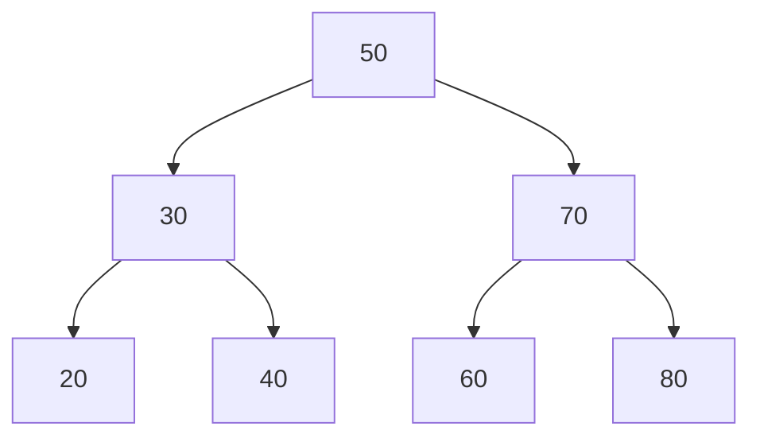

# Data structures in Javascript

> *Click &#9733; if you like the project. Your contributions are heartily &#9825; welcome.*
> This notes was taken from *Freecodecamp.org* [youtube](https://www.youtube.com/watch?v=t2CEgPsws3U) video by [Beau Carnes](https://x.com/carnesbeau)

- [Data structures in Javascript](#data-structures-in-javascript)
- [Stack](#stack)
- [Sets](#sets)
- [Queue](#queue)
- [Binary Search Tree](#binary-search-tree)
  - [Basic Operations](#basic-operations)
    - [1. Search](#1-search)
    - [2. Insert](#2-insert)
    - [3. Delete](#3-delete)
  - [Example Binary Search Tree](#example-binary-search-tree)
    - [Visualization](#visualization)
    - [Step-by-Step Construction](#step-by-step-construction)
  - [Traversals in BST](#traversals-in-bst)
    - [1. In-Order Traversal (Left, Root, Right)](#1-in-order-traversal-left-root-right)
    - [2. Pre-Order Traversal (Root, Left, Right)](#2-pre-order-traversal-root-left-right)
    - [3. Post-Order Traversal (Left, Right, Root)](#3-post-order-traversal-left-right-root)
  - [Applications of BST](#applications-of-bst)
- [Binary Search Tree: Traversal and Height](#binary-search-tree-traversal-and-height)
- [Hashtables](#hashtables)
  - [Definition](#definition)


# Stack

- **Definition:** Array follows the stack approach, which is LIFO method.

1. **push**: Add value at the top of the stack
1. **pop**: Delete value from the top of the stack and return it.
1. **size**: Get length of the stack
1. **peek**: Get top value from the stack.


```js
let Stack = function (){
  this.storage = {};
  this.count = 0;

  this.push = function(value) {
    this.storage[this.count] = value;
    this.count++;
    // return this.storage;
  }

  this.pop = function(value){
    if(this.count === 0) return undefined;

    this.count--;
    let result = this.storage[this.count];
    delete this.storage[this.count]
    return result;
  }

  this.size = function(){
    return this.count;
  }

  this.peek = function(){
    return this.storage[this.count-1];
  }
}

let myStack = new Stack();

myStack.push(1)
myStack.push(2)
myStack.push(3)
console.log(myStack.size());
console.log(myStack.pop());
console.log(myStack.peek());
```

# Sets

- `Set` is similar to an `Array` excepts having duplicate items in it.
- ES6 has built-in option for the `Set`.
- Built-in methods in `Sets`
  1. **add()**
  2. **delete()**
  3. **size**

```js
function mySet(){
  // a collection will hold the set
  let collection = [];

  this.has = function(element){
    return (collection.indexOf(element) !== -1)
  }

  this.values = function(){
    return collection;
  }

  this.add = function(element){
    if(!this.has(element)){
      collection.push(element);
      return true;
    }
    return false;
  }

  this.remove = function(element){
    if(this.has(element)){
      index = collection.indexOf(element);
      collection.splice(index, 1);
      return true;
    }
    return false;
  }

  this.size = function() {
    return collection.length;
  }

  this.union = function(otherSet){
    var unionSet = new mySet();
    let firstSet = this.values();
    let secondSet = otherSet.values();
    firstSet.forEach(function(e){
      unionSet.add(e);
    })
    secondSet.forEach(function(e){
      unionSet.add(e);
    })
    return unionSet;
  }

  this.intersection = function(){
    
  }
  
}
var setA = new mySet();
var setB = new mySet();
setA.add("a");
setB.add("b");
setB.add("c");
setB.add("a");
setB.add("d");
console.log(setA.subset(setB));
console.log(setA.intersection(setB).values());
console.log(setB.difference(setA).values());

var setC = new Set();
var setD = new Set();
setC.add("a");
setD.add("b");
setD.add("c");
setD.add("a");
setD.add("d");
console.log(setD.values());
setD.delete("a");
console.log(setD.has("a"));
console.log(setD.add("d"));
```

# Queue

- It is similar to stack but it follows FIFO method, First In First Out.
- In real world example, People is standing for cash payment in super market. So first person get first serve.

```js
function Queue () { 
    collection = [];
    this.print = function() {
        console.log(collection);
    };
    this.enqueue = function(element) {
        collection.push(element);
    };
    this.dequeue = function() {
        return collection.shift(); 
    };
    this.front = function() {
        return collection[0];
    };
    this.size = function() {
        return collection.length; 
    };
    this.isEmpty = function() {
        return (collection.length === 0); 
    };
}

var q = new Queue(); 
q.enqueue('a'); 
q.enqueue('b');
q.enqueue('c');
q.print();
q.dequeue();
console.log(q.front());
q.print();

function PriorityQueue () {
    var collection = [];
    this.printCollection = function() {
      (console.log(collection));
    };
    this.enqueue = function(element){
        if (this.isEmpty()){ 
            collection.push(element);
        } else {
            var added = false;
            for (var i=0; i<collection.length; i++){
                 if (element[1] < collection[i][1]){ //checking priorities
                    collection.splice(i,0,element);
                    added = true;
                    break;
                }
            }
            if (!added){
                collection.push(element);
            }
        }
    };
    this.dequeue = function() {
        var value = collection.shift();
        return value[0];
    };
    this.front = function() {
        return collection[0];
    };
    this.size = function() {
        return collection.length; 
    };
    this.isEmpty = function() {
        return (collection.length === 0); 
    };
}

var pq = new PriorityQueue(); 
pq.enqueue(['Beau Carnes', 2]); 
pq.enqueue(['Quincy Larson', 3]);
pq.enqueue(['Ewa Mitulska-Wójcik', 1])
pq.enqueue(['Briana Swift', 2])
pq.printCollection();
pq.dequeue();
console.log(pq.front());
pq.printCollection();
```

# Binary Search Tree

A **Binary Search Tree (BST)** is a type of binary tree where each node satisfies the following properties:

1. A **node** is a fundamental unit of a binary tree. Each node contains:
  1. **Value**: The data stored in the node.
  2. **Left Child**: A pointer/reference to the left subtree.
  3. **Right Child**: A pointer/reference to the right subtree.
2. The **left subtree** of a node contains only nodes with values **less than** the node's value.
3. The **right subtree** of a node contains only nodes with values **greater than** the node's value.
4. Both left and right subtrees must also be binary search trees.

---

## Basic Operations


### 1. Search
- Begin at the root.
- Compare the target value with the current node's value:
  - If equal, the value is found.
  - If smaller, search the left subtree.
  - If larger, search the right subtree.
- Repeat until the value is found or the subtree is empty.

### 2. Insert
- Start at the root and compare the value to be inserted.
- Traverse to the left or right child based on comparison:
  - If the target position is empty, insert the new node there.

### 3. Delete
- Locate the node to delete.
- Handle three cases:
  1. **Node has no children**: Simply remove the node.
  2. **Node has one child**: Replace the node with its child.
  3. **Node has two children**: Replace the node with its in-order successor (smallest node in the right subtree).

---

## Example Binary Search Tree

Let’s construct a BST by inserting the following values in order: `50, 30, 70, 20, 40, 60, 80`.

### Visualization



### Step-by-Step Construction
1. Insert `50`: Becomes the root.
2. Insert `30`: Goes to the left of `50`.
3. Insert `70`: Goes to the right of `50`.
4. Insert `20`: Goes to the left of `30`.
5. Insert `40`: Goes to the right of `30`.
6. Insert `60`: Goes to the left of `70`.
7. Insert `80`: Goes to the right of `70`.

---

## Traversals in BST
### 1. In-Order Traversal (Left, Root, Right)
- Visits nodes in ascending order for a BST.
- Example for the above tree: `20, 30, 40, 50, 60, 70, 80`.

### 2. Pre-Order Traversal (Root, Left, Right)
- Example: `50, 30, 20, 40, 70, 60, 80`.

### 3. Post-Order Traversal (Left, Right, Root)
- Example: `20, 40, 30, 60, 80, 70, 50`.

---

## Applications of BST
1. **Searching and Sorting**: Efficiently retrieve or organize data.
2. **Dynamic Sets**: Maintain data that changes frequently (e.g., insertion/deletion).
3. **Database Indexing**: Store keys in databases for quick lookups.


```js
/* Binary Search Tree */

class Node {
  constructor(data, left = null, right = null) {
    this.data = data;
    this.left = left;
    this.right = right;
  }
}

class BST {
  constructor() {
    this.root = null;
  }
  add(data) {
    const node = this.root;
    if (node === null) {
      this.root = new Node(data);
      return;
    } else {
      const searchTree = function(node) {
        if (data < node.data) {
          if (node.left === null) {
            node.left = new Node(data);
            return;
          } else if (node.left !== null) {
            return searchTree(node.left);
          }
        } else if (data > node.data) {
          if (node.right === null) {
            node.right = new Node(data);
            return;
          } else if (node.right !== null) {
            return searchTree(node.right);
          }
        } else {
          return null;
        }
      };
      return searchTree(node);
    }
  }
  findMin() {
    let current = this.root;
    while (current.left !== null) {
      current = current.left;
    }
    return current.data;
  }
  findMax() {
    let current = this.root;
    while (current.right !== null) {
      current = current.right;
    }
    return current.data;
  }
  find(data) {
    let current = this.root;
    while (current.data !== data) {
      if (data < current.data) {
        current = current.left;
      } else {
        current = current.right;
      }
      if (current === null) {
        return null;
      }
    }
    return current;
  }
  isPresent(data) {
    let current = this.root;
    while (current) {
      if (data === current.data) {
        return true;
      }
      if (data < current.data) {
        current = current.left;
      } else {
        current = current.right;
      }
    }
    return false;
  }
  remove(data) {
    const removeNode = function(node, data) {
      if (node == null) {
        return null;
      }
      if (data == node.data) {
        // node has no children 
        if (node.left == null && node.right == null) {
          return null;
        }
        // node has no left child 
        if (node.left == null) {
          return node.right;
        }
        // node has no right child 
        if (node.right == null) {
          return node.left;
        }
        // node has two children 
        var tempNode = node.right;
        while (tempNode.left !== null) {
          tempNode = tempNode.left;
        }
        node.data = tempNode.data;
        node.right = removeNode(node.right, tempNode.data);
        return node;
      } else if (data < node.data) {
        node.left = removeNode(node.left, data);
        return node;
      } else {
        node.right = removeNode(node.right, data);
        return node;
      }
    }
    this.root = removeNode(this.root, data);
  }
  isBalanced() {
    return (this.findMinHeight() >= this.findMaxHeight() - 1)
  }
}


const bst = new BST();

bst.add(9);
bst.add(4);
bst.add(17);
bst.add(3);
bst.add(6);
bst.add(22);
bst.add(5);
bst.add(7);
bst.add(20);

console.log(bst.findMinHeight());
console.log(bst.findMaxHeight());
console.log(bst.isBalanced());
bst.add(10);
console.log(bst.findMinHeight());
console.log(bst.findMaxHeight());
console.log(bst.isBalanced());
```

# Binary Search Tree: Traversal and Height

```js
class Node {
  constructor(data, left = null, right = null) {
    this.data = data;
    this.left = left;
    this.right = right;
  }
}

class BSTheight{

  findMinHeight(node = this.root) {
      if (node == null) {
          return -1;
      };
      let left = this.findMinHeight(node.left);
      let right = this.findMinHeight(node.right);
      if (left < right) {
          return left + 1;
      } else {
          return right + 1;
      };
  }
  findMaxHeight(node = this.root) {
      if (node == null) {
          return -1;
      };
      let left = this.findMaxHeight(node.left);
      let right = this.findMaxHeight(node.right);
      if (left > right) {
          return left + 1;
      } else {
          return right + 1;
      };
  }
  inOrder() {
    if (this.root == null) {
      return null;
    } else {
      var result = new Array();
      function traverseInOrder(node) {       
        node.left && traverseInOrder(node.left);
        result.push(node.data);
        node.right && traverseInOrder(node.right);
      }
      traverseInOrder(this.root);
      return result;
    };
  }
  preOrder() {
    if (this.root == null) {
      return null;
    } else {
      var result = new Array();
      function traversePreOrder(node) {
        result.push(node.data);
        node.left && traversePreOrder(node.left);
        node.right && traversePreOrder(node.right);
      };
      traversePreOrder(this.root);
      return result;
    };
  }
  postOrder() {
    if (this.root == null) {
      return null;
    } else {
      var result = new Array();
      function traversePostOrder(node) {
        node.left && traversePostOrder(node.left);
        node.right && traversePostOrder(node.right);
        result.push(node.data);
      };
      traversePostOrder(this.root);
      return result;
    }
  }
  
  levelOrder() {
      let result = [];
      let Q = []; 
      if (this.root != null) {
          Q.push(this.root);
          while(Q.length > 0) {
              let node = Q.shift();
              result.push(node.data);
              if (node.left != null) {
                  Q.push(node.left);
              };
              if (node.right != null) {
                  Q.push(node.right);
              };
          };
          return result;
      } else {
          return null;
      };
  };
}

console.log('inOrder: ' + bst.inOrder());
console.log('preOrder: ' + bst.preOrder());
console.log('postOrder: ' + bst.postOrder());

console.log('levelOrder: ' + bst.levelOrder());
```

# Hashtables

## Definition

- Hash-table is used to implement associative arrays or mapping of key value pairs.
- Hash tables are common way to implement the map data structures or objects.

| Algorithm 	| Average 	| Worst case 	|
|:---------:	|:-------:	|:----------:	|
|   Space   	|   O(n)  	|    O(n)    	|
|   Search  	|   O(1)  	|    O(n)    	|
|   Insert  	|   O(1)  	|    O(n)    	|
|   Delete  	|   O(1)  	|    O(n)    	|


```js
/* Hash Table */

var hash = (string, max) => {
  var hash = 0;
  for (var i = 0; i < string.length; i++) {
    hash += string.charCodeAt(i);
  }
  return hash % max;
};

let HashTable = function() {

  let storage = [];
  const storageLimit = 14;
  
  this.print = function() {
    console.log(storage)
  }

  this.add = function(key, value) {
    var index = hash(key, storageLimit);
    if (storage[index] === undefined) {
      storage[index] = [
        [key, value]
      ];
    } else {
      var inserted = false;
      for (var i = 0; i < storage[index].length; i++) {
        if (storage[index][i][0] === key) {
          storage[index][i][1] = value;
          inserted = true;
        }
      }
      if (inserted === false) {
        storage[index].push([key, value]);
      }
    }
  };

  this.remove = function(key) {
    var index = hash(key, storageLimit);
    if (storage[index].length === 1 && storage[index][0][0] === key) {
      delete storage[index];
    } else {
      for (var i = 0; i < storage[index].length; i++) {
        if (storage[index][i][0] === key) {
          delete storage[index][i];
        }
      }
    }
  };

  this.lookup = function(key) {
    var index = hash(key, storageLimit);
    if (storage[index] === undefined) {
      return undefined;
    } else {
      for (var i = 0; i < storage[index].length; i++) {
        if (storage[index][i][0] === key) {
          return storage[index][i][1];
        }
      }
    }
  };

};


console.log(hash('quincy', 10))

let ht = new HashTable();
ht.add('beau', 'person');
ht.add('fido', 'dog');
ht.add('rex', 'dinosour');
ht.add('tux', 'penguin')
console.log(ht.lookup('tux'))
ht.print();
```


