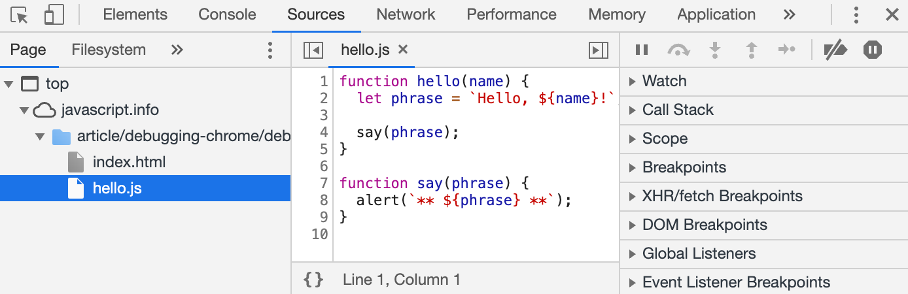
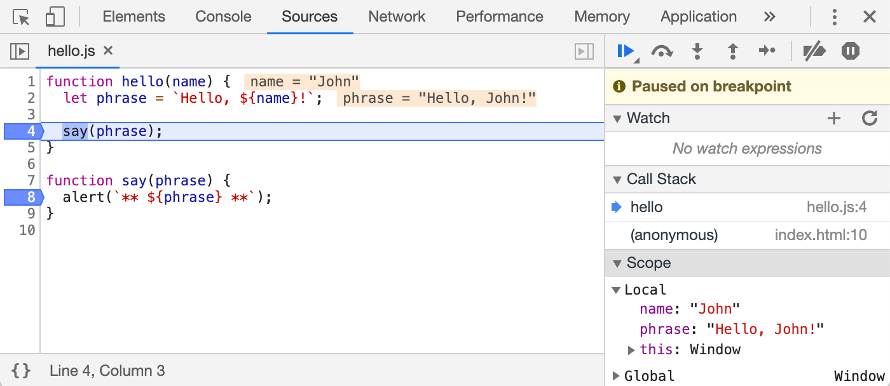

# JS Part 2

## Debugging

- For more info please follow this [link](https://javascript.info/debugging-chrome).
1. A breakpoint is a point of code where the debugger will automatically pause the JavaScript execution.
2. **Resume**: continue the execution, hotkey <kbd class="shortcut">F8</kbd>.
3. **Step**: run the next command, hotkey <kbd class="shortcut">F9</kbd>.
4. **Step over**: run the next command, but *don’t go into a function*, hotkey <kbd class="shortcut">F10</kbd>.
5. **Step into**: command ignores async actions, such as setTimeout hotkey <kbd class="shortcut">F11</kbd>.
6. **Step out**: continue the execution till the end of the current function, hotkey <kbd class="shortcut">Shift+F11</kbd>.
7. The command `debugger`, pause the code.
    -  ```js
        function hello(name) {
          let phrase = `Hello, ${name}!`;

          debugger;  // <-- the debugger stops here

          say(phrase);
        }
       ```
8.  **Logging**: To output something to console from our code, there’s `console.log` function.
    - ```js
      // open console to see
      for (let i = 0; i < 5; i++) {
        console.log("value,", i);
      }
      ```



1. The File Navigator pane lists HTML, JavaScript, CSS and other files, including images that are attached to the page. Chrome extensions may appear here too.
2. The Code Editor pane shows the source code.
3. The JavaScript Debugging pane is for debugging, we’ll explore it soon.
   
### The command debugger

```js
function hello(name) {
  let phrase = `Hello, ${name}!`;

  debugger;  // <-- the debugger stops here

  say(phrase);
}
```

function hello(name) {
  let phrase = `Hello, ${name}!`;

  debugger;  // <-- the debugger stops here

  say(phrase);
}




1. **`Watch`** – **shows current values for any expressions.**
   1. You can click the plus `+` and input an expression. The debugger will show its value, automatically recalculating it in the process of execution.

2. **`Call Stack`** – **shows the nested calls chain.**
   1. At the current moment the debugger is inside `hello()` call, called by a script in `index.html` (no function there, so it’s called “anonymous”).
   2. If you click on a stack item (e.g. “anonymous”), the debugger jumps to the corresponding code, and all its variables can be examined as well.

3.  **`Scope`**– **current variables.**
    1.  Local shows local function variables. You can also see their values highlighted right over the source.
    2.  Global has global variables (out of any functions).

## Styling

[Google Guides](https://google.github.io/styleguide/jsguide.html)


