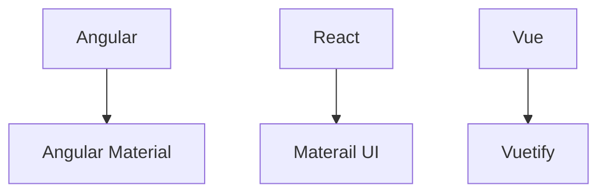

# Material UI

- Ul component library
- Provides us with components to build awesome user interfaces in quick time
- Implementation of Google's material design specification



## Contents

1. [Install MUI in a react application](#installation)
1. [Typography](#typography)
1. Components
1. Inputs / Form controls
1. Layout
1. Navigation
1. Data display and feedback
1. MUI Lab
1. MUI Customization

### Installation

```bash
npm install @mui/material @emotion/react @emotion/styled
```

- `@mui/material` is the core material library which provides us with ready-to-use components
- `@emotion` is a library designed for writing css styles with javascript and is the default styling solution

### Typography

`variant` in *Material-UI* is like a style or appearance option for a component. It's a way to easily change how something looks without having to manually specify all the details.

Boilerplate Code for `Typography`.
- There are *13* `varients` in `Typography`.
    - `6` Heading typography, `h1` to `h6`.
    - `subtitle1`, `subtitle2` Styles for subtitles or secondary text. It is in `h6` sementic tag.

    - `2` Paragrapgh typography
        - `body1` is the *default* `typography` tag. It's  *`font-size:16px`*
        - `body2`
    - `caption` to Styles for small or auxiliary text.
    - `button` Styles for button text.
    - `overline` Styles for an overline text.

- `2` props are:
    - `component` is to change semantic tag.
    - `gutterBottom` is to give `margin bottom`, it is defaultly `false`.


```jsx
// Component.tsx
import {Typography} from '@mui/material';

// ...

<Typography variant='h1'>h1 Heading</Typography>
<Typography variant='h2'>h2 Heading</Typography>
<Typography variant='h3'>h3 Heading</Typography>
<Typography variant='h4'>h4 Heading</Typography>
<Typography variant='h5'>h5 Heading</Typography>
<Typography variant='h6'>h6 Heading</Typography>

<Typography variant='subtitle1'>subtitle1</Typography>
<Typography variant='subtitle2'>subtitle2</Typography>

//...variant="body1" no need to add, default variant
<Typography> {/*variant="body1" no need to add, default variant*/}
  Lorem ipsum dolor sit amet, consectetur adipisicing elit. Nam saepe magnam
</Typography>
<Typography variant='body2'>
  Lorem ipsum dolor sit amet consectetur adipisicing elit. Dolorum, harum
  quam deserunt optio atque illo iste! Qui ullam ut nisi.
</Typography>

<Typography variant='h6' component="h1">h6 Heading</Typography>
<Typography variant='h6'gutterBottom>h4 Heading</Typography>
```

### Components

#### Button

1. It's an `anchor` elements, enhanced with Material Design.
1. It has *3* `variants`.
    - `text` , `contained` and `outlined`
1. `color` prop is to change the background color of `<Button>` component.
    - `primary`,`secondary`,`error`,`warning`,`info`,`success`.
1. `size` prop is to change the size of the `<Button>` component.
1. To use icon-material, need to install `npm i @mui/icons-material`.
    - [Icon Link](https://mui.com/material-ui/material-icons/)
1. `<IconButtons>` is component for *icons* to show in UI. 
1. Button props: 
    - `disableElevation` is to disable the elevation of button.
    - `disableRipple` is to disable the ripple, means white glowing effect when cliking on the button. 
    - `onClick()` is to disable the ripple, means white glowing effect when cliking on the button.
1. `<ButtonGroup>` is used to stack the Button in one group.
    - You can use all `props` that are used in `<Button>` component.
    - It mandatory to use `aria-label` in `<ButtonGroup>` component.
1. Formatting button like `B`, *`I`*, `U` is <Formating...> components.
    - It toggles the button based on the <ToggleButtonGroup> onclick `handler` method.
    - value store the toggle button values in array.
    - You can use all `props` that are used in `<Button>` component i.e, `size`, `color` and `orientation`.
    - `exclusive` props is used to toggle only one button option among others. Use only string instead array of string.

```jsx
import {Button, IconButton, ButtonGroup, ToggleButtonGroup, ToggleButton} from '@mui/material';
import SendIcon from '@mui/icons-material/Send'
import FormatBoldIcon from '@mui/icons-material/FormatBold'
import FormatItalicIcon from '@mui/icons-material/FormatItalic'
import FormatUnderlinedIcon from '@mui/icons-material/FormatUnderlined'
// VARIANTS 
<Button variant='text'>Text</Button>
<Button variant='contained'>Contained</Button>
<Button variant='outlined'>Outlined</Button>


// COLOR
<Button variant='contained' color='primary'>Primary</Button>
<Button variant='contained' color='secondary'>Secondary</Button>
<Button variant='contained' color='error'>Error</Button>
<Button variant='contained' color='warning'>Warning</Button>
<Button variant='contained' color='info'>Info</Button>
<Button variant='contained' color='success'>Success</Button>

// SIZE
<Button variant='contained' size='small'>Small</Button>
<Button variant='contained' size='medium'>Medium</Button>
<Button variant='contained' size='large'>Large</Button>

// ICONS
<Button variant='contained' startIcon={<SendIcon />}>Send</Button>
<Button variant='contained' endIcon={<SendIcon />}>Send</Button>

// ICONS BUTTONS
<IconButton color='success' size='small' aria-label='send'>
  <SendIcon />
</IconButton>

// Button props
<Button variant='contained' startIcon={<SendIcon />} onClick={() => alert('onclick function')}>Send</Button>

// Button Groups
<ButtonGroup variant='contained'>
  <Button>Left</Button>
  <Button>center</Button>
  <Button>right</Button>
</ButtonGroup>
<ButtonGroup variant='text' orientation='vertical' size='small' color='secondary' aria-label='alignment button group'>
  <Button onClick={() => alert('Left clicked')}>Left</Button>
  <Button>center</Button>
  <Button>right</Button>
</ButtonGroup>

// Toggle Button

const [formats, setFormats] = useState<string[]>([])
console.log(formats)

const handleFormatChange = ( _event: React.MouseEvent<HTMLElement>, updatedFormats: string[]) => {
  setFormats(updatedFormats)
}

<ToggleButtonGroup aria-label='text formatting' value={formats} onChange={handleFormatChange}>
  <ToggleButton value='bold' aria-label='bold'>
    <FormatBoldIcon />
  </ToggleButton>
  <ToggleButton value='italic' aria-label='italic'>
    <FormatItalicIcon />
  </ToggleButton>
  <ToggleButton value='underlined' aria-label='underline'>
    <FormatUnderlinedIcon />
  </ToggleButton>
</ToggleButtonGroup>

// Exclusive Prop in ToggleButtonGroup

const [formats, setFormats] = useState<string | null>(null) // null is added
console.log(formats)

const handleFormatChange = ( _event: React.MouseEvent<HTMLElement>, updatedFormats: string | null) => {
  setFormats(updatedFormats)
}

<ToggleButtonGroup aria-label='text formatting' value={formats} onChange={handleFormatChange} exclusive>

  {/* ... */}

</ToggleButtonGroup>
```

### Text Field

