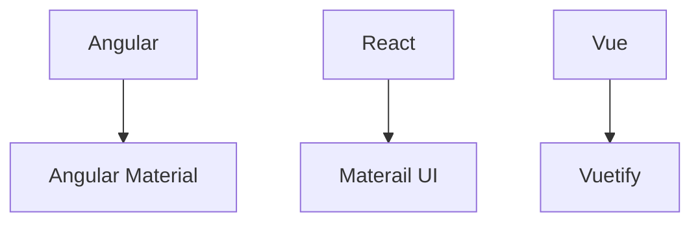
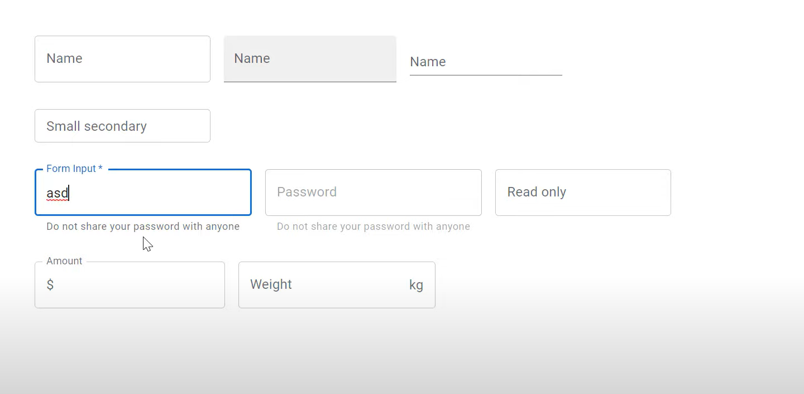

# Material UI

- Ul component library
- Provides us with components to build awesome user interfaces in quick time
- Implementation of Google's material design specification



## Contents

1. [Install MUI in a react application](#installation)
1. [Typography](#typography)
1. [Components](#components)
    - [Button](#button)
1. Inputs / Form controls
    - [Text field](#text-field)
    - [Dropdown Select](#select-dropdown)
    - [Radio Button](#radio-button)
    - [Checkbox Button](#checkbox)
    - [Switch Button](#switch)
    - [Rating Button](#rating)
    - [Autocomplete](#autocomplete)
1. [Layout](#layout)
    - [Box](#box)
1. Navigation
1. Data display and feedback
1. MUI Lab
1. MUI Customization

### Installation

```bash
npm install @mui/material @emotion/react @emotion/styled
```

- `@mui/material` is the core material library which provides us with ready-to-use components
- `@emotion` is a library designed for writing css styles with javascript and is the default styling solution

### Typography

`variant` in *Material-UI* is like a style or appearance option for a component. It's a way to easily change how something looks without having to manually specify all the details.

Boilerplate Code for `Typography`.
- There are *13* `varients` in `Typography`.
    - `6` Heading typography, `h1` to `h6`.
    - `subtitle1`, `subtitle2` Styles for subtitles or secondary text. It is in `h6` sementic tag.

    - `2` Paragrapgh typography
        - `body1` is the *default* `typography` tag. It's  *`font-size:16px`*
        - `body2`
    - `caption` to Styles for small or auxiliary text.
    - `button` Styles for button text.
    - `overline` Styles for an overline text.

- `2` props are:
    - `component` is to change semantic tag.
    - `gutterBottom` is to give `margin bottom`, it is defaultly `false`.


```jsx
// Component.tsx
import {Typography} from '@mui/material';

// ...

<Typography variant='h1'>h1 Heading</Typography>
<Typography variant='h2'>h2 Heading</Typography>
<Typography variant='h3'>h3 Heading</Typography>
<Typography variant='h4'>h4 Heading</Typography>
<Typography variant='h5'>h5 Heading</Typography>
<Typography variant='h6'>h6 Heading</Typography>

<Typography variant='subtitle1'>subtitle1</Typography>
<Typography variant='subtitle2'>subtitle2</Typography>

//...variant="body1" no need to add, default variant
<Typography> {/*variant="body1" no need to add, default variant*/}
  Lorem ipsum dolor sit amet, consectetur adipisicing elit. Nam saepe magnam
</Typography>
<Typography variant='body2'>
  Lorem ipsum dolor sit amet consectetur adipisicing elit. Dolorum, harum
  quam deserunt optio atque illo iste! Qui ullam ut nisi.
</Typography>

<Typography variant='h6' component="h1">h6 Heading</Typography>
<Typography variant='h6'gutterBottom>h4 Heading</Typography>
```

### Components

#### Button

1. It's an `anchor` elements, enhanced with Material Design.
1. It has *3* `variants` props.
    - `text` , `contained` and `outlined`
1. `color` prop is to change the background color of `<Button>` component.
    - `primary`,`secondary`,`error`,`warning`,`info`,`success`.
1. `size` prop is to change the size of the `<Button>` component.
1. To use icon-material, need to install `npm i @mui/icons-material`.
    - [Icon Link](https://mui.com/material-ui/material-icons/)
1. `<IconButtons>` is component for *icons* to show in UI. 
1. Button props: 
    - `disableElevation` is to disable the elevation of button.
    - `disableRipple` is to disable the ripple, means white glowing effect when cliking on the button. 
    - `onClick()` is to disable the ripple, means white glowing effect when cliking on the button.
1. `<ButtonGroup>` is used to stack the Button in one group.
    - You can use all `props` that are used in `<Button>` component.
    - It mandatory to use `aria-label` in `<ButtonGroup>` component.
1. Formatting button like `B`, *`I`*, `U` is <Formating...> components.
    - It toggles the button based on the <ToggleButtonGroup> onclick `handler` method.
    - value store the toggle button values in array.
    - You can use all `props` that are used in `<Button>` component i.e, `size`, `color` and `orientation`.
    - `exclusive` props is used to toggle only one button option among others. Use only string instead array of string.

```jsx
import {Button, IconButton, ButtonGroup, ToggleButtonGroup, ToggleButton} from '@mui/material';
import SendIcon from '@mui/icons-material/Send'
import FormatBoldIcon from '@mui/icons-material/FormatBold'
import FormatItalicIcon from '@mui/icons-material/FormatItalic'
import FormatUnderlinedIcon from '@mui/icons-material/FormatUnderlined'
// VARIANTS 
<Button variant='text'>Text</Button>
<Button variant='contained'>Contained</Button>
<Button variant='outlined'>Outlined</Button>


// COLOR
<Button variant='contained' color='primary'>Primary</Button>
<Button variant='contained' color='secondary'>Secondary</Button>
<Button variant='contained' color='error'>Error</Button>
<Button variant='contained' color='warning'>Warning</Button>
<Button variant='contained' color='info'>Info</Button>
<Button variant='contained' color='success'>Success</Button>

// SIZE
<Button variant='contained' size='small'>Small</Button>
<Button variant='contained' size='medium'>Medium</Button>
<Button variant='contained' size='large'>Large</Button>

// ICONS
<Button variant='contained' startIcon={<SendIcon />}>Send</Button>
<Button variant='contained' endIcon={<SendIcon />}>Send</Button>

// ICONS BUTTONS
<IconButton color='success' size='small' aria-label='send'>
  <SendIcon />
</IconButton>

// Button props
<Button variant='contained' startIcon={<SendIcon />} onClick={() => alert('onclick function')}>Send</Button>

// Button Groups
<ButtonGroup variant='contained'>
  <Button>Left</Button>
  <Button>center</Button>
  <Button>right</Button>
</ButtonGroup>
<ButtonGroup variant='text' orientation='vertical' size='small' color='secondary' aria-label='alignment button group'>
  <Button onClick={() => alert('Left clicked')}>Left</Button>
  <Button>center</Button>
  <Button>right</Button>
</ButtonGroup>

// Toggle Button

const [formats, setFormats] = useState<string[]>([])
console.log(formats)

const handleFormatChange = ( _event: React.MouseEvent<HTMLElement>, updatedFormats: string[]) => {
  setFormats(updatedFormats)
}

<ToggleButtonGroup aria-label='text formatting' value={formats} onChange={handleFormatChange}>
  <ToggleButton value='bold' aria-label='bold'>
    <FormatBoldIcon />
  </ToggleButton>
  <ToggleButton value='italic' aria-label='italic'>
    <FormatItalicIcon />
  </ToggleButton>
  <ToggleButton value='underlined' aria-label='underline'>
    <FormatUnderlinedIcon />
  </ToggleButton>
</ToggleButtonGroup>

// Exclusive Prop in ToggleButtonGroup

const [formats, setFormats] = useState<string | null>(null) // null is added
console.log(formats)

const handleFormatChange = ( _event: React.MouseEvent<HTMLElement>, updatedFormats: string | null) => {
  setFormats(updatedFormats)
}

<ToggleButtonGroup aria-label='text formatting' value={formats} onChange={handleFormatChange} exclusive>

  {/* ... */}

</ToggleButtonGroup>
```


#### Text Field

1. It's a Input text component, 
    - It has *3* `variants` props, `outlined`, `filled` and  `standard`.
1. It has 2 props `size` and `color`.
1. It has `required` prop.
1. `helperText` is used to show the text below the input field component.
1. `type` prop is used to change the input format like `password`.
1. `disabled` prop is used to disabled the input component
1. `inputProps`
    - `inputProps={{readOnly: true}}` is to use read-only property.
    -  Add suffix or prefix using `...adornment`
        - `startAdornment` and `endAdornment`.
    -  `<InputAdornment>`
1. `error` prop
```jsx
import {  TextField } from '@mui/material'

<TextField label='Name' variants="outlined"/>

<TextField label='Name' size="small" color="secondary"/>

// Required prop
<TextField label='Form input' required/>

// HelperText prop
<TextField label='Form input' helperText="Do not show your password to others."/>

// type prop
<TextField label='Form input' type="password" helperText="Do not show your password to others."/>

// Disable
<TextField label='Form input' type="password" disabled helperText="Do not show your password to others."/>

// Readonly
<TextField label='Read Only' InputProps={{readOnly: true}}/>

// Adorment
<TextField label='Amount' InputProps={{ startAdornment: <InputAdornment position='start'>$</InputAdornment>}}/>
<TextField  label='Weight' InputProps={{ endAdornment: <InputAdornment position='end'>kg</InputAdornment>}}/>

// Error prop 
<TextField label='Input form' error/>
```



#### Select Dropdown

1. It is used to show an option list based on the user's selection.
1. `fullwidth` prop is *width:100%*
1. Use `SelectProps={{multiple: true}}` prop for Multi select option and add a logic.
1. `size`, `color`, `helperText` and `error` props can used in select dropdown.
1. Use map list rendering to iterate the `<MenuItem>` in Select option and the values are came from API.


```jsx
const [countries, setCountries] = useState<string[]>([]);
console.log(countries);

const handleChange = (event: React.ChangeEvent<HTMLInputElement>) => {
  setCountries(event.target.value as string)
}

// Simple Basic Single Select dropdown component
<TextField label='Select country' select value={countries} onChange={handleChange} fullwidth>
  <MenuItem value='IN'>India</MenuItem>
  <MenuItem value='US'>USA</MenuItem>
  <MenuItem value='AU'>Australia</MenuItem>
</TextField>

// Multi select drowdown component
 const handleChange = (event: React.ChangeEvent<HTMLInputElement>) => {
    const value = event.target.value
    setCountries(typeof value === 'string' ? value.split(',') : value)
  }

<TextField label='Select country' select value={countries} onChange={handleChange}  SelectProps={{multiple: true}} fullwidth >
  <MenuItem value='IN'>India</MenuItem>
  <MenuItem value='US'>USA</MenuItem>
  <MenuItem value='AU'>Australia</MenuItem>
</TextField>
```

#### Radio button

1. Props are 
    - `row` in `<RadioGroup>`
    - `size`, `color` can be used in `<Radio/>`
    - `error` in `<FormControl>`
1. Add `<FormHelperText>` below the `<RadioGroup>` optional

```jsx
import { useState } from 'react'
import { FormControl,  FormLabel,  FormControlLabel,  RadioGroup,  Radio} from '@mui/material'

// Basic Radio Group buttons
<FormControl>
  <FormLabel id='job-experience-group-label'>Years of experience</FormLabel>
  <RadioGroup aria-labelledby='job-experience-group-label' name='job-experience-group'>
    <FormControlLabel value='0-2' control={<Radio size='small' color='secondary' />} label='0-2 years'/>
    <FormControlLabel value='3-5' control={<Radio size='small' color='secondary' />} label='3-5 years'/>
    <FormControlLabel value='6-10' control={<Radio size='small' color='secondary' />} label='6-10 years'/>
  </RadioGroup>
</FormControl>

// Handle value of the radio button
const [value, setValue] = useState('')
console.log(value)

const handleChange = (event: React.ChangeEvent<HTMLInputElement>) => {
  setValue(event.target.value)
}
<FormControl>
  <FormLabel id='job-experience-group-label'>Years of experience</FormLabel>
  <RadioGroup aria-labelledby='job-experience-group-label' name='job-experience-group' value={value} onChange={handleChange}>
    <FormControlLabel value='0-2' control={<Radio size='small' color='secondary' />} label='0-2 years'/>
    <FormControlLabel value='3-5' control={<Radio size='small' color='secondary' />} label='3-5 years'/>
    <FormControlLabel value='6-10' control={<Radio size='small' color='secondary' />} label='6-10 years'/>
  </RadioGroup>
</FormControl>


// Props
<RadioGroup aria-labelledby='job-experience-group-label' row >
  {/* ... */}
</RadioGroup>

// Props

<RadioGroup aria-labelledby='job-experience-group-label' row >
  {/* ... */}
</RadioGroup>
<FormHelperText>Invalid selection</FormHelperText>
```

#### Checkbox

1. Basic Props can use `size`, `checked`, `color` in `<Checkbox />`
1. Advanced props are `icon`, `checkedIcon`
1. Checkbox group
    - `row` prop in `<FormGroup>`.
    - `size`, `color` prop in `<Checkbox/>`
    - `error` prop in `<FormControl>` 


```jsx
import { useState } from 'react'
import {FormControlLabel,Checkbox,FormControl,FormLabel,FormGroup} from '@mui/material'
import BookmarkBorderIcon from '@mui/icons-material/BookmarkBorder'
import BookmarkIcon from '@mui/icons-material/Bookmark'

// Basic Checkbox
<FormControlLabel control={<Checkbox/>} label='Accept terms and conditions'/>

// Control checkbox
const [acceptTnC, setAcceptTnC] = useState(false)
const handleChange = (event: React.ChangeEvent<HTMLInputElement>) => {
  setAcceptTnC(event.target.checked)
}

<FormControlLabel control={<Checkbox checked={acceptTnC} onChange={handleChange}/>}label='Accept terms and conditions'/>


// Bookmark checkbox
<Checkbox icon={<BookmarkBorderIcon />} checkedIcon={<BookmarkIcon />} checked={acceptTnC} onChange={handleChange} />

// Checkbox Group
const [skills, setSkills] = useState<string[]>([])
    // skill.includes('html') => return true if it contains 'html' otherwise false

const handleSkillChange = (event: React.ChangeEvent<HTMLInputElement>) => {
  const index = skills.indexOf(event.target.value)
  if (index === -1) {
    setSkills([...skills, event.target.value])
  } else {
    setSkills(skills.filter(skill => skill !== event.target.value))
  }
}

 <FormControl>
  <FormLabel>Skills</FormLabel>
  <FormGroup>
    <FormControlLabel control={<Checkbox value='html' checked={skills.includes('html')} onChange={handleSkillChange}/>} label='HTML' />
    <FormControlLabel control={<Checkbox value='css' checked={skills.includes('css')} onChange={handleSkillChange}/>} label='CSS'/>
    <FormControlLabel control={<Checkbox value='javascript' checked={skills.includes('javascript')} onChange={handleSkillChange}/>} label='JavaScript'/>
  </FormGroup>
</FormControl>
```

#### Switch

1. Switch are used to toggle the button
1. Basic Props can use `size`, `checked`, `color` in `<Switch />`
1. Can be Group `FormGroup` same as `<Checkbox>`, just replace with `<Switch />`

```jsx
import { FormControlLabel, Switch } from '@mui/material'

// Basic switch component
<FormControlLabel control={<Switch/>} label='Dark mode'/>

// Handling the toggle value
const [checked, setChecked] = useState(false)
console.log(checked)
const handleChange = (event: React.ChangeEvent<HTMLInputElement>) => {
  setChecked(event.target.checked)
}
<FormControlLabel control={<Switch checked={checked} onChange={handleChange} />} label='Dark mode' />
```


#### Rating

1. Ratings provide insight regarding others opinions and can allow the user to submit a rating of their own.
1. onChange have 2 params 
    - event
    - newValue -> is the select user value
1. Props
    - `precision` -> *precision={0.5}*
    - `size` -> *size='large'*
    - `readOnly`
1. `highlightSelectedOnly` prop is used only highlight the user selected icon, 
    - *tip:* Emoji icons is good example to have `highlightSelectedOnly` prop
```jsx
import { Stack, Rating } from '@mui/material'
import { useState } from 'react'

// Basic ratings
<Rating/>

// Handling the Rating
const [value, setValue] = useState<number | null>(3)
console.log(value)

const handleChange = (  _event: React.ChangeEvent<{}>,  newValue: number | null) => {
  setValue(newValue)
}

<Rating  value={value} onChange={handleChange}/>

// Adding precision
<Rating  value={value} onChange={handleChange} precision={0.5}/>


// Adding Favorite Icon --Heart Icon--
import FavoriteIcon from '@mui/icons-material/Favorite'
import FavoriteBorderIcon from '@mui/icons-material/FavoriteBorder'

<Rating  value={value} onChange={handleChange} precision={0.5}  icon={<FavoriteIcon fontSize='inherit' color='error' />} emptyIcon={<FavoriteBorderIcon fontSize='inherit' />}/>


// Read Only
<Rating value={3} readonly/>

// Highlight selected only
<Rating value={value} onChange={handleChange} precision={0.5} size='large' icon={<FavoriteIcon fontSize='inherit' color='error' />} 
  emptyIcon={<FavoriteBorderIcon fontSize='inherit'/> highlightSelectedOnly}
/>
```

#### Autocomplete

1. It's an works like ComboBox and also have type search option
1. Props are:
    - `options`
    - `renderInput`, `params` are value to 
    - `label`
1. 
```jsx
import { Autocomplete, TextField } from '@mui/material'
import { useState } from 'react'

const skills = ['HTML', 'CSS', 'JavaScript', 'TypeScript', 'React']
 const [value, setValue] = useState<string | null>(null)

// Basics Autocomplete Combo box
<Autocomplete options={skills} renderInput={params => <TextField {...params} label='Skills' />}/>

// Track value in State
<Autocomplete options={skills} renderInput={params => <TextField {...params} label='Skills' value={value} onChange={(event: any, newValue: string | null) => { setValue(newValue) }} />}/>


// Add or Select any text instead of options -- add a freesolo prop
<Autocomplete options={skills} renderInput={params => <TextField {...params} label='Skills' value={value} onChange={(event: any, newValue: string | null) => { setValue(newValue) }} />}  freeSolo/>

// Array of object with id, label
type Skill = {
  id: number
  label: string
}

const [skill, setSkill] = useState<Skill | null>(null)

const skillsOptions = skills.map((skill, index) => ({
  id: index + 1,
  label: skill
}))

<Autocomplete
        options={skillsOptions}
        renderInput={params => <TextField {...params} label='Skills' />}
        value={skill}
        onChange={(_event: any, newValue: Skill | null) => {
          setSkill(newValue)
        }}
      />
```

### Layout

#### Box

1. The `Box` component is primarily a utility for styling and layout purposes,
1. `Box` is replacement of `div` tag/
1. props are:
    - `component` used for the root node. Either a string to use a HTML element or a component.
    - `sx` for custom styling.
1. CSS utility component  it supports what are called *material ui system properties* that simply means you can use a lot of the css properties as a *prop directly* on the component
1. Short names:
    - `bgcolor` - background-color
    - `p`       - padding, So here `p={2}` value is *`8 x 2 => 16px`*.  8 x n , It's multiplied by `8px`. 
```jsx
import { Box } from '@mui/material'

// Basic Box component
<Box>Codevolution</Box>

// Change the semantic tags names by component prop
<Box component="span">Codevolution</Box>


// Box stylings 
<Box component='span'
  sx={{
    backgroundColor: 'primary.main',
    color: 'white',
    height: '100px',
    width: '100px',
    padding: '16px',
    '&:hover': {
      backgroundColor: 'primary.light'
    }
  }}>
  Salman Hakeem
</Box>

// Box stylings with system properties 
<Box display='flex' height='100px'>Salman Hakeem</Box>

// Short name for system properties
 <Box display='flex' height='100px' width='100px' bgcolor='success.light' p={2}></Box>
```

#### Stack

1. The `<Stack>` component is used to manage layout in one dimension either along the *vertical* or the *horizontal* axis
1. CSS utility pass directly to the component as a props.
1. Props are:
    - `border`
    - `spacing`   - it means *gap*, So here `spacing={2}` value is *`8 x 2 => 16px`*.  8 x n , It's multiplied by `8px`.
    - `direction` - values are `row`, `row-reverse`, `column`, `column-reverse` 
    - `divider`   - divides the component

```jsx
import {  Stack } from '@mui/material'

// Basic
<Stack >
  <Box display='flex' height='100px' width='100px' bgcolor='primary'>Salman</Box>
  <Box display='flex' height='100px' width='100px' bgcolor='secondary'>Hakeem</Box>
</Stack>

// Props Stack
<Stack border='1px solid' spacing={2} direction='row' >
  <Box display='flex' height='100px' width='100px' bgcolor='primary'>Salman</Box>
  <Box display='flex' height='100px' width='100px' bgcolor='secondary'>Hakeem</Box>
</Stack>

// Divider prop
import {  Stack, Divider } from '@mui/material';

<Stack border='1px solid' spacing={2} direction='row' divider={<Divider orientation='vertical' flexitem>} >
  <Box display='flex' height='100px' width='100px' bgcolor='primary'>Salman</Box>
  <Box display='flex' height='100px' width='100px' bgcolor='secondary'>Hakeem</Box>
</Stack>
```


#### Grid

1. The grid component is useful for creating two-dimensional and responsive layouts.
1. The Grid component under the hood uses the flexbox module
1. The Grid consists of 12 columns
1. Each item in the grid can take up one or more columns as its width
1. There are five breakpoints each corresponding to a certain device width.
1. `xs` for mobile device size, `sm` for tablet, `md` for desktop, `lg` and `xl` for larger monitors.
1. We can assign integer values to each breakpoint which indicates how many of the 12 available columns are occupied by that item when the viewport satisfies that breakpoint constraints
1. Grid component has *2 variations*.
    - grid `container` for the parent.
    - grid `item` for children.
1. Breakpoints are:
    - `xs`
    - `sm`
    - `md`
    - `lg`
    - `xl`
1. props are
    - `spacing` means gap
    - `rowSpacing`
    - `columnSpacing`


```jsx
import {  Grid, Box } from '@mui/material';

// Basic 
<Grid container>
  <Grid item>
    <Box>Item 1</Box>
  </Grid>
  <Grid item>
    <Box>Item 2</Box>
  </Grid>
  <Grid item>
    <Box>Item 3</Box>
  </Grid>
  <Grid item>
    <Box>Item 4</Box>
  </Grid>
</Grid>

// Breakpoints xs - x-small 6 out of 12 columns means takes half of the width
<Grid container>
  <Grid item xs={6}>
    <Box>Item 1</Box>
  </Grid>
  <Grid item xs={6}>
    <Box>Item 2</Box>
  </Grid>
  <Grid item xs={6}>
    <Box>Item 3</Box>
  </Grid>
  <Grid item xs={6}>
    <Box>Item 4</Box>
  </Grid>
</Grid>
```

#### Paper

1. Paper component is a part of the Material Design system and is used to create surfaces that mimic the characteristics of paper. It is a simple container that provides elevation and a consistent background color.
1. It's used in `<Card>` component
1. Props are:
    - `sx` for styling
    - `elevation` for giving depth box-shadow surrounding of paper component

```jsx
import { Paper } from '@mui/material';

<Paper elevation={3} /* other styling props */>
      {/* Your content goes here */}
</Paper>
```

#### Card

1. In Material-UI, a Card is a higher-level component designed to represent a "card" or a surface containing related information.
1. It contains sub-components
    - `CardHeader`
    - `CardContent`
    - `CardActions`

```jsx
import { Card, CardContent, Typography} from '@mui/material';

// Basic card components
<Card>
  <CardContent>
    <Typography gutterBottom variant='h5' component='div'>
      React
    </Typography>
    <Typography variant='body2' color='text.secondary'>
      React is a JavaScript library for building user interfaces. React
      can be used as a base in the development of single-page or mobile
      applications.
    </Typography>
  </CardContent>
  
</Card>

// Card actions
<Card>
  <CardContent>
    <Typography gutterBottom variant='h5' component='div'>
      React
    </Typography>
    <Typography variant='body2' color='text.secondary'>
      React is a JavaScript library for building user interfaces. React
      can be used as a base in the development of single-page or mobile
      applications.
    </Typography>
  </CardContent>
  <CardActions>
    <Button size='small'>Share</Button>
    <Button size='small'>Learn More</Button>
  </CardActions>
</Card>

// Adding images to card, so use CardMedia
import { Card, CardContent, CardActions, CardMedia} from '@mui/material'

<Card>
  <CardMedia component='img' height='140' image='https://source.unsplash.com/random' alt='unsplash image' />
  <CardContent>
    ...
  </CardContent>
  <CardActions>
    ...
  </CardActions>
</Card>
```

#### Accordion

