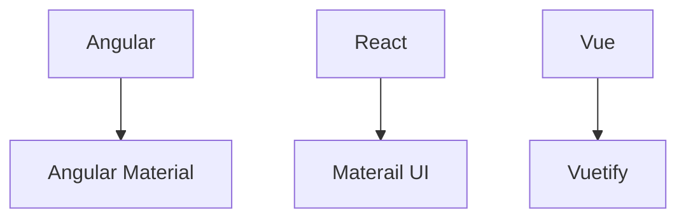

# Material UI

- Ul component library
- Provides us with components to build awesome user interfaces in quick time
- Implementation of Google's material design specification



## Contents

1. [Install MUI in a react application](#installation)
1. [Typography](#typography)
1. Components
1. Inputs / Form controls
1. Layout
1. Navigation
1. Data display and feedback
1. MUI Lab
1. MUI Customization

### Installation

```bash
npm install @mui/material @emotion/react @emotion/styled
```

- `@mui/material` is the core material library which provides us with ready-to-use components
- `@emotion` is a library designed for writing css styles with javascript and is the default styling solution

### Typography

Boilerplate Code for `Typography`.
- There are *13* `varients` in `Typography`.
    - `6` Heading typography, `h1` to `h6`.
    - `subtitle1`, `subtitle2` Styles for subtitles or secondary text. It is in `h6` sementic tag.

    - `2` Paragrapgh typography
        - `body1` is the *default* `typography` tag. It's  *`font-size:16px`*
        - `body2`
    - `caption` to Styles for small or auxiliary text.
    - `button` Styles for button text.
    - `overline` Styles for an overline text.

- `2` props are:
    - `component` is to change semantic tag.
    - `gutterBottom` is to give `margin bottom`, it is defaultly `false`.


```jsx
// Component.tsx
import {Typography} from '@mui/material';

// ...

<Typography variant='h1'>h1 Heading</Typography>
<Typography variant='h2'>h2 Heading</Typography>
<Typography variant='h3'>h3 Heading</Typography>
<Typography variant='h4'>h4 Heading</Typography>
<Typography variant='h5'>h5 Heading</Typography>
<Typography variant='h6'>h6 Heading</Typography>

<Typography variant='subtitle1'>subtitle1</Typography>
<Typography variant='subtitle2'>subtitle2</Typography>

//...variant="body1" no need to add, default variant
<Typography> {/*variant="body1" no need to add, default variant*/}
  Lorem ipsum dolor sit amet, consectetur adipisicing elit. Nam saepe magnam
</Typography>
<Typography variant='body2'>
  Lorem ipsum dolor sit amet consectetur adipisicing elit. Dolorum, harum
  quam deserunt optio atque illo iste! Qui ullam ut nisi.
</Typography>

<Typography variant='h6' component="h1">h6 Heading</Typography>
<Typography variant='h6'gutterBottom>h4 Heading</Typography>
```

### Components

#### Button

1. It's an `anchor` elements, enhanced with Material Design.

```jsx
import {Button} from '@mui/material';

// ...

```