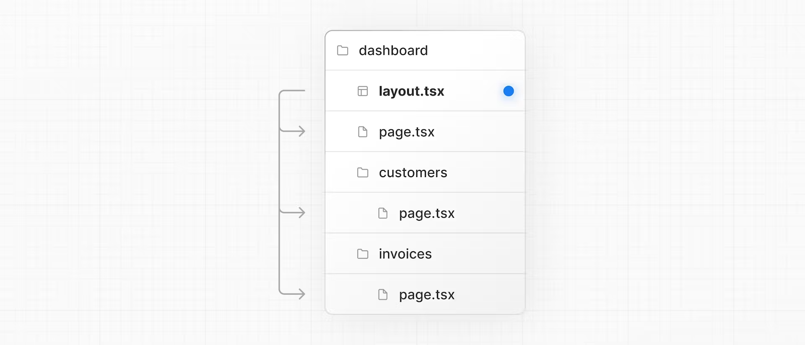

# NExt.js

1. Next.js is a flexible **React framework** that gives you building blocks to create fast web applications.
1. You can use React to build your UI, then incrementally adopt Next.js features to solve common application requirements such as routing, data fetching, integrations - all while improving the developer and end-user experience.

## Installation of Next app

**To create *Next* App**

```shell
$ npm init  
$ npm install create-next-app   
$ npx create-next-app appName  
$ npm run dev  
```

## Navigating with Pages

1. **Pages** directory is the important directory for navigating pages.
1. `/` is root directory for every page. 
1. Add pages in this directory to show in browser, `first-post.js`
1. Import `next/link` in component to add links.

```js
import Link from 'next/link';

// ...

<Link href="/">Back to home</Link>

// ...
```


## Adding Assets, Metadata and Images

1. Add images in `public` directory.
1. Import `image` module from `next` package, instead of using `` tag.
1. Import `head` component from `next` package, and use this instead of `<head>` ... `</head>` tag.
1. Import `script` component from `next` package, and use this instead of `<script>`... `</script>`.

```js
import Head from 'next/head';
import Link from 'next/link';
import Image from 'next/image';
import Script from 'next/script';

export default function FirstPost() {
  return (
    <>
      <Head>
        <title>First Post</title>
      </Head>
      <Script
        src="https://connect.facebook.net/en_US/sdk.js"
        strategy="lazyOnload"
        onLoad={() =>
          console.log(`script loaded correctly, window.FB has been populated`)
        }
      />
      <h1>First Post</h1>
      <h2>
        <Link href="/">← Back to home</Link>
      </h2>
      <Image
    src="/images/profile.jpg" // Route of the image file
    height={144} // Desired size with correct aspect ratio
    width={144} // Desired size with correct aspect ratio
    alt="Your Name"
  />
    </>
  );
}
```

## CSS Styling

CSS modules allow you to locally scope CSS at the component-level by automatically creating unique class names. This allows you to use the same CSS class name in different files without worrying about class name collisions.

1. In addition to CSS modules, you can style your Next.js application in a variety of ways, including:
    - Sass which allows you to import `.css` and `.scss` files.
    - PostCSS libraries like [Tailwind CSS](https://github.com/vercel/next.js/tree/canary/examples/with-tailwindcss).
    - CSS-in-JS libraries such as [styled-jsx](https://github.com/vercel/styled-jsx), [styled-components](https://github.com/vercel/next.js/tree/canary/examples/with-styled-components), and [emotion](https://github.com/vercel/next.js/tree/canary/examples/with-emotion)


#### Layout Component

Follow this [link](https://nextjs.org/learn/basics/assets-metadata-css/layout-component)

- Create a top-level directory called `components`.
- Inside `components`, create a file called `layout.js`.
- Create a CSS file called `components/layout.module.css`

<table>
  <tr>
    <th>index.js</th>
    <th>layout.js</th>
    <th>layout.module.css</th>
  </tr>
  <tr>
    <td>
    
  ```js
  import Head from 'next/head';
  import Link from 'next/link';
  import Layout from './layout';

  export default function FirstPost() {
    return (
      <Layout>
        <Head>
          <title>First Post</title>
        </Head>
        <h1>First Post</h1>
        <h2>
          <Link href="/">← Back to home</Link>
        </h2>
      </Layout>
    );
  }
  ```

  </td>
  <td>
  
  ```js
  import styles from './layout.module.css';

  export default function Layout({ children }) {
    return <div className={styles.container}>{children}</div>;
  }
  ```
  
  </td>
  <td>
  
  ```css
  .container {
    max-width: 36rem;
    padding: 0 1rem;
    margin: 3rem auto 6rem;
  }
  ```
  
  </td>
  </tr>
</table>

#### Global Styles

1. ***CSS Modules*** are useful for *component-level* styles. But if you want some CSS to be loaded by **every page**, Next.js has support for that as well, **Global CSS**.
1. You can use this component to keep state when navigating between pages, or to add global styles as we're doing here.
1. create a file called `pages/_app.js`
    - ```js
      // `pages/_app.js`
      import '../styles/global.css';

      export default function App({ Component, pageProps }) {
        return <Component {...pageProps} />;
      }
      ```
1. - Create a top-level styles directory and a global.css file.
   - Add the following CSS inside styles/global.css. This code resets some styles and changes the color of the a tag:
   - ```js
      html,
      body {
        padding: 0;
        margin: 0;
        font-family: -apple-system, BlinkMacSystemFont, Segoe UI, Roboto, Oxygen, Ubuntu,
          Cantarell, Fira Sans, Droid Sans, Helvetica Neue, sans-serif;
        line-height: 1.6;
        font-size: 18px;
      }

      * {
        box-sizing: border-box;
      }
     ```


## [TIPS](https://nextjs.org/learn/basics/assets-metadata-css/styling-tips)

## Using Sass
You can use component-level Sass via CSS Modules and the `.module.scss` or `.module.sass` extension.

>  npm install -D sass


## Pre-rendering and Data Fetching

By default, Next.js pre-renders every page. This means that Next.js *generates HTML for each page in advance*.

Each generated HTML is associated with minimal JavaScript code necessary for that page. When a page is loaded by the browser, its JavaScript code runs and makes the page fully interactive. (This process is called **hydration**.)


--
---

**Two Forms of Pre-rendering**

- **Static Generation** is the pre-rendering method that generates the HTML at **build time**. The pre-rendered HTML is then *reused* on each request.
- **Server-side Rendering** is the pre-rendering method that generates the HTML on each request.


> We can create *Hybrid app* by mixing two forms also on one app.

#### When to Use Static Generation v.s. Server-side Rendering

We recommend using **Static Generation**(with and without data) whenever possible because your page can be built once and served by CDN, which makes it much faster than having a server render the page on every request.

You can use Static Generation for many types of pages, including:

- Marketing pages
- Blog posts
- E-commerce product listings
- Help and documentation

You should ask yourself: "Can I pre-render this page **ahead** of a user's request?" If the answer is yes, then you should choose Static Generation.

On the other hand, Static Generation is **not** a good idea if you cannot pre-render a page ahead of a user's request. Maybe your page shows frequently updated data, and the page content changes on every request.

In that case, you can use **Server-side Rendering**. It will be slower, but the pre-rendered page will always be up-to-date. Or you can skip pre-rendering and use client-side JavaScript to populate frequently updated data.


## CSS Modules

[CSS Modules](https://nextjs.org/docs/basic-features/built-in-css-support) allow you to scope CSS to a component by automatically creating unique class names, so you don't have to worry about style collisions as well.

CSS Modules create unique class names for each component, so you don't have to worry about style collisions.

```css
/* /app/ui/home.module.css */

.shape {
  height: 0;
  width: 0;
  border-bottom: 30px solid black;
  border-left: 20px solid transparent;
  border-right: 20px solid transparent;
}
```

```js
//  /app/page.tsx
import styles from '@/app/ui/home.module.css';
<div className={styles.shape} />;
```
### clsx conditional CSS styling

[clsx](https://www.npmjs.com/package/clsx) is a library that lets you toggle class names easily. We recommend taking a look at documentation for more details, but here's the basic usage:

```jsx
import clsx from 'clsx';
 
export default function InvoiceStatus({ status }: { status: string }) {
  return (
    <span
      className={clsx(
        'inline-flex items-center rounded-full px-2 py-1 text-sm',
        {
          'bg-gray-100 text-gray-500': status === 'pending',
          'bg-green-500 text-white': status === 'paid',
        },
      )}
    >
    // ...
)}
```

In addition to the approaches we've discussed, you can also style your Next.js application with:

Sass which allows you to import .css and .scss files.
CSS-in-JS libraries such as styled-jsx, styled-components, and emotion.


## Fonts
Next.js automatically optimizes fonts in the application when you use the` next/font `module. I

Next.js downloads font files at build time and hosts them with your other static assets. This means when a user visits your application, there are no additional network requests for fonts which would impact performance.


### addding fonts

In your `/app/ui` folder, create a new file called `fonts.ts`. You'll use this file to keep the fonts that will be used throughout your application.

```tsx
// /app/ui/fonts.ts
import { Inter } from 'next/font/google';
 
export const inter = Inter({ subsets: ['latin'] });
```

```ts

// /app/layout.tsx
import '@/app/ui/global.css';
import { inter } from '@/app/ui/fonts';
 
export default function RootLayout({
  children,
}: {
  children: React.ReactNode;
}) {
  return (
    <html lang="en">
      <body className={`${inter.className} antialiased`}>{children}</body>
    </html>
  );
}
```

## The `<Image>` component

Images without dimensions and web fonts are common causes of layout shift due to the browser having to download additional resources.

```diff
import AcmeLogo from '@/app/ui/acme-logo';
import { ArrowRightIcon } from '@heroicons/react/24/outline';
import Link from 'next/link';
import { lusitana } from '@/app/ui/fonts';
+ import Image from 'next/image';
 
export default function Page() {
  return (
    // ...
    <div className="flex items-center justify-center p-6 md:w-3/5 md:px-28 md:py-12">
      {/* Add Hero Images Here */}
+      <Image
+        src="/hero-desktop.png"
+        width={1000}
+        height={760}
+        className="hidden md:block"
+        alt="Screenshots of the dashboard project showing desktop version"
+      />
    </div>
    //...
  );
}
```


## Page Routing

Nested routing
Next.js uses file-system routing where folders are used to create nested routes. Each folder represents a route segment that maps to a URL segment.


You can create separate UIs for each route using `layout.tsx` and `page.tsx `files.

`/app/page.tsx `- this is the home page associated with the route `/`


> Create a `dashboard` folder in `app` folder and in that add a `page.tsx`

```jsx
export default function Page() {
  return <p>Dashboard Page</p>;
}
```

## Creating the layout

What is the purpose of the layout file in Next.js?

the layout file is the best way to create a shared layout that all pages in your application can use.

One benefit of using layouts in Next.js is that on navigation, only the page components update while the layout won't re-render. This is called partial rendering:

The `<Layout />` component receives a children prop. This child can either be a page or another layout. In your case, the pages inside `/dashboard` will automatically be nested inside a `<Layout />` like so:



## Navigation Link

To link between pages, you'd traditionally use the `<a>` HTML element. At the moment, the sidebar links use `<a>` elements, but notice what happens when you navigate between the home, invoices, and customers pages on your browser.

Did you see it?

There's a full page refresh on each page navigation!

`<Link>` allows you to do client-side navigation with JavaScript.


```tsx
import {
  UserGroupIcon,
  HomeIcon,
  DocumentDuplicateIcon,
} from '@heroicons/react/24/outline';
import Link from 'next/link'; //      <<<<<<<-----------------------
 
// ...
 
export default function NavLinks() {
  return (
    <>
      {links.map((link) => {
        const LinkIcon = link.icon;
        return (
          <Link               //      <<<<<<<-----------------------
            key={link.name}
            href={link.href}
            className="flex h-[48px] grow items-center justify-center gap-2 rounded-md bg-gray-50 p-3 text-sm font-medium hover:bg-sky-100 hover:text-blue-600 md:flex-none md:justify-start md:p-2 md:px-3"
          >
            <LinkIcon className="w-6" />
            <p className="hidden md:block">{link.name}</p>
          </Link>
        );
      })}
    </>
  );
}
```

In production, whenever `<Link>` components appear in the browser's viewport, Next.js automatically prefetches the code for the linked route in the background. 


### Pattern: Showing active links


A common UI pattern is to show an active link to indicate to the user what page they are currently on. To do this, you need to get the user's current path from the URL. Next.js provides a hook called `usePathname()` that you can use to check the path and implement this pattern.


```diff
+ 'use client';
 
import {
  UserGroupIcon,
  HomeIcon,
  DocumentDuplicateIcon,
} from '@heroicons/react/24/outline';
import Link from 'next/link';
+ import { usePathname } from 'next/navigation';
+ import clsx from 'clsx';
 
// ...
 
export default function NavLinks() {
+  const pathname = usePathname();
 
  return (
    <>
      {links.map((link) => {
        const LinkIcon = link.icon;
        return (
          <Link
            key={link.name}
            href={link.href}
+            className={clsx(
+              'flex h-[48px] grow items-center justify-center gap-2 rounded-md bg-gray-50 p-3 text-sm font-medium hover:bg-sky-100 hover:text-blue-600 md:flex-none md:justify-start md:p-2 md:px-3',
+              {
+                'bg-sky-100 text-blue-600': pathname === link.href,
+              },
+            )}
          >
            <LinkIcon className="w-6" />
            <p className="hidden md:block">{link.name}</p>
          </Link>
        );
      })}
    </>
  );
}
```

## Setting up the Database


## Fetching the database

**APIs are an intermediary layer between your application code and database. There are a few cases where you might use an API:**
- If you're using 3rd party services that provide an API.
- If you're fetching data from the client, you want to have an API layer that runs on the server to avoid exposing your database secrets to the client.

**There are a few cases where you have to write database queries:**
- When creating your API endpoints, you need to write logic to interact with your database.
- If you are using React Server Components (fetching data on the server), you can skip the API layer, and query your database directly without risking exposing your database secrets to the client.

**In which of these scenarios should you not query your database directly?** - 
`when fetching data on the client as this would expose your database secrets.`

**Server components**
- Server components allow you fetch data directly from your database.
- Server Components support promises, providing a simpler solution for asynchronous tasks like data fetching. You can use async/await syntax without reaching out for useEffect, useState or data fetching libraries.
- Server Components execute on the server, so you can keep expensive data fetches and logic on the server and only send the result to the client.

