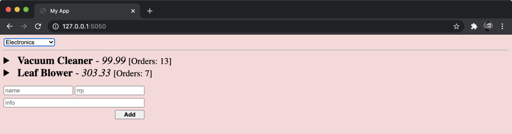

# Modifying and Receiving Server-Side State in Real-Time

## Part 1:

1. **State Handling**: 
   - Holding state directly in a Node process is not ideal for production, but it can be used for mocking a real-time server with state.
   - This approach can be later integrated with a database for production use.

2. **New POST Route**:
   - A POST route will be added for the `/orders/{ID}` endpoint.
   - This route will handle POST requests that increment the total for a given product.

3. **WebSocket Updates**:
   - The WebSocket connection will no longer send simulated orders.
   - It will send only the current order totals and any new order totals resulting from POST requests to the `/orders/{ID}` endpoint.


- We'll add the new POST route in `mock-srv/routes/orders/index.mjs` by modifying it to the following:

    - ```diff
        "use strict";

        export default async function (fastify, opts) {
          function monitorMessages(socket) {
            socket.on("message", (data) => {
              const message = JSON.parse(data);
              try {
                if (message.cmd === "update-category") {
                  return sendCurrentOrders(message.payload.category, socket);
                }
              } catch (err) {
                fastify.log.warn(
                  "WebSocket Message (data: %o) Error: %s",
                  message,
                  err.message
                );
              }
            });
          }

          function sendCurrentOrders(category, socket) {
          const orders = Array.from(fastify.currentOrders(category));
          for (const order of orders) {
            socket.send(order);
          }
        }

          fastify.get(
            "/:category",
            { websocket: true },
            async ({ socket }, request) => {
              monitorMessages(socket);
              sendCurrentOrders(request.params.category, socket);
              for await (const order of fastify.realtimeOrders()) {
                if (socket.readyState >= socket.CLOSING) break;
                socket.send(order);
              }
            }
          );

      +    fastify.post("/:id", async (request) => {
      +      const { id } = request.params;
      +      fastify.addOrder(id, request.body.amount);
      +      return { ok: true };
      +    });
      +  }
      ```

## Part 2:

- Added a new `POST` route at `/:id` using Fastify.
- The `id` is extracted from `request.params` in the route handler.
- The `id` and `request.body.amount` are passed to a method called `fastify.addOrder`.
- The `fastify.addOrder` method hasn't been implemented yet and will be added in `mock-srv/plugins/data-utils.mjs`.
- The route returns an object with an `ok` property set to `true`.
- Fastify sends this response back to the client as serialized JSON.
- Let's alter the top of `mock-srv/plugins/data-utils.mjs` to the following:
```diff
  "use strict";
  import fp from "fastify-plugin";
+ import { PassThrough } from "node:stream";
- import { promisify } from "node:util";

- // Promisify setTimeout
- const timeout = promisify(setTimeout);

  // Mock data
  const orders = {
    A1: { total: 3 },
    A2: { total: 7 },
    B1: { total: 101 },
  };

  // Map category to ID prefix
  const catToPrefix = {
    electronics: "A",
    confectionery: "B",
  };
```

- The `orders` and `catToPrefix` objects remain unchanged.
- The `promisify` function and the `timeout` function have been removed.
- The `PassThrough` constructor from the `streams` module is now being used.
- Node.js streams handle continuous data and come in various types: readable, writable, and hybrid streams (e.g., duplex, transform, and passthrough).
- Readable streams are async iterables, allowing the use of `for await of` loops, similar to the WebSocket route handler in `mock-srv/routes/orders/index.mjs`.
- A passthrough stream sends any writes directly to its readable side without modifications.
- The `PassThrough` stream is being used to handle the continuous flow of orders sent via POST requests to the `/orders/{id}` route.
- For more details on Node streams, the following resources are recommended:
  - [Node.js Documentation](https://nodejs.org/docs/latest-v18.x/api/stream.html)
  - [Stream.PassThrough](https://nodejs.org/docs/latest-v18.x/api/stream.html#class-streampassthrough)
  - [Streams Compatibility with async Generators and async Iterators](https://nodejs.org/docs/latest-v18.x/api/stream.html#streams-compatibility-with-async-generators-and-async-iterators)
- Let's remove the `realtimeOrdersSimulator` async generator function and replace it with the following:

```js
// Create a stream of orders
const orderStream = new PassThrough({ objectMode: true });

// Simulate real-time orders
async function* realtimeOrdersSimulator() {
  for await (const { id, total } of orderStream) {
    yield JSON.stringify({ id, total });
  }
}
```

## Part 3:

- An object-mode passthrough stream named `orderStream` is created, which allows objects to be written to it instead of just binary data.
- The `realtimeOrders` function uses a `for await of` loop to asynchronously iterate over the `orderStream`.
- The function yields serialized objects containing `id` and `total` values from objects written to `orderStream`.
- The next step is to implement the `addOrders` function, which will write data to `orderStream`.
- This writing process will drive the `for await of` loop in the `realtimeOrders` async generator function.
- The next code additions are to be made to `mock-srv/plugins/data-utils.mjs` under the `realtimeOrders` function.

```js
// Add order to stream and update total
function addOrder(id, amount) {
  if (orders.hasOwnProperty(id) === false) {
    const err = new Error(`Order ${id} not found`);
    err.status = 404;
    throw err;
  }
  if (Number.isInteger(amount) === false) {
    const err = new Error('Supplied amount must be an integer');
    err.status = 400;
    throw err;
  }
  orders[id].total += amount;
  const { total } = orders[id]
  console.log("Adding order: %o", { id, total });
  orderStream.write({ id, total });
}
```

- **Fastify Instance Decoration**: The next step involves decorating the Fastify instance with the `addOrder` function, which is called from the new POST route.

- **Error Handling**:
  - If the `id` isn't found in the `orders` object, a 404 error is thrown and converted into an HTTP 404 Not Found response by Fastify.
  - The `amount` is checked to ensure it's an integer using `Number.isInteger`. If it's not, a 400 error is thrown and converted into an HTTP 400 Bad Request response.
  
- **Type Validation**: It's suggested that type checking should be handled using Fastify schemas rather than manually in the `addOrder` function. This is left as an exercise for the reader.

- **Order Processing**:
  - If validation passes, the `amount` is added to the total for the given `id`.
  - The updated `id` and new total are written to the `orderStream`.

- The final part of mock-srv/plugins/data-utils.mjs should look like so:

```js
// Plugin
export default fp(async function (fastify, opts) {
  fastify.decorate("currentOrders", currentOrders);
  fastify.decorate("realtimeOrders", realtimeOrdersSimulator);
  fastify.decorate("addOrder", addOrder);       // <-------------------- added here
  fastify.decorate("mockDataInsert", function (request, category, data) {
    const idPrefix = catToPrefix[category];
    const id = calculateID(idPrefix, data);
    data.push({ id, ...request.body });
    return data;
  });
});
```

## Part 4:

- The **exported plugin function** has been updated to:
  - Reference the newly created `realtimeOrders` function instead of the previous `realtimeOrdersSimulator` function.
  - Add a new decorator to the Fastify instance called `addOrder`, which references the `addOrder` function.
  
- These updates allow the `addOrder` function to be used in the new POST route. 

- The `mock-srv/plugins/data-utils.mjs` file now includes these changes, ensuring that the new functions are correctly integrated with Fastify.

```js
"use strict";
import fastify from "fastify";
import fp from "fastify-plugin";
import { PassThrough } from "node:stream";

 

// Mock data
const orders = {
  A1: { total: 3 },
  A2: { total: 7 },
  B1: { total: 101 },
};

// Map category to ID prefix
const catToPrefix = {
  electronics: "A",
  confectionery: "B",
};

// Create a stream of orders
const orderStream = new PassThrough({ objectMode: true });

// Simulate real-time orders
async function* realtimeOrdersSimulator() {
  for await (const { id, total } of orderStream) {
    yield JSON.stringify({ id, total });
  }
}

// Add order to stream and update total
function addOrder(id, amount) {
  if (orders.hasOwnProperty(id) === false) {
    const err = new Error(`Order ${id} not found`);
    err.status = 404;
    throw err;
  }
  if (Number.isInteger(amount) === false) {
    const err = new Error('Supplied amount must be an integer');
    err.status = 400;
    throw err;
  }
  orders[id].total += amount;
  const { total } = orders[id]
  orderStream.write({ id, total });
}

// Return current orders
function* currentOrders(category) {
  const idPrefix = catToPrefix[category];
  if (!idPrefix) return;
  const ids = Object.keys(orders).filter((id) => id[0] === idPrefix);
  for (const id of ids) {
    yield JSON.stringify({ id, ...orders[id] });
  }
}

// Calculate next ID
const calculateID = (idPrefix, data) => {
  const sorted = [...new Set(data.map(({ id }) => id))];
  const next = Number(sorted.pop().slice(1)) + 1;
  return `${idPrefix}${next}`;
};

// Plugin
export default fp(async function (fastify, opts) {
  debugger
  fastify.decorate("currentOrders", currentOrders);
  fastify.decorate("realtimeOrders", realtimeOrdersSimulator);
  fastify.decorate("addOrder", addOrder);
  fastify.decorate("mockDataInsert", function (request, category, data) {
    const idPrefix = catToPrefix[category];
    const id = calculateID(idPrefix, data);
    data.push({ id, ...request.body });
    return data;
  });
});
```

## Part 5:

- The entire "happy-path" for this new feature is as follows:
  - Once a client establishes a WebSocket connection with the server, it receives all the current order totals for the selected category. Then the for await of loop in the /orders/{category} WebSocket route handler begins waiting for a new serialized order object to be yielded from the async iterable returned from fastify.realtimeOrders. If a valid POST request is then made to /orders/{ID} for a particular ID (one corresponding to a product in the currently selected category within the web app) then the amount indicated in the POST request is added to the order tally for that item.

  - The async iterable returned from the fastify.realtimeOrders async generator function which is being awaited in the /orders/{category} WebSocket route handler will then yield a serialized object containing the new total and the product ID, which will then be written to the socket instance. The client will receive this serialized object, parse it and then add the new total to the corresponding order slot of the <product-item> element in the web app.

  - The `for await of` loop in the /orders/{category} WebSocket route handler will then again be waiting for the next serialized order object to be yielded from the async iterable. The reason the async iterable returned from realtimeOrders yields the new total as a result of the POST request's given amount is that the addOrders function calls the write method of the orderStream passthrough stream. The passthrough stream is itself an async iterable, and the realtimeOrders async generator function is using a for await of loop to asynchronously iterate through each object that is written to orderStream so that it can yield the id and total properties in a serialized object.

If the prior explanation is a little unclear, it may become clearer by trying out the functionality and then re-reading it afterward. Let's start our server and web app by running npm run dev in the mock-srv folder and npm run static in the project root. If we navigate to http://localhost:5050 and select the Electronics category, we will see our two products with order counts of 3 and 7, respectively. If we now run the following command in a third terminal window, we can execute a POST request to add Vacuum Cleaner orders:

```bash
$ node -e "http.request('http://localhost:3000/orders/A1', { method: \ 'POST', headers: {'content-type': 'application/json'}}, (res) => \ res.pipe(process.stdout)).end(JSON.stringify({amount: 10}))"
```
Or you can use curl to make the request from the terminal:

```bash
$ curl -X POST -H "Content-Type: application/json" -d '{"amount": 10}' http://localhost:3000/orders/A1
```

- This makes a POST request to http://localhost:3000/orders/A1 with a JSON payload of {"amount": 10}.

- This command should output {"ok":true} (which is the HTTP response body) to the terminal and exit. The web app should then look as follows:
- 

