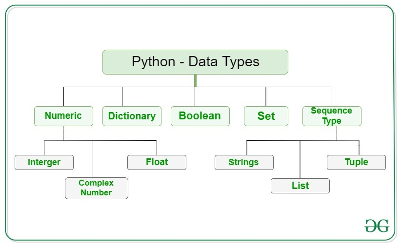
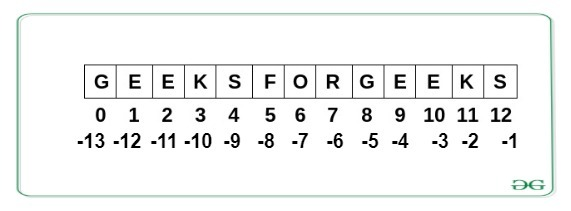

- This course is brought to you by GFG - Introduction to Python

## Run pythong script
```bash
python intro.py
# py intro.py      <--- alternate command
```

## Variables

- Variables **need not be declared** first in python.
- They can be used directly.
- Variables in python are **case-sensitive** as most of the other programming languages.

```py
a = 3
A = 4
print (a)
print (A)

# output
# 3
# 4
```

## Conditions in Python

- Conditional output in python can be obtained by using if-else and elif (else if) statements. 

```py
a = 3
b = 9
if b % a == 0 :
    print ("b is divisible by a")
elif b + 1 == 10:
    print ("Increment in b produces 10")
else:
    print ("You are in else statement")
```


## Functions

- A function in python is declared by the keyword `def` before the name of the function.
- The *return* type of the function need **not** be specified **explicitly** in python.
- The function can be **invoked** by writing the function name followed by the parameter list in the brackets.

```py
# Function for checking the divisibility
# Notice the indentation after function declaration
# and if and else statements
def checkDivisibility(a, b):
    if a % b == 0 :
        print ("a is divisible by b")
    else:
        print ("a is not divisible by b")
#Driver program to test the above function
checkDivisibility(4, 2)
```

## Data Types



- Everything is an object in Python programming, data types are actually classes and variables are instances (objects) of these classes.
- Following are the standard or built-in data types of Python:
    1. Numeric
    1. Sequence Type
    1. Boolean
    1. Set
    1. Dictionary

### 1. Numeric

- In Python, numeric data type represents the data that has a numeric value.
    - **Integers** - This value is represented by **int class.** It contains positive or negative whole numbers (without fractions or decimals).
        - In Python, there is **no limit** to how long an integer value can be.
    - **Float** - This value is represented by the **float class**. It is a real number with a floating-point representation. It is specified by a decimal point. Optionally, the character **e or E followed by a positive or negative integer** may be appended to specify scientific notation.
    - **Complex Numbers** - Complex number is represented by a **complex class**. It is specified as (real part) + (imaginary part)j. For example - 2+3j

> Note - type() function is used to determine the type of data type.


```py
# Python program to 
# demonstrate numeric value

a = 5
print("Type of a: ", type(a))

b = 5.0
print("\nType of b: ", type(b))

c = 2 + 4j
print("\nType of c: ", type(c))

# output
# Type of a:  <class 'int'>Type of b:  <class 'float'>Type of c:  <class 'complex'>
```

### 2. Sequence Type

- In Python, the sequence is the ordered collection of similar or different data types. Sequences allow to store multiple values in an organized and efficient fashion.
  - String
  - List
  - Tuple

#### 1. Strings

- Strings are arrays of bytes representing Unicode characters.
- A string is a collection of one or more characters put in a **single quote**, **double-quote** or **triple quote**.
- In python there is **no character data type**, a character is a string of length one. It is represented by str class.  
    -   ```py
        # Python Program for 
        # Creation of String 
        
        # Creating a String  
        # with single Quotes 
        String1 = 'Welcome to the Geeks World'
        print("String with the use of Single Quotes: ") 
        print(String1) 
        
        # Creating a String 
        # with double Quotes 
        String1 = "I'm a Geek"
        print("\nString with the use of Double Quotes: ") 
        print(String1) 
        print(type(String1))
        
        # Creating a String 
        # with triple Quotes 
        String1 = '''I'm a Geek and I live in a world of "Geeks"'''
        print("\nString with the use of Triple Quotes: ") 
        print(String1) 
        print(type(String1))

        # Creating String with triple 
        # Quotes allows multiple lines 
        String1 = '''Geeks 
                    For 
                    Life'''
        print("\nCreating a multiline String: ") 
        print(String1) 
        ```
##### Accessing String elements

- Individual characters of a String can be accessed by using the method of Indexing.
- Indexing allows negative address references to access characters from the back of the String, e.g. -1 refers to the last character, -2 refers to the second last character and so on.
    - 
    - ```py
        # Python Program to Access 
        # characters of String 
        
        String1 = "GeeksForGeeks"
        print("Initial String: ") 
        print(String1) 
        
        # Printing First character 
        print("\nFirst character of String is: ") 
        print(String1[0])                            # G
        
        # Printing Last character 
        print("\nLast character of String is: ") 
        print(String1[-1])                           # s
        ```
#### 2. List

- [Lists](https://www.geeksforgeeks.org/python-list/) are just like arrays, declared in other languages which is an ordered collection of data.
- It is very flexible as the items in a list do not need to be of the same type.  
    - ```py
      # Python program to demonstrate  
      # Creation of List
      # Lists in Python can be created by just placing the sequence inside the square brackets[]
      
      # Creating a List 
      List = [] 
      print("Initial blank List: ") 
      print(List) 
      
      # Creating a List with  
      # the use of a String 
      List = ['GeeksForGeeks'] 
      print("\nList with the use of String: ") 
      print(List)                                    # ['GeeksForGeeks']
      
      # Creating a List with 
      # the use of multiple values 
      List = ["Geeks", "For", "Geeks"] 
      print("\nList containing multiple values: ") 
      print(List[0])                                 # Geeks
      print(List[2])                                 # Geeks
      
      # Creating a Multi-Dimensional List 
      # (By Nesting a list inside a List) 
      List = [['Geeks', 'For'], ['Geeks']] 
      print("\nMulti-Dimensional List: ") 
      print(List)                                    # [['Geeks', 'For'], ['Geeks']]
      ```


**Accessing elements of List**
  - In order to access the list items refer to the index number. Use the index operator [ ] to access an item in a list. In Python, negative sequence indexes represent positions from the end of the array. Instead of having to compute the offset as in `List[len(List)-3]`, it is enough to just write `List[-3]`. Negative indexing means beginning from the end, -1 refers to the last item, -2 refers to the second-last item, etc


#### 3. Tuple

- Just like a list, [tuple](https://www.geeksforgeeks.org/python-tuples/) is also an ordered collection of Python objects.
- The only difference between tuple and list is that **tuples are immutable** i.e. tuples cannot be modified after it is created.
- It is represented by tuple class.

- In Python, tuples are created by placing a sequence of values separated by ‘comma’ with or without the use of parentheses for grouping of the data sequence.
- Tuples can contain any number of elements and of any datatype (like strings, integers, list, etc.).
- **Note**: Tuples can also be created with a single element, but it is a bit tricky. Having one element in the parentheses is not sufficient, there must be a trailing ‘comma’ to make it a tuple. 
    - ```py
      # Python program to demonstrate  
      # creation of Set 
      
      # Creating an empty tuple 
      Tuple1 = () 
      print("Initial empty Tuple: ") 
      print (Tuple1) 
      
      # Creating a Tuple with  
      # the use of Strings 
      Tuple1 = ('Geeks', 'For') 
      print("\nTuple with the use of String: ") 
      print(Tuple1) 
      
      # Creating a Tuple with 
      # the use of list 
      list1 = [1, 2, 4, 5, 6] 
      print("\nTuple using List: ") 
      print(tuple(list1)) 

      # Creating a Tuple with the 
      # use of built-in function 
      Tuple1 = tuple('Geeks') 
      print("\nTuple with the use of function: ") 
      print(Tuple1) 

      # Creating a Tuple  
      # with nested tuples 
      Tuple1 = (0, 1, 2, 3) 
      Tuple2 = ('python', 'geek') 
      Tuple3 = (Tuple1, Tuple2) 
      print("\nTuple with nested tuples: ") 
      print(Tuple3) 
      ```

**Accessing elements of Tuple**
    - Use the index operator [ ] to access an item in a tuple.
    - The index must be an integer.
    - Nested tuples are accessed using nested indexing.
  
### 3. Boolean

- Data type with one of the two built-in values, True or False.
- Boolean objects that are equal to True are truthy (true), and those equal to False are falsy (false).
- But non-Boolean objects can be evaluated in Boolean context as well and determined to be true or false. It is denoted by the class bool.

> Note - True and False with capital 'T' and 'F' are valid booleans otherwise python will throw an error.
- ```py
	# Python program to 
	# demonstrate boolean type

	print(type(True)) 		# <class 'bool'><class 'bool'>
	print(type(False))		# <class 'bool'><class 'bool'>

	print(type(true))			# Traceback (most recent call last):  File "/home/7e8862763fb66153d70824099d4f5fb7.py", line 8, in     print(type(true))NameError: name 'true' is not defined
	```

### 4. Set

- n Python, [Set](https://www.geeksforgeeks.org/python-sets/) is an unordered collection of data types that is **iterable**, **mutable**, and has **no duplicate** elements.
- The order of elements in a set is undefined though it may consist of various elements.
- Sets can be created by using the built-in `set()` function with an iterable object or a sequence by placing the sequence inside curly braces, separated by a ‘comma’.
- The type of elements in a set need not be the same, various mixed-up data type values can also be passed to the set. 
	-	```py
		# Python program to demonstrate  
		# Creation of Set in Python 
			
		# Creating a Set 
		set1 = set() 
		print("Initial blank Set: ") 
		print(set1) 
			
		# Creating a Set with  
		# the use of a String 
		set1 = set("GeeksForGeeks") 
		print("\nSet with the use of String: ") 
		print(set1) 

		# Creating a Set with 
		# the use of a List 
		set1 = set(["Geeks", "For", "Geeks"]) 
		print("\nSet with the use of List: ") 
		print(set1) 

		# Creating a Set with  
		# a mixed type of values 
		# (Having numbers and strings) 
		set1 = set([1, 2, 'Geeks', 4, 'For', 6, 'Geeks']) 
		print("\nSet with the use of Mixed Values") 
		print(set1) 
		```

**Accessing elements of Sets**
- Set items **cannot** be **accessed** by referring to **an index**, since sets are unordered the items has no index.
- But you can loop through the set items using a `for` loop, or a**sk if a specified value** is present in a set, by using in keyword. 
	- ```py
		# Python program to demonstrate 
		# Accessing of elements in a set 
			
		# Creating a set 
		set1 = set(["Geeks", "For", "Geeks"]) 
		print("\nInitial set") 
		print(set1) 
			
		# Accessing element using 
		# for loop 
		print("\nElements of set: ") 
		for i in set1: 
				print(i, end =" ") 
			
		# Checking the element 
		# using in keyword 
		print("Geeks" in set1) 

		# OUTPUT
		# ----------
		# Initial set: {'Geeks', 'For'}
		# Elements of set: Geeks For True
		```


### 5. Dictionary

- [Dictionary](https://www.geeksforgeeks.org/python-dictionary/) in Python is an unordered collection of data values, used to store data values like a map.
- Which unlike other Data Types that hold only single value as an element, Dictionary holds key:value pair.
- **Key-value** is provided in the dictionary to make it more optimized. Each **key-value** pair in a Dictionary is separated by a colon `:`, whereas **each key** is separated by a **‘comma’**.
	-	```python
		# Creating an empty Dictionary 
		Dict = {} 
		print("Empty Dictionary: ") 
		print(Dict) 
			
		# Creating a Dictionary  
		# with Integer Keys 
		Dict = {1: 'Geeks', 2: 'For', 3: 'Geeks'} 
		print("\nDictionary with the use of Integer Keys: ") 
		print(Dict) 
			
		# Creating a Dictionary  
		# with Mixed keys 
		Dict = {'Name': 'Geeks', 1: [1, 2, 3, 4]} 
		print("\nDictionary with the use of Mixed Keys: ") 
		print(Dict) 
			
		# Creating a Dictionary 
		# with dict() method 
		Dict = dict({1: 'Geeks', 2: 'For', 3:'Geeks'}) 
		print("\nDictionary with the use of dict(): ") 
		print(Dict) 
			
		# Creating a Dictionary 
		# with each item as a Pair 
		Dict = dict([(1, 'Geeks'), (2, 'For')]) 
		print("\nDictionary with each item as a pair: ") 
		print(Dict)

		# OUTPUT
		# --------
		# Empty Dictionary: {}
		# Dictionary with the use of Integer Keys: {1: 'Geeks', 2: 'For', 3: 'Geeks'}
		# Dictionary with the use of Mixed Keys: {1: [1, 2, 3, 4], 'Name': 'Geeks'}
		# Dictionary with the use of dict(): {1: 'Geeks', 2: 'For', 3: 'Geeks'}
		# Dictionary with each item as a pair: {1: 'Geeks', 2: 'For'}
		``` 

**Accessing elements of Dictionary**
-	In order to access the items of a dictionary refer to its key name. Key can be used inside square brackets. There is also a method called get() that will also help in accessing the element from a dictionary. 
	- ```py
		# Python program to demonstrate   
		# accessing a element from a Dictionary  
			
		# Creating a Dictionary  
		Dict = {1: 'Geeks', 'name': 'For', 3: 'Geeks'} 
			
		# accessing a element using key 
		print("Accessing a element using key:") 
		print(Dict['name']) 

		# accessing a element using get() 
		# method 
		print("Accessing a element using get:") 
		print(Dict.get(3)) 
		```


