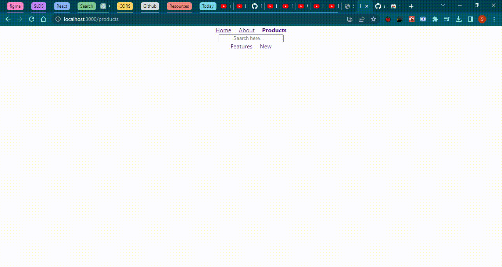

# React Router

## What it is it?

1. It is a fully-featured client and server-side routing library for React.
1. Helps create and navigate between different URLs that make up your web application.
1. Provides unique URLs for different components in the app and makes the Ul
easily shareable with other users.

## Content

1. [Installation](#installation)
1. [Configuring routes](#configuring-routes)
1. [Navigating on button click](#navigation--links)
1. [Active Links](#active-links--navlinks)
    - [NavLinks styling](#navlinks-styling)
1. [Navigating programmatically](#navigating-programmatically)
1. [History Clear Stack](#to-clear-history-stacks)
1. [No Match Route](#no-match-route--not-found-page)
1. [Nested routes](#nested-routes)
    - [Short Demo Nested Routes](#short-demo-nested-routes)
1. [Relative Links](#relative-links)
1. [Dynamic routes](#dynamic-routes)
1. [Route parameters]()
    - [URL Params](#url-params)
    - [Search Params](#search-params)
1. [Lazy loading](#lazy-loading)
1. [Authentication](#authentication-and-protected-routes)

### Installation

```shel
$ npx create-react-app react-router-app
$ npm i react-router-dom@latest
```

### Configuring routes

As of now for simple understanding, we are creating *two* routes. 
  - Home Page component
  - About Page component


**Step 1**

1. Import `BrowserRouter` from `react-router-dom`
1. nest `<App />` component in `<BrowserRouter>` component.

```jsx
// index
import { BrowserRouter } from 'react-router-dom'
// ...

<BrowserRouter>
  <App />
</BrowserRouter>

// ...
```

**Step 2**
1. Import `{Routes, Route}` from `react-router-dom`.
1. Nest the `Route` inside the `Routes` component.
1. It has two *required attributes*.
    - `path=' '` URL of localhost
    - `element={ }` component which need to show on that path.
1. **Add** `path` to `Route` component to link the component.
1. `path` is similar to *anchor tag **href*** `<a href="" ></a>` where `href` *is equal to* `path`.
1. **Add** *forward slash* - `/` to use *Root of the App* which is the *Localhost:3000/* in the `path` value.
    - ```jsx
      // App.jsx
      return( 
        <Routes>
          <Route path='/'>
        </Routes>
      )
      ```
1. **Add** `element` attri. and use `<Home />` component in that.
    - ```jsx
      // App.jsx
      return( 
        <Routes>
          <Route path='/' element={<Home />}>
        </Routes>
      )
      ```
1. Do it same for `<About />` component.
    - ```jsx
      // App.jsx
      return( 
        <Routes>
          <Route path='/' element={<Home />}>
          <Route path='about' element={<About />}> // this is Relative path
        </Routes>
      )
      ```

### Navigation / Links

**Step 1**
1. Create a `<Navbar />` component.
1. Import `Link` from `react-router-dom` module and then add a `<Link/>` component inside `nav` tag
1. Add `to` attribute into the `Link` component, give respective path to that component, as shown in below code.
    - ```jsx
      // Navbar.jsx
      return(
        <nav>
          <link to='/'>Home</Link>
          <link to='/about'>About</Link>    // Here it is Absolute path.
        </nav>
      )
      ```
1. Now **Add** `Navbar` above the `Routes` element.
    - ```jsx
      // App.jsx 
      return (
        <React.Fragment>
          <Navbar/>
          <Routes>
            <Route path='/' element={<Home />}/>
            <Route path='about' element={<About />}/>
          </Routes>
        </React.Fragment>
      );
      ```

### Active Links / NavLinks

1. Replace `<Link>...</Link>` with `<NavLink>...</NavLink>`.
1. `<NavLink>` adds a *active* class to that current page link.

```diff
- <link to='/'>Home</Link>
- <link to='/about'>About</Link>
+ <NavLink to='/'>Home</NavLink>
+ <NavLink to='/about'>About</NavLink>
```
1. We will have active class, and can add styles to that `active` class.
  ```html
  <!-- ... -->
  <a class="active" href="/" aria-current="page">Home</a>
  <!-- ... -->

  <style>
    .active{
      font-weight: bold;
    }
  </style>
  ```

#### NavLinks styling

```jsx

const Navbar = () => {
  return (
    <nav>
      <NavLink to='/' style={navStyleLink}>Home</NavLink>
      <NavLink to='/about'style={navStyleLink}>About</NavLink>
    </nav>
  )
}

const navStyleLink= ({isActive}) =>{

  return {
    fontWeight: isActive ? 'bold': 'normal',
    textDecoration: isActive ? 'none' : 'underline',
  }

  /*
  if (isActive) {
      return {
        fontWeight: 'bold'
      }
  } else{
    return {
      fontWeight: 'normal'
    }
  }
  */
}

export default Navbar;
```

### Navigating Programmatically

Suppose we place an order and we want to navigate to `order confirmation page` only after *successful of order* otherwise *error*.

1. Create a component of `OrderConfirmed.jsx` and add text `Order is confirmed`
1. Add a `Route` in *App.jsx* by adding `path='order-summary'` and `element={<OrderConfirmed/>}`
1. Now cross-check the page by entering `order-summary` in URL.
1. import `useNavigate` Hook in *Home.jsx*.
    - ```jsx
      import React from 'react'
      import {useNavigate} from 'react-router-dom';

      const Home = () => {

        const nvigate = useNavigate();
        return (
          <>
            <p>Home page</p>
            <button onClick={() => {nvigate('order-summary')}}>Place Order</button>
          </>
        )
      }

      export default Home;
      ```
> `useNavigate()` provides a programmatic way to navigate to different routes or locations within the application, without the need for a specific component to render a link or button. The useNavigate hook is particularly useful in scenarios where you want to trigger navigation based on certain conditions or events, such as form submissions, user authentication, or other programmatic logic.

1. To use *Go Back* at same page where it came from,
    - ```jsx
      import React from 'react'
      import {useNavigate} from 'react-router-dom';
      const OrderConfirmed = () => {

        const navigate = useNavigate()
        return (
          <>
          <p>Order confirmed!</p>
          <button onClick={()=>{navigate(-1)}}>Go Back</button>
          </>
        )
      }

      export default OrderConfirmed
      ```

### To Clear History Stacks

The `{ replace: true }` option is used to replace the current entry in the history stack with the new location, effectively modifying the history without adding a new entry. This can be useful in scenarios where you want to update the URL without creating a new history entry, such as during form submissions or other user interactions.
  - ```jsx
    import React from 'react'
    import {useNavigate} from 'react-router-dom';
    const OrderConfirmed = () => {

      const navigate = useNavigate()
      return (
        <>
        <p>Order confirmed!</p>
        <button onClick={() => {nvigate('order-summary', {replace: true})}}>Place Order</button>
        </>
      )
    }

    export default OrderConfirmed
    ```

###  No Match Route / Not Found page

If page is not available, then we need to *asterisk* `*` symbol in `path`

```jsx
<Route path='*' element={<NoMatch />}/>
```


### Nested Routes


1. Add `Route`, `path` to *App.jsx* inside of **Parent Route**.
1. Add `Link` into the *Navbar.jsx*
1. Inside *Products.jsx*, Add `Link` of *FeaturesProduct.jsx* *NewProduct.jsx* add `outlet` component to render inside same product page.

<table>
  <tr>
  <th>App.jsx</th>
  <th>Navbar.jsx</th>
  <th>Products.jsx</th>
  </tr>
  <tr>
  <td>

```diff
import React from "react";
import { Route, Routes } from "react-router-dom";
import Products from "./components/Products";
import FeaturesProduct from "./components/FeaturesProduct";
import NewProduct from "./components/NewProduct";

function App() {
  return (
    <React.Fragment>
      <Navbar />
      <Routes>
        {/* ... */}
        <Route path="products" element={<Products />}>
+         <Route path="features" element={<FeaturesProduct />} />
+         <Route path="new" element={<NewProduct />} />
        </Route>
        {/* ... */}
      </Routes>
    </React.Fragment>
  );
}

export default App;
```

  </td>
  <td>
  
```diff
import React from 'react'
import {NavLink} from 'react-router-dom';

const Navbar = () => {
  return (
    <nav>
      {/* ... */}
+     <NavLink to='/products'>Products</NavLink>
    </nav>
  )
}
export default Navbar;
{/*  swipe next */}
```
  
  </td>
  <td>
  
```diff
import { React } from "react";
+ import { NavLink, Outlet } from "react-router-dom";

const Products = () => {
  return (
    <>
      <div>
        <input type="search" placeholder="Search here..." />
      </div>
+      <nav>
+        <NavLink to="features">Features</NavLink>
+        <NavLink to="new">New</NavLink>
+      </nav>
+      <Outlet />
    </>
  );
};

export default Products;
```

  </td>
  </tr>
</table>

#### Short Demo Nested Routes

```jsx
// Parent component
<Route path="/parent" element={<ParentComponent />}>
  <Route path="child1" element={<Child1Component />} />
  <Route path="child2" element={<Child2Component />} />
</Route>


// Parent component rendering
function ParentComponent() {
  return (
    <div>
      <h2>Parent Component</h2>
      <Outlet />
    </div>
  );
}

// Child component rendering
function Child1Component() {
  return <div>Child 1</div>;
}

function Child2Component() {
  return <div>Child 2</div>;
}

// Linking to child routes
<Link to="child1">Go to Child 1</Link>
<Link to="child2">Go to Child 2</Link>
```

### Relative Links

1. Relative links are the `path` value start with Relative path.
1. Absolute links are the `path` value start with Absolute path.

```jsx
// Navbar.jsx
<NavLink to='/products'>Products</NavLink>

// Product.jsx
  <nav>
    <NavLink to="features">Features</NavLink>
    <NavLink to="new">New</NavLink>
  </nav>
```

### Index Route

The index prop is used to specify that the route should only be matched if it is the "index" route, i.e., the default route for a particular nesting level. When a route is the index route, it is the route that is matched when the path exactly matches the parent's path.

```jsx
<Route path="/parent" element={<ParentComponent />}>
  <Route index element={<DefaultComponent />} />
  <Route path="child" element={<ChildComponent />} />
</Route>
```

<table>
  <tr>
    <th>Without Index</th>
    <th>With Index</th>
  </tr>
  <tr>
  <td>



</td>
<td>


  </td>
  </tr>
</table>

### Dynamic Routes

1. URL parameters are a way to pass dynamic data in the URL. They allow you to specify variable parts in the URL that can be accessed and used within your components. These parameters are often used to identify specific resources or to customize the content based on the URL. `:userId`

```jsx
<Route path="users/:userId" element={<UserDetail />} />
```

Resource: [LINK](https://youtu.be/P5xgsRIKJjo?list=PLC3y8-rFHvwjkxt8TOteFdT_YmzwpBlrG)

1. When dealing with a list detail pattern or if the route parameter can vary in value make use of dynamic routes specify the url param denoted by a colon prefix in the path
1. React router will always try to match the route that is more specific before trying to match a dynamic route so  `/admin` before `/userid`
1. it is possible to have nested dynamic routes

### URL Params

1. Take userId from URL parameters and show on UI, by using `useParams()` Hooks
1. It returns the object, which contain key-value pair of dynamic params from the current URL


```jsx
// UserDetails.jsx
import { useParams} from 'react-router-dom';

export const UserDetails = () => {
  const params = useParams();
  const userId = params.userId;
  return <div>Details about user {userId}</div>
}
```

```jsx
// App.jsx
function App() {
  return (
    <React.Fragment>
      <Navbar />
      <Routes>
        {/* */}
        <Route path="users" element={<Users />}>
          <Route path=":userId" element={<UserDetails />} /> {/* <== params.userId*/}
          <Route path="admin" element={<Admin />} />
        </Route>
        {/* */}
      </Routes>
    </React.Fragment>
  );
}

export default App;
```


### Search Params

1. import `useSearchParams` from `react-router-dom`
1. `useSearchParams()` is a *Hook* to access and manage the query parameters present in the URL.
1. Query parameters are `key-value` pairs that come after the ` ? ` in a URL and are commonly used to pass data between different pages or components.
1. It returns two values
  - object, the key-value pair
  - function, to `set` the search parameter, with this we can `add or remove` the parameters.

```jsx
import { useSearchParams } from 'react-router-dom';

function MyComponent() {
  const [searchParams, setSearchParams] = useSearchParams();

  // Access a specific query parameter
  const myQueryParam = searchParams.get('filter');

  // Update the query parameters
  const updateParams = () => {
    setSearchParams({ filter: 'active' });
  };

  return (
    <div>
      <p>My Query Parameter: {myQueryParam}</p>
      <button onClick={updateParams}>Update Query Params</button>
    </div>
  );
}
```

### Lazy loading

1. When you have a big application with many parts, lazy loading helps you load only the parts you need when you need them.
1. The lazy function is used to dynamically import the components, and the Suspense component is used to show a loading message while the component is being loaded. This way, the initial load time of the application is minimized, making it faster and more efficient for the user.

```jsx
// App.jsx

import React, { Suspense, lazy } from 'react'; // suspense and lazy
import { BrowserRouter as Router, Route } from 'react-router-dom';

const Home = lazy(() => import('./Home'));
const About = lazy(() => import('./About'));

function App() {
  return (
    <Router>
    <Route exact path="/" component={Home} />
      <Suspense fallback={<div>Loading...</div>}>
          <Route path="/about" component={About} />
      </Suspense>
    </Router>
  );
}

export default App;
```

### Authentication and Protected Routes


>NOTE: *pending* Still need more about this Authentication, follow this [link](https://youtu.be/X8eAbu1RWZ4?list=PLC3y8-rFHvwjkxt8TOteFdT_YmzwpBlrG)

1. Create a `AuthProvider.jsx`, and below code

```jsx
// Auth.jsx

import { useState, createContext, useContext } from 'react'

const AuthContext = createContext(null);

export const AuthProvider = ({ children }) => {
  const [user, setUser] = useState(null);

  const login = (user) => {
    setUser(user);
  }

  const logout = () => {
    setUser (null)
  }
  return(
    <AuthContext.Provider value={{user, login, logout }}>
      {children}
    </AuthContext.Provider>
  )
}

export const useAuth = () => {
  return useContext(AuthContext);
}

// App.jsx

import AuthProvider from './AuthProvider';

function App() {
  return (
    <AuthProvider>
      <Navbar />
      <Routes>
        {/* */}
        <Route path="users" element={<Users />}>
          <Route path=":userId" element={<UserDetails />} /> {/* <== params.userId*/}
          <Route path="admin" element={<Admin />} />
        </Route>
        {/* */}
      </Routes>
    </AuthProvider>
  );
}

export default App;
```

