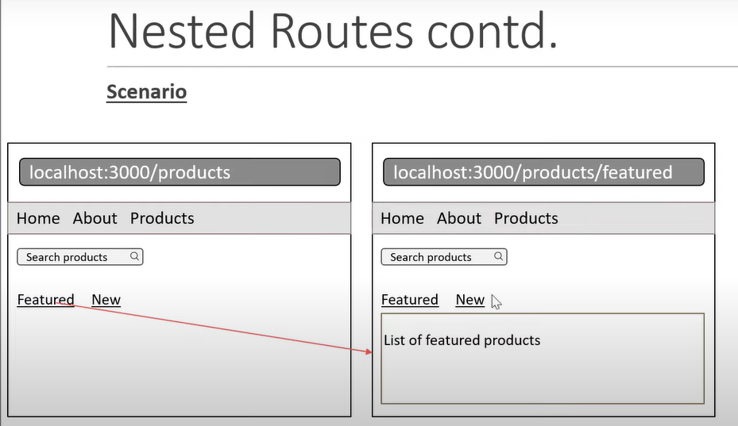

# React Router

## What it is it?

1. It is a fully-featured client and server-side routing library for React.
1. Helps create and navigate between different URLs that make up your web application.
1. Provides unique URLs for different components in the app and makes the Ul
easily shareable with other users.

## Content

1. [Installation](#installation)
1. [Configuring routes](#configuring-routes)
1. [Navigating on button click](#navigation--links)
1. [Active Links](#active-links--navlinks)
    - [NavLinks styling](#navlinks-styling)
1. [Navigating programmatically](#navigating-programmatically)
1. [History Clear Stack](#to-clear-history-stacks)
1. [No Match Route](#no-match-route--not-found-page)
1. [Dynamic routes]()
1. [Nested routes](#nested-routes)
1. [Route parameters]()
1. [Lazy loading]()
1. [Authentication]()

### Installation

```shel
$ npx create-react-app react-router-app
$ npm i react-router-dom@latest
```

### Configuring routes

As of now for simple understanding, we are creating *two* routes. 
  - Home Page component
  - About Page component


**Step 1**

1. Import `BrowserRouter` from `react-router-dom`
1. nest `<App />` component in `<BrowserRouter>` component.

```jsx
// index
import { BrowserRouter } from 'react-router-dom'
// ...

<BrowserRouter>
  <App />
</BrowserRouter>

// ...
```

**Step 2**
1. Import `{Routes, Route}` from `react-router-dom`.
1. Nest the `Route` inside the `Routes` component.
1. It has two *required attributes*.
    - `path=' '` URL of localhost
    - `element={ }` component which need to show on that path.
1. **Add** `path` to `Route` component to link the component.
1. `path` is similar to *anchor tag **href*** `<a href="" ></a>` where `href` *is equal to* `path`.
1. **Add** *forward slash* - `/` to use *Root of the App* which is the *Localhost:3000/* in the `path` value.
    - ```jsx
      // App.jsx
      return( 
        <Routes>
          <Route path='/'>
        </Routes>
      )
      ```
1. **Add** `element` attri. and use `<Home />` component in that.
    - ```jsx
      // App.jsx
      return( 
        <Routes>
          <Route path='/' element={<Home />}>
        </Routes>
      )
      ```
1. Do it same for `<About />` component.
    - ```jsx
      // App.jsx
      return( 
        <Routes>
          <Route path='/' element={<Home />}>
          <Route path='about' element={<About />}> // this is Relative path
        </Routes>
      )
      ```

### Navigation / Links

**Step 1**
1. Create a `<Navbar />` component.
1. Import `Link` from `react-router-dom` module and then add a `<Link/>` component inside `nav` tag
1. Add `to` attribute into the `Link` component, give respective path to that component, as shown in below code.
    - ```jsx
      // Navbar.jsx
      return(
        <nav>
          <link to='/'>Home</Link>
          <link to='/about'>About</Link>    // Here it is Absolute path.
        </nav>
      )
      ```
1. Now **Add** `Navbar` above the `Routes` element.
    - ```jsx
      // App.jsx 
      return (
        <React.Fragment>
          <Navbar/>
          <Routes>
            <Route path='/' element={<Home />}/>
            <Route path='about' element={<About />}/>
          </Routes>
        </React.Fragment>
      );
      ```

### Active Links / NavLinks

1. Replace `<Link>...</Link>` with `<NavLink>...</NavLink>`.
1. `<NavLink>` adds a *active* class to that current page link.

```diff
- <link to='/'>Home</Link>
- <link to='/about'>About</Link>
+ <NavLink to='/'>Home</NavLink>
+ <NavLink to='/about'>About</NavLink>
```
1. We will have active class, and can add styles to that `active` class.
  ```html
  <!-- ... -->
  <a class="active" href="/" aria-current="page">Home</a>
  <!-- ... -->

  <style>
    .active{
      font-weight: bold;
    }
  </style>
  ```

#### NavLinks styling

```jsx

const Navbar = () => {
  return (
    <nav>
      <NavLink to='/' style={navStyleLink}>Home</NavLink>
      <NavLink to='/about'style={navStyleLink}>About</NavLink>
    </nav>
  )
}

const navStyleLink= ({isActive}) =>{

  return {
    fontWeight: isActive ? 'bold': 'normal',
    textDecoration: isActive ? 'none' : 'underline',
  }

  /*
  if (isActive) {
      return {
        fontWeight: 'bold'
      }
  } else{
    return {
      fontWeight: 'normal'
    }
  }
  */
}

export default Navbar;
```

### Navigating Programmatically

Suppose we place an order and we want to navigate to `order confirmation page` only after *successful of order* otherwise *error*.

1. Create a component of `OrderConfirmed.jsx` and add text `Order is confirmed`
1. Add a `Route` in *App.jsx* by adding `path='order-summary'` and `element={<OrderConfirmed/>}`
1. Now cross-check the page by entering `order-summary` in URL.
1. import `useNavigate` Hook in *Home.jsx*.
    - ```jsx
      import React from 'react'
      import {useNavigate} from 'react-router-dom';

      const Home = () => {

        const nvigate = useNavigate();
        return (
          <>
            <p>Home page</p>
            <button onClick={() => {nvigate('order-summary')}}>Place Order</button>
          </>
        )
      }

      export default Home;
      ```
> `useNavigate()` provides a programmatic way to navigate to different routes or locations within the application, without the need for a specific component to render a link or button. The useNavigate hook is particularly useful in scenarios where you want to trigger navigation based on certain conditions or events, such as form submissions, user authentication, or other programmatic logic.

1. To use *Go Back* at same page where it came from,
    - ```jsx
      import React from 'react'
      import {useNavigate} from 'react-router-dom';
      const OrderConfirmed = () => {

        const navigate = useNavigate()
        return (
          <>
          <p>Order confirmed!</p>
          <button onClick={()=>{navigate(-1)}}>Go Back</button>
          </>
        )
      }

      export default OrderConfirmed
      ```

### To Clear History Stacks

The `{ replace: true }` option is used to replace the current entry in the history stack with the new location, effectively modifying the history without adding a new entry. This can be useful in scenarios where you want to update the URL without creating a new history entry, such as during form submissions or other user interactions.
  - ```jsx
    import React from 'react'
    import {useNavigate} from 'react-router-dom';
    const OrderConfirmed = () => {

      const navigate = useNavigate()
      return (
        <>
        <p>Order confirmed!</p>
        <button onClick={() => {nvigate('order-summary', {replace: true})}}>Place Order</button>
        </>
      )
    }

    export default OrderConfirmed
    ```

###  No Match Route / Not Found page

If page is not available, then we need to *asterisk* `*` symbol in `path`

```jsx
<Route path='*' element={<NoMatch />}/>
```

### Nested Routes



1. Add `Route`, `path` to *App.jsx* inside of **Parent Route**.
1. Inside *Products.jsx* add `outlet` component to render inside same product page.

<table>
  <tr>
  <th>App.jsx</th>
  <th>Navbar.jsx</th>
  <th>Products.jsx</th>
  </tr>
  <tr>
  <td>

```diff
import React from "react";
import { Route, Routes } from "react-router-dom";
import Products from "./components/Products";
import Features from "./components/Features";
import New from "./components/New";

function App() {
  return (
    <React.Fragment>
      <Navbar />
      <Routes>
        {/* ... */}
        <Route path="products" element={<Products />}>
+         <Route path="features" element={<Features />} />
+         <Route path="new" element={<New />} />
        </Route>
        {/* ... */}
      </Routes>
    </React.Fragment>
  );
}

export default App;
```

  </td>
  <td>
  
```jsx
import React from 'react'
import {NavLink} from 'react-router-dom';

const Navbar = () => {
  return (
    <nav>
      {/* ... */}
      <NavLink to='/products'>Products</NavLink>
    </nav>
  )
}
export default Navbar
```
  
  </td>
  <td>
  
```jsx
import { React } from "react";
import { NavLink, Outlet } from "react-router-dom";

const Products = () => {
  return (
    <>
      <div>
        <input type="search" placeholder="Search here..." />
      </div>
      <nav>
        <NavLink to="features">Features</NavLink>
        <NavLink to="new">New</NavLink>
      </nav>
      <Outlet />
    </>
  );
};

export default Products;
```

  </td>
  </tr>
</table>

```jsx
// Parent component
<Route path="/parent" element={<ParentComponent />}>
  <Route path="child1" element={<Child1Component />} />
  <Route path="child2" element={<Child2Component />} />
</Route>


// Parent component rendering
function ParentComponent() {
  return (
    <div>
      <h2>Parent Component</h2>
      <Outlet />
    </div>
  );
}

// Child component rendering
function Child1Component() {
  return <div>Child 1</div>;
}

function Child2Component() {
  return <div>Child 2</div>;
}

// Linking to child routes
<Link to="child1">Go to Child 1</Link>
<Link to="child2">Go to Child 2</Link>
```


