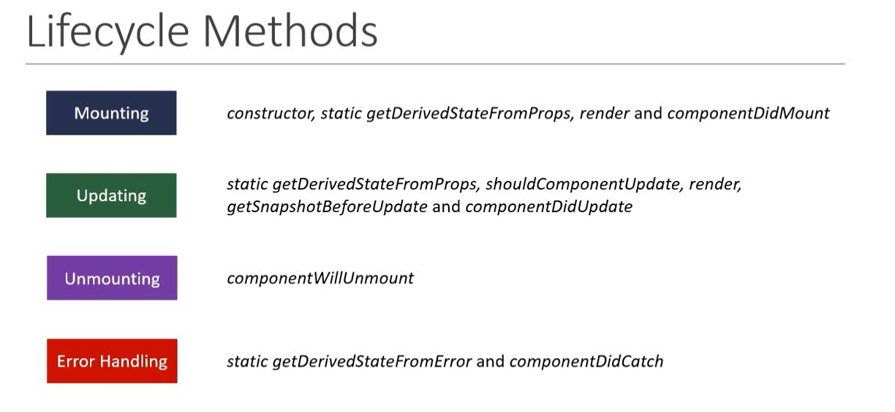

# React Part 2

# Contents

1. [Rendering the List](#rendering-the-list)
1. [Index key pattern](#index-as-key-anti-pattern)
1. [Styling CSS](#styling-and-css-basics)
    - [Stylesheets](#css-stylesheets)
    - [Inline styling](#inline-styling)
    - [CSS Modules](#css-modules)
1. [Basic of Form Handling](#basic-of-form-handling)
1. [Life cycle Methods](#life-cycle-methods)
    - [Component Mounting Lifecycle Methods](#component-mounting-lifecycle-methods)

## Rendering the List

Rendering the list using `Array.map()`

#### Map the item

1. Move the data into an array:
   -  ```jsx
      const people = [
        {
          id: 0,
          name: 'Creola Katherine Johnson',
          title: 'mathematician'
        },
        {
          id: 1,
          name: 'Mario José Molina-Pasquel Henríquez',
          title: 'chemist'
        },
        {
          id: 2,
          name: 'Mohammad Abdus Salam',
          title: 'physicist'
        },
        {
          id: 3,
          name: 'Percy Lavon Julian',
          title: 'chemist'
        },
        {
          id: 4,
          name: 'Subrahmanyan Chandrasekhar',
          title: 'astrophysicist'
        }
      ];
      ```

2. Map the `people` members into a new array of JSX nodes, `listItems`:
   -  ```jsx
      const listItems = people.map(person => <li key={person.id}>{person.name}</li>);
      ```

3. Return `listItems` from your component wrapped in a `<ul>`:
   -  ```jsx
      return <ul>{listItems}</ul>;
      ```


***Best Practice to use Separate Component of List***
   -    ```jsx
        // Person.jsx

        import React from 'react'

        const Person = ({personName, key}) => {
          return (
            <li key={key}>{personName}</li>
          )
        }
        export default Person


        // NameList.jsx

        import React from 'react'

        const NameList = () => {
          const listItems = people.map(person => <Person key={person.id} personName={person.name} />);
          return (
            <div>{listItems}</div>
          )
        }
        export default NameList

        ```

> NOTE: you will get error in console, that *key* is keywork in ReactJS. 

1. A "key" is a special string attribute you need to include when creating lists of elements.
1. Keys give the elements a stable identity
1. Keys help React identify which items have changed, are added, or are removed.


## Index as Key Anti-pattern

When to use Index key in `Array.map`:
1. The items in your list do not have a unique id.
1. The list is a static list and will not change.
1. The list will never be reordered or filtered.

```jsx
// NOT recommended
const listItems = people.map((person, index) => <Person key={index} personName={person.name} />);
```


##  Styling and CSS Basics

1. CSS stylesheets
2. Inline styling
3. CSS Modules
4. CSS in IS Libaries (Styled Components)

### CSS stylesheets

<table>
  <tr>
    <th>StyleComponent.jsx</th>
    <th>myStyles.css</th>
  </tr>
  <tr>
    <td>

      ```jsx
      import React from 'react'
      import './myStyles.css'

      function Stylesheet() {
        return(
          <h1 className='primary'>Hello World!</h1>
        );
      }
      export default Stylesheet
      ```

  </td>
  <td>

    ```css
    .primary{
      color: orange;
    }
    .font-xl{
      font-size: 28px;
    }
    ```
  </td>
  </tr>
   <tr>
    <th>Multiple classes</th>
  </tr>
  <tr>
    <th>App.jsx</th>
    <th>Stylesheet.jsx</th>
  </tr>
  <tr>
  <td>
      
```jsx
import React, {Component} from 'react'
class App extend Component() {
  render(){
    return(
      // ...

      <Stylesheet className={true}/> // try to do with false also

      // ...
    )
  }
}
export default Stylesheet
```
  
  </td>
  <td>

```jsx
import React from 'react';
import './myStyles.css'

function Stylesheet(props) {
  let className = props.primary ? 'primary' : ''
  return(
    <h1 className={`${className} font-xl`}>Hello World!</h1>
  );
}
export default Stylesheet
```
  
  </td>
  </tr>
</table>

### Inline styling

```jsx
import React from 'react'

const heading = {
  fontSize: '72px',
  color: 'blue'
}

function Inline() {
  return (
    <h1 style={heading}>Inline</h1>
  )
}
export default Inline
```

### CSS Modules

> To use CSS modules, `react-script` version should be *greater* than `2.0.0`

*Use* **module.css** for Best Practices.

<table>
<tr>
  <th>.css</th>
  <th>.module.css</th>
</tr>
<tr>
  <td>Global scope</td>
  <td>Local Scope</td>
</tr>
<tr>
  <td>No need write Module Name</td>
  <td>Should write Module Name</td>
</tr>
<tr>
  <td>Classes affect to children components</td>
  <td>Modules does NOT effect to children components</td>
</tr>
<tr>
<td>

```jsx
import './myStyles.css'
```

</td>
<td>

```jsx
import styles './myStyles.module.css'
```

  </td>
</tr>
<tr>
  <td>

```jsx
import React from 'react'
import './myStyles.css'

function Person() {
  return (
    <h1 className={color}>Name</h1>
  )
}
export default Person
```

  </td>
  <td>
  
```jsx
import React from 'react'
import styles from './myStyles.module.css'

function Person() {
  return (
    <h1 className={styles.color}>Name</h1>
  )
}
export default Person
```

  </td>
  </tr>
</table>

## Basic of Form Handling


```jsx
import React, { Component } from 'react';

class MyForm extends Component {
  constructor(props) {
    super(props);
    this.state = {
      inputValue: '',
      textAreaValue: '',
      selectValue: 'Option 1',
    };
  }

  handleInputChange = (event) => {
    this.setState({ inputValue: event.target.value });
  }

  handleTextAreaChange = (event) => {
    this.setState({ textAreaValue: event.target.value });
  }

  handleSelectChange = (event) => {
    this.setState({ selectValue: event.target.value });
  }

  handleSubmit = (event) => {
    event.preventDefault();
    // Here, you can use this.state to access the form data
    console.log('Input Value:', this.state.inputValue);
    console.log('Text Area Value:', this.state.textAreaValue);
    console.log('Select Value:', this.state.selectValue);
    // You can perform other actions like API calls or further processing here
  }

  render() {
    return (
      <form onSubmit={this.handleSubmit}>
        <div>
          <label>Input:</label>
          <input
            type="text"
            value={this.state.inputValue}
            onChange={this.handleInputChange}
          />
        </div>
        <div>
          <label>Text Area:</label>
          <textarea
            value={this.state.textAreaValue}
            onChange={this.handleTextAreaChange}
          />
        </div>
        <div>
          <label>Select Option:</label>
          <select value={this.state.selectValue} onChange={this.handleSelectChange}>
            <option value="Option 1">Option 1</option>
            <option value="Option 2">Option 2</option>
            <option value="Option 3">Option 3</option>
          </select>
        </div>
        <button type="submit">Submit</button>
      </form>
    );
  }
}

export default MyForm;
```

## Life cycle Methods

 <table>
  <tr>
    <td>


  </td>
  <td>



  </td>
  </tr>
 </table>


## Component Mounting Lifecycle Methods

 <table>
  <tr>
    <td>


  </td>
  <td>


  </td>
  </tr>
  <tr>
    <td>


  </td>
  <td>
    


  </td>
  </tr>
 </table>


 

