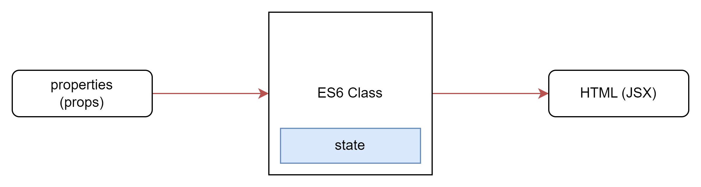

# Topics

1. [Class Component](#class-component)
1. 

# Adding Interactivity

In React, data that changes over time is called state. You can add state to any component, and update it as needed.

## Responding to Events

- Event handlers are your own functions that will be triggered in response to interactions like clicking, hovering, focusing form inputs, and so on.

#### Adding event handlers 

1. First of all, Define a function 
1. Implement the logic inside that function (use alert to show the message).
1. And then pass it as a *prop* to the appropriate JSX tag.

**Example:-**

1. Declare a function called `handleClick` inside your `Button` component.
2. Implement the logic inside that function (use `alert` to show the message).
3. Add `onClick={handleClick}` to the `<button>` JSX.

```jsx
export default function Button() {
  function handleClick() {
    alert('You clicked me!');
  }

  return (
    <button onClick={handleClick}>
      Click me
    </button>
  );
}
```


 <table>
  <thead>
    <tr>
      <td>passing a function (correct)</td>
      <td>calling a function (incorrect)</td>
    </tr>
  </thead>
  <tbody>
    <tr>
      <td>

  ```jsx
  <button onClick={handleClick}>
  ```
      
  </td>
  <td>

  ```jsx
  <button onClick={handleClick()}>    
  ```
  
  </td>
    </tr>
    <tr>
      <td>

  ```jsx
  <button onClick={() => alert('...')}>	
  ```
      
  </td>
  <td>

  ```jsx
  <button onClick={alert('...')}>
  ```
  
  </td>
    </tr>
  </tbody>
 </table>


#### Reading props in event handlers 

Because event handlers are declared inside of a component, they have access to the component’s props. Here is a button that, when clicked, shows an alert with its `message` prop:

```jsx
function AlertButton({ message, children }) {
  return (
    <button onClick={() => alert(message)}>
      {children}
    </button>
  );
}

export default function Toolbar() {
  return (
    <div>
      <AlertButton message="Playing!">
        Play Movie
      </AlertButton>
      <AlertButton message="Uploading!">
        Upload Image
      </AlertButton>
    </div>
  );
}
```

#### Passing event handlers as props 

- Depending on where you’re using a Button component, you might want to *execute* a **different function**—perhaps one plays a movie and another uploads an image.

- To do this, pass a prop the component receives from its parent as the event handler like so:

- for more info follow this [link](https://react.dev/learn/responding-to-events#passing-event-handlers-as-props)

```jsx
function Button({ onClick, children }) {
  return (
    <button onClick={onClick}>
      {children}
    </button>
  );
}

function PlayButton({ movieName }) {
  function handlePlayClick() {
    alert(`Playing ${movieName}!`);
  }

  return (
    <Button onClick={handlePlayClick}>
      Play "{movieName}"
    </Button>
  );
}

function UploadButton() {
  return (
    <Button onClick={() => alert('Uploading!')}>
      Upload Image
    </Button>
  );
}

export default function Toolbar() {
  return (
    <div>
      <PlayButton movieName="Kiki's Delivery Service" />
      <UploadButton />
    </div>
  );
}

```

#### Naming event handler props 

- when you’re building your own components, you can name their event handler props any way that you like.
By convention, event handler props should start with `on`, followed by a capital letter.

For example, the `Button` component’s `onClick` prop could have been called `onSmash`

```jsx
function Button({ onSmash, children }) {
  return (
    <button onClick={onSmash}>
      {children}
    </button>
  );
}

export default function App() {
  return (
    <div>
      <Button onSmash={() => alert('Playing!')}>
        Play Movie
      </Button>
      <Button onSmash={() => alert('Uploading!')}>
        Upload Image
      </Button>
    </div>
  );
}
```

> All events propagate in React except `onScroll`, which only works on the JSX tag you attach it to.

#### Stopping propagation 

1. That event object also lets you stop the propagation. If you want to prevent an event from reaching parent components, you need to call `e.stopPropagation()` like this `Button` component does:
1. Follow this [Link](https://react.dev/learn/responding-to-events#stopping-propagation) to know more.

```jsx
function Button({ onClick, children }) {
  return (
    <button onClick={e => {
      e.stopPropagation();
      onClick();
    }}>
      {children}
    </button>
  );
}

export default function Toolbar() {
  return (
    <div className="Toolbar" onClick={() => {
      alert('You clicked on the toolbar!');
    }}>
      <Button onClick={() => alert('Playing!')}>
        Play Movie
      </Button>
      <Button onClick={() => alert('Uploading!')}>
        Upload Image
      </Button>
    </div>
  );
}

```

#### Passing handlers as alternative to propagation 

- follow this [Link](https://react.dev/learn/responding-to-events#passing-handlers-as-alternative-to-propagation)

#### Preventing default behavior 

- Some browser events have default behavior associated with them. For example, a `<form>` submit event, which happens when a button inside of it is clicked, will *reload the whole page* by default:
- You can call `e.preventDefault()` on the event object to stop this from happening:

```jsx
<form onSubmit={e => {
      e.preventDefault();
      alert('Submitting!');
    }}>
      <input />
      <button>Send</button>
    </form>
```

Don’t confuse `e.stopPropagation()` and `e.preventDefault()`. They are both useful, but are unrelated:

- `e.stopPropagation()`: stops the event handlers attached to the tags above from firing.
- `e.preventDefault()`: prevents the default browser behavior for the few events that have it.


## State: A Component's Memory

Components need to “remember” things: the current input value, current image, etc. In React, this kind of component-specific memory is called *state*.


1. Hooks are special functions that are only available while React is rendering
1. **Hook** start with `use...` like `useState`, `useAffect`, etc... It can only be called at the top level of your components or your own Hooks.
1. State is just one of those features, but you will meet the other Hooks later.

The `useState` Hook provides those two things:

1. The array returned by `useState` always has exactly two items.
1. A **state variable** to retain the data between renders.
1. A **state setter function** to update the variable and trigger React to render the component again.

#### Adding a state variable 

1. Import useState from React at the top of the file:
    - ```jsx
      import { useState } from 'react';
      ```
1. Add this code in the file.
    - ```jsx
      const [index, setIndex] = useState(0);
      ```
> NOTE The convention is to name this pair like `const [index, setindex]`. You ***could name it anything*** you like, but conventions make things easier to understand across projects.


#### Giving a component multiple state variables 


<table>
  <thead>
    <tr>
      <td>App.jsx</td>
      <td>data.jsx</td>
    </tr>
  </thead>
  <tbody>
    <tr>
      <td>

    ```jsx
    import { useState } from 'react';
    import { sculptureList } from './data.js';

    export default function Gallery() {
      const [index, setIndex] = useState(0);
      const [showMore, setShowMore] = useState(false);

      function handleNextClick() {
        setIndex(index + 1);
      }

      function handleMoreClick() {
        setShowMore(!showMore);
      }

      let sculpture = sculptureList[index];
      return (
        <>
          <button onClick={handleNextClick}>
            Next
          </button>
          <h2>
            <i>{sculpture.name} </i> 
            by {sculpture.artist}
          </h2>
          <h3>  
            ({index + 1} of {sculptureList.length})
          </h3>
          <button onClick={handleMoreClick}>
            {showMore ? 'Hide' : 'Show'} details
          </button>
          {showMore && <p>{sculpture.description}</p>}
          
        </>
      );
    }
    ```
  
  </td>
  <td>

  ```jsx
  export const sculptureList = [{
    name: 'Homenaje a la Neurocirugía',
    artist: 'Marta Colvin Andrade',
    description: 'Although Colvin is predominantly known for abstract themes that allude to pre-Hispanic symbols, this gigantic sculpture, an homage to neurosurgery, is one of her most recognizable public art pieces.',
    url: 'https://i.imgur.com/Mx7dA2Y.jpg',
    alt: 'A bronze statue of two crossed hands delicately holding a human brain in their fingertips.'  
  }, {
    name: 'Floralis Genérica',
    artist: 'Eduardo Catalano',
    description: 'This enormous (75 ft. or 23m) silver flower is located in Buenos Aires. It is designed to move, closing its petals in the evening or when strong winds blow and opening them in the morning.',
    url: 'https://i.imgur.com/ZF6s192m.jpg',
    alt: 'A gigantic metallic flower sculpture with reflective mirror-like petals and strong stamens.'
  }, {
    name: 'Eternal Presence',
    artist: 'John Woodrow Wilson',
    description: 'Wilson was known for his preoccupation with equality, social justice, as well as the essential and spiritual qualities of humankind. This massive (7ft. or 2,13m) bronze represents what he described as "a symbolic Black presence infused with a sense of universal humanity."',
    url: 'https://i.imgur.com/aTtVpES.jpg',
    alt: 'The sculpture depicting a human head seems ever-present and solemn. It radiates calm and serenity.'
  }, {
    name: 'Moai',
    artist: 'Unknown Artist',
    description: 'Located on the Easter Island, there are 1,000 moai, or extant monumental statues, created by the early Rapa Nui people, which some believe represented deified ancestors.',
    url: 'https://i.imgur.com/RCwLEoQm.jpg',
    alt: 'Three monumental stone busts with the heads that are disproportionately large with somber faces.'
  }, {
    name: 'Blue Nana',
    artist: 'Niki de Saint Phalle',
    description: 'The Nanas are triumphant creatures, symbols of femininity and maternity. Initially, Saint Phalle used fabric and found objects for the Nanas, and later on introduced polyester to achieve a more vibrant effect.',
    url: 'https://i.imgur.com/Sd1AgUOm.jpg',
    alt: 'A large mosaic sculpture of a whimsical dancing female figure in a colorful costume emanating joy.'
  }, {
    name: 'Ultimate Form',
    artist: 'Barbara Hepworth',
    description: 'This abstract bronze sculpture is a part of The Family of Man series located at Yorkshire Sculpture Park. Hepworth chose not to create literal representations of the world but developed abstract forms inspired by people and landscapes.',
    url: 'https://i.imgur.com/2heNQDcm.jpg',
    alt: 'A tall sculpture made of three elements stacked on each other reminding of a human figure.'
  }, {
    name: 'Cavaliere',
    artist: 'Lamidi Olonade Fakeye',
    description: "Descended from four generations of woodcarvers, Fakeye's work blended traditional and contemporary Yoruba themes.",
    url: 'https://i.imgur.com/wIdGuZwm.png',
    alt: 'An intricate wood sculpture of a warrior with a focused face on a horse adorned with patterns.'
  }, {
    name: 'Big Bellies',
    artist: 'Alina Szapocznikow',
    description: "Szapocznikow is known for her sculptures of the fragmented body as a metaphor for the fragility and impermanence of youth and beauty. This sculpture depicts two very realistic large bellies stacked on top of each other, each around five feet (1,5m) tall.",
    url: 'https://i.imgur.com/AlHTAdDm.jpg',
    alt: 'The sculpture reminds a cascade of folds, quite different from bellies in classical sculptures.'
  }, {
    name: 'Terracotta Army',
    artist: 'Unknown Artist',
    description: 'The Terracotta Army is a collection of terracotta sculptures depicting the armies of Qin Shi Huang, the first Emperor of China. The army consisted of more than 8,000 soldiers, 130 chariots with 520 horses, and 150 cavalry horses.',
    url: 'https://i.imgur.com/HMFmH6m.jpg',
    alt: '12 terracotta sculptures of solemn warriors, each with a unique facial expression and armor.'
  }, {
    name: 'Lunar Landscape',
    artist: 'Louise Nevelson',
    description: 'Nevelson was known for scavenging objects from New York City debris, which she would later assemble into monumental constructions. In this one, she used disparate parts like a bedpost, juggling pin, and seat fragment, nailing and gluing them into boxes that reflect the influence of Cubism’s geometric abstraction of space and form.',
    url: 'https://i.imgur.com/rN7hY6om.jpg',
    alt: 'A black matte sculpture where the individual elements are initially indistinguishable.'
  }, {
    name: 'Aureole',
    artist: 'Ranjani Shettar',
    description: 'Shettar merges the traditional and the modern, the natural and the industrial. Her art focuses on the relationship between man and nature. Her work was described as compelling both abstractly and figuratively, gravity defying, and a "fine synthesis of unlikely materials."',
    url: 'https://i.imgur.com/okTpbHhm.jpg',
    alt: 'A pale wire-like sculpture mounted on concrete wall and descending on the floor. It appears light.'
  }, {
    name: 'Hippos',
    artist: 'Taipei Zoo',
    description: 'The Taipei Zoo commissioned a Hippo Square featuring submerged hippos at play.',
    url: 'https://i.imgur.com/6o5Vuyu.jpg',
    alt: 'A group of bronze hippo sculptures emerging from the sett sidewalk as if they were swimming.'
  }];

  ```
  
  </td>
    </tr>
  </tbody>
 </table>


1. It is a good idea to have multiple state variables if their state is unrelated, like index and showMore in this example.
1. But if you find that you often change two state variables together, it might be easier to combine them into one.
1. For example, if you have a form with many fields, it’s more convenient to have a single state variable that holds an object than state variable per field. Read [Choosing the State Structure](https://react.dev/learn/choosing-the-state-structure) for more tips.


#### State is isolated and private 

1. If you render the same component twice, *each copy* will have completely ***isolated state***! Changing one of them will not affect the other.

Read more about [state and isolated](https://react.dev/learn/state-a-components-memory#state-is-isolated-and-private)

## Render and Commit

This process of requesting and serving UI has three steps:

1. Triggering a render (delivering the guest’s order to the kitchen)
1. Rendering the component (preparing the order in the kitchen)
1. Committing to the DOM (placing the order on the table)

#### Step 1: Trigger a render 


1. Initial render 
    - it’s done by calling createRoot with the target DOM node, and then calling its render method with your component 
      ```jsx
      import ReactDOM from 'react-dom/client'

      const root = ReactDOM.createRoot(document.getElementById('root'))
      root.render(<Image />);
      ```

2. The component’s (or one of its ancestors’) state has been updated.

#### Step 2: React renders your components 

After you trigger a render, React calls your components to figure out what to display on screen. “Rendering” is React calling your components.


#### Step 3: React commits changes to the DOM 

Follow this [link](https://react.dev/learn/render-and-commit#step-3-react-commits-changes-to-the-dom)


## State as a Snapshot

*pending*

## Class Component



<table>
    <thead>
      <tr>
        <td>
          Functional Component
        </td>
        <td>
          stateful Class Component
        </td>
      </tr>
    </thead>
    <tbody>
      <tr>
    <td>

    1. Javascript Functions
    2. Use Func components as much as possible.
    3. Absense of 'this' keyword. 


  ```jsx
  function Page({props}) {
    return (
      <h1>Hello, {props.name}</h1>
    );
  }
  ```

 </td>
<td>

    1. Class extending Component Class
    1. Render method returning HTML

  ```jsx
  class Welcome extends React.Component{
    render(){
      return (
        <h1>Hello, {this.props.name}</h1>
      );
    }
  }
  ```

  </td>
</tr>
</tbody>
</table>


