# LIFECYCLE HOOKS OF LWC

A lifecycle hook is a callback method triggered at a specific phase of a component instance’s lifecycle.

## Phase of hooks

1. Mounting Phase
   1. [constructor()](#constructor)
   1. [connectedCallback()]()
   1. [renderedCallback()]()

1. Unmounting Phase
   1. disconnectedCallback()

1. Error Phase
   1. errorCallback(error, stack)

  > Note:-The render() method is not technically a lifecycle hook. It is a protected method on the LightningElement.will discuss about render() below.

**Mounting Phase:-** Placing the component to DOM.
**Unmounting Phase:-** Removing the component from DOM.
**Error Phase:-** when error occur in Mounting or Unmounting  phase.

## Flow of Hooks

```mermaid
graph LR;
  Parent_component --> Constructor;
  Constructor --> Public_Property_to_update;
  Public_Property_to_update --> Component_Inserted_into_DOM;
  Component_Inserted_into_DOM --> connectedCallback;
  connectedCallback --> component_rendered;
  component_rendered --> follow_same_process_from_constructor_if_true_child_component;
  follow_same_process_from_constructor_if_true_child_component --> if_false;
  if_false --> renderedCallback;
  renderedCallback --> Component_lifecycle_end
```



> conculsion of flow:- when component load into the salesforce engine.

1. [Constructor called](#constructor)
1. Update public property.
1. Check if the component is inserted into the DOM.
1. ConnectedCallback.
1. Component rendered.
1. If the component has any child component, then it will go to the child component from the constructor to component rendered and renderedCallback as well, then parent renderedCallback.
1. RenderedCallback.
1. Component lifecycle hooks end.

## constructor()

This hook is invoked when a component is created.

keypoints:-
1. The first statement must be the super() with no parameters.
   -  ```java
      constructor() {
        super();
      }
      ```            
1. The constructor flows from parent to child.
1. We can not access child element in the component body because they do not exist yet.
1. we can call apex method inside the constructor.
1. you can not access the element inside the constructor.

```js
this.template.querySelector('lightning-button');
```
> through an error beacause of component is not inserted into DOM yet.

## connectedCallback()

**Description**: This hook is invoked when a component is inserted into the DOM.
```js
connectedCallback() {
  // Implementation details
  // -----------
}
```

**Points:**
The hook flow is from parent to child.
We cannot access the child element in the parent connectedCallback because they do not exist yet.


## renderedCallback()

**Description**: This hook is invoked after every render of the component and is used to interact with a component's UI.


```js
renderedCallback() {
  // Implementation details
  // -----------
}
```

**Points**:
It can fire more than once.
The hook flows from child to parent.

### Example of mouting phase on parent and child components.

1. [Parent component](#parent-component)
2. [Child component](#child-component)


#### Parent component
```html
<template>
    <lightning-card variant="Narrow" title="Parent component" icon-name="standard:account">
        <c-child-component></c-child-component>
    </lightning-card>
</template>
```

```js
import { LightningElement } from 'lwc';

export default class ParentComponent extends LightningElement {

    constructor() {
        super();
        console.log('Parent constructor called');
    }

    connectedCallback() {
        console.log('Parent connectedCallback called');
    }

    renderedCallback() {
        console.log('Parent rendered callback called');
    }

}
```

#### Child component

```html
<template>
    <lightning-card variant="Narrow" title="Child component" icon-name="standard:account">
    </lightning-card>
</template>
```


```js
import { LightningElement } from 'lwc';

export default class ChildComponent extends LightningElement {

    constructor() {
        super();
        console.log('Child constructor called');
    }

    connectedCallback() {
        console.log('Child connectedCallback called');
    }

    renderedCallback() {
        console.log('Child rendered callback called');
    }

}
```


#### Loading Parent components

```console
Parent constructor called
Parent connectedCallback called
Child constructor called
Child connectedCallback called
Child rendered callback called
Parent rendered callback called
```

> Unmounting Phase: Removing the component from DOM.

## disconnectedCallback()

This hook is invoked when the element is removed from the DOM.

```js
disconnectedCallback() {
  // Implementation details
  // -----------
}
```


Points:

It fires when the component is removed from the DOM.
The hook flows from parent to child.


### Example of Unmouting phase on parent and child components

1. [Parent component]()
1. [Child component]()

#### Parent component

```html
<template>
	<lightning-card variant="Narrow" title="Parent component" icon-name="standard:account">
		<lightning-button variant="Destructive" label="SHOW" onclick={handleClickShowButton}></lightning-button>
		<div if:true={childCompo}>
			<c-child-component></c-child-component>
			<lightning-button variant="Destructive" label="HIDE" onclick={handleClickHideButton}></lightning-button>
		</div>
	</lightning-card>
</template>
```

```js
import { LightningElement } from 'lwc';

export default class ParentComponent extends LightningElement {
    childCompo;

    constructor() {
        super();
        console.log('Parent constructor called');
    }

    connectedCallback() {
        console.log('Parent connectedCallback called');
    }

    renderedCallback() {
        console.log('Parent rendered callback called');
    }

    disconnectedCallback() {
        console.log('Parent disconnectdcallback called');
    }

    handleClickShowButton() {
        this.childCompo = true;
    }

    handleClickHideButton() {
        this.childCompo = false;
    }
}
```

#### Child Component

```html
<template>
    <lightning-card variant="Narrow" title="Child component" icon-name="standard:account">
    </lightning-card>
</template>
```

```js
import { LightningElement } from 'lwc';

export default class ChildComponent extends LightningElement {

    constructor() {
        super();
        console.log('Child constructor called');
    }

    connectedCallback() {
        console.log('Child connectedCallback called');
    }

    renderedCallback() {
        console.log('Child rendered callback called');
    }

    disconnectedCallback() {
        console.log('Child disconnectdcallback called');
    }

}
```

### Loading Parent components

So, once parent componet visible on UI. It will show parent component with show button.

```console
Parent constructor called
Parent connectedCallback called
Parent rendered callback called
```

once we click on the show button. child component will visble with Hide button on UI With.

```console
Child constructor called
Child connectedCallback called
Child rendered callback called
Parent rendered callback called
```

and now going to click Hide button of Parent Component then it will hide the hide button and remove the child componet.

```console
Child disconnectdcallback called
Parent rendered callback called
```

## Error Phase
`errorCallback(error, stack)` This hook is invoked when any other lifecycle throws an error.

```js
errorCallback(error, stack) {
    console.log(error.message); // error: JavaScript native error
    console.log(stack); // stack: Argument error
}
```

**Example**:
Create two components, parent and child, to observe the error phase.

#### Parent Component
```html
<template>
    <lightning-card variant="Narrow" title="Parent component" icon-name="standard:account">
        <lightning-button variant="Destructive" label="SHOW" onclick={handleClickShowButton}></lightning-button>
        <div if:true={childCompo}>
            <c-child-component></c-child-component>
            <lightning-button variant="Destructive" label="HIDE" onclick={handleClickHideButton}></lightning-button>
        </div>
    </lightning-card>
</template>
```

```js
import { LightningElement } from 'lwc';

export default class ParentComponent extends LightningElement {
    childCompo;

    constructor() {
        super();
        console.log('Parent constructor called');
    }

    connectedCallback() {
        console.log('Parent connectedCallback called');
    }

    renderedCallback() {
        console.log('Parent rendered callback called');
    }

    disconnectedCallback() {
        console.log('Parent disconnectdcallback called');
    }

    handleClickShowButton() {
        this.childCompo = true;
    }

    handleClickHideButton() {
        this.childCompo = false;
    }

    errorCallback(error, stack) {
        console.log('error call back called');
        console.log(stack);
        console.log(error.message);
    }
}
```

#### child component

```html
<template>
    <lightning-card variant="Narrow" title="Child component" icon-name="standard:account">
    </lightning-card>
</template>
```

```js
import { LightningElement } from 'lwc';

export default class ChildComponent extends LightningElement {
    constructor() {
        super();
        console.log('Child constructor called');
    }

    connectedCallback() {
        console.log('Child connectedCallback called');
        throw new Error('Loading of child component failed');
    }

    renderedCallback() {
        console.log('Child rendered callback called');
    }

    disconnectedCallback() {
        console.log('Child disconnectdcallback called');
    }
}
```

***OUTPUT WITH CONCULSION:-***

1. . Once the page is loaded, the Parent component will be shown with the "SHOW" button with the following console output:

```console
Parent constructor called
Parent connectedCallback called
Parent rendered callback called
```

1. When we click on the "SHOW" button, the Child component will be visible with the "HIDE" button with the following console output:

```console
Child constructor called
Child connectedCallback called
error call back called
<c-parent-component><c-child-component>
Loading of child component failed
Child rendered callback called
Parent rendered callback called
```

1. Once we click on the "HIDE" button, the Child component will not be shown with the following console output:

```console
Child disconnectdcallback called
Parent rendered callback called
```

## render():

It's not a part of lifecycle hook. generally the main purpose of render() method to update the UI.The render() method runs whenever the event action happens. 

**Usage:-**
instead of `<div if:true=""></div>` we use render method but it is not suitable for less components if you have more. then go with the render method. it's a predefined method. 

```js
render() {
    return this.showTemplateOne ? templateOne : templateTwo;
}
```

### Example:- create component and with three html in one file with one js.

**First HTML**
```html
<template>
    <lightning-card variant="Narrow" title="Render Method example" icon-name="standard:account">
        <lightning-button variant="destructive" label="Go To Template1" onclick={handleGoTOTemplate1}>
        </lightning-button>
        <lightning-button variant="destructive" label="Go To Template2" onclick={handleGoTOTemplate2}>
        </lightning-button>
    </lightning-card>
</template>
```
**Second HTML**
```html
<template>
    <lightning-card variant="Narrow" title="ComponentOne" icon-name="standard:account">
    </lightning-card>
</template>
```
**Third HTML**
```html
<template>
    <lightning-card variant="Narrow" title="ComponetTwo" icon-name="standard:account">
    </lightning-card>
</template>
```
```js
import { LightningElement } from 'lwc';
import templateOne from './componentOne.html';
import templateTwo from './componentTwo.html';
import mainTemplate from './renderExample.html';

export default class RenderExample extends LightningElement {
    showTemplateOne = mainTemplate;

    render() {
        return this.showTemplateOne;
    }

    handleGoTOTemplate1() {
        this.showTemplateOne = templateOne;
    }

    handleGoTOTemplate2() {
        this.showTemplateOne = templateTwo;
    }
}
```

#### Way of create of componet:

1. create component with the name of RenderExample.
1. create a html file inside the component with the name of componentOne
1. create another html file inside the component with the name of componentTwo
1. for these three html file we have one component.
1. we have only one js. go with the js.

**OUTPUT**
So, on starting you will see RendorExample card with two buttons "Go To Template1" and  "Go To Template2" so once you click any of one button rendorexample card will not show. which button you clicked that card will show.