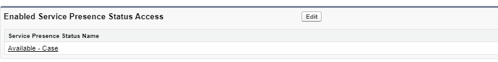
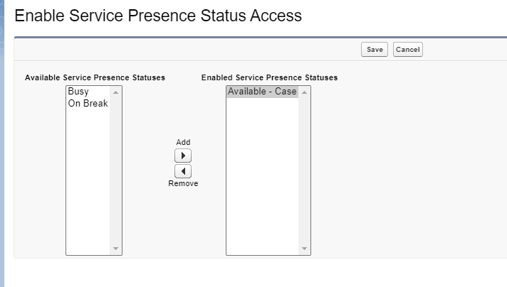

# Omni channel

## Queue Based Routing

1. From `Setup`, go to `Omni-Channel` Settings.
1. Enable `Omni-Channel`.
1. Open `Service Setup`.
1. In Recommended Setup, click View All.
1. Scroll to select `Omni-Channel Setup`, or you can enter Omni-Channel in the Quick Find box.
1. Create a Queue name, enter High-Priority Cases
1. For Name These Agents, enter a name for the permission set. Maria enters Tier1 Agents.
Add agents to the queue. You can click the + sign next to an agent’s name, or search for the agent. Be sure to add your name to the list of agents in the queue.
Click Next.
If you don’t have an existing routing configuration set up, the Prioritize work for your agents screen appears. To create a routing configuration for the queue, set the priority to 1 and click Next.

The priority determines which work records are assigned to agents and in which order. For example, enter 1 for this routing configuration to have the highest priority. When you set up the first queue, Salesforce automatically assigns it a priority of 1 because it’s the only queue. You can change this priority as you add more queues.

Note: If you don’t see this screen, we create a routing configuration for you. You're automatically skipped to the next step.
Adjust your agents’ workload.
In Work Item Size, set the amount of an agent’s capacity that one work item consumes. Maria enters 5.
In Agent Capacity, set the agent’s total capacity. Maria enters 20.
Click Next.
Click Finish

## Skill Based Routing

From Service Setup, enter Omni-Channel in the Quick Find box, then select Omni-Channel Settings.
Select Enable Skills-Based and Direct-to-Agent Routing, then click Save.
To create the Service Resource Layout, enable Field Service.
From Setup, enter Field Service Settings in the Quick Find box, then select Field Service Settings.
Enable Field Service, and click Save.
Enter Omni-Channel in the Quick Find box, then select Skills.
Click New.
Enter a name for the skill.
Maria creates a skill called Spanish.
Optionally, enter a description of the skill.
Skip Skill Type.
Skip the Assign Users and Assign Profiles sections. Instead, you add these skills in Service Resources in a minute.
Click Save.
Maria repeats steps 5–9 to define more skills from her planning list.
She then adds Skills as a related list to the Service Resource object.
From Service Setup, click Object Manager.
Enter Service Resource in the Quick Find box and select Service Resource.
Select Page Layouts then select Service Resource Layout to edit it.
Click Related Lists and drag Service Resource Skills onto the page layout. If it’s already there, you’re good to go!
Click Save.

### Create Service Resources for Agents
From the App Launcher, find and select Service Resources.
Click New.
Enter the following values:
For Name, enter the name of the agent.
Select the Active checkbox. A service resource must be active to receive work items.
For User, use the lookup icon to select the agent.
For Resource Type, select Agent.
Click Save.

### Assign Skills to Agents
From the App Launcher, find and select Service Resources.
Click the service resource that you just created.
Select the Related tab.
Scroll to the Service Resource Skills section and click New.
Select a skill. You can optionally enter a skill level 1 (novice) – 10 (expert).
Enter a start date, and if needed, an end date. For example, if an agent must be recertified in a particular skill every 6 months, enter an end date that’s 6 months later than the start date.
Click Save.

### Define Skills-Based Routing Rules

From Service Setup, enter Skills-Based Routing Rules in the Quick Find box, then select Skills-Based Routing Rules.
Click New Skill Mapping Set.
Provide a name and developer name for the mapping set and select the type of object to be routed. Then click Next.
Select the fields to use for routing your cases. Then click Next.
For each field, select the field value and corresponding skill.

You can also specify a skill level and set skills to additional. For additional skills, you can specify the order in which skills are dropped if after the specified timeout no agent with that skill is available.

When you have mapped field values to skills for each field, click Done.

### Enable Skills-Based Routing Rules from the Routing Configuration
Locate the routing configuration associated with the queue.
 From Setup, enter Queues in the Quick Find box, then select Queues.
 Edit the queue and note the routing configuration name in the Configuration with Omni-Channel Routing section. (You may want to write the name down.)
Click Cancel.
From Setup, enter Routing in the Quick Find box, then select Routing Configurations.
Edit the routing configuration that is used by the queue through which the work item is routed.
Select Use with Skills-Based Routing Rules.
Select Save.

## Link Your Routing Configuration to a Queue

1. Enter *Users* and select `Queue` in Setup.
1. Edit `High-priority-cases`.
1. Under *Supported Objects* select `Case`
1. Under *Queue Members* 
  1. select Public Groups > All Internal Users.
  1. select Users > **Your Name**.

1. Enter *Users* and select `Profiles` in Setup.
1. Go to desired profile to enable, hover to `Enabled Service Presence Status Access` and *Edit*.

1. Select Available-case and Save.
1. Repeat for same procedure for various `Profiles` like Custom: Support Profile.

## Add the Omni-Channel Widget to Service Console

1. From Setup, enter App Manager in the Quick Find box and click App Manager.
1. Click the dropdown to the right of Service Console, and select Edit.
1. Select Utility Items. (You may see Utility Items (Desktop Only)).
1. Click Add Utility Item.
1. Select Omni-Channel and click Save.
1. Click Navigation Items.
1. Add Accounts, App Launcher, Cases, and Contacts as navigation items by selecting them and clicking the right arrow.
1. Click Save.
1. Select Navigation Rules.
1. Click Cases, select Subtabs of and select Account (Account) to make Cases and Contacts open as subtabs of the Account.
1. Click Save.
1. Select User Profiles.
1. Assign this app to profiles by moving Custom: Support Profile, Standard User, and System Administrator to Selected Profiles.
1. Click Save.

## Add Omni-Channel Supervisor to Your Service Console
Here’s how Maria adds Omni-Channel Supervisor to her console.
From Setup, enter App Manager in the Quick Find box, then select App Manager.
Next to Service Console, click the down arrow then click Edit.
Click the Navigation Items vertical tab.
Search the Available Items for Omni Supervisor and add it to Selected Items.
Click Save.
Click Back.

