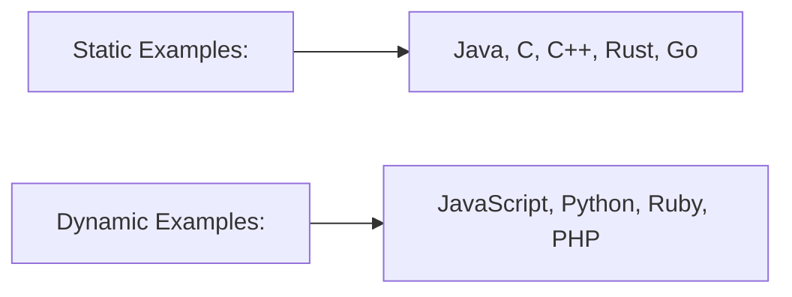

# Typescript

1. TypeScript is an open source language and is a superset of JavaScript
    - Offers additional features to JavaScript including static types
    - Using types is completely optional
    - Compiles down to regular JS
    - Can be used for front-end JS as well as backend with Node.js
    - Includes most features from ES6, ES7 (classes, arrow functions, etc)
    - Types from 3rd party libraries can be added with type definitions

## Dynamic vs Static Typing
In dynamically typed languages, the types are associated with run-time values and not named explicitly in your code
In statically typed languages, you explicitly assign types to variables, function parameters, return values, etc

PROS:
• More Robust
• Easily Spot Bugs
• Predictability
• Readability
• Popular
CONS:
• More Code To Write
• More To Learn
• Required Compilation
• Not True Static Typing