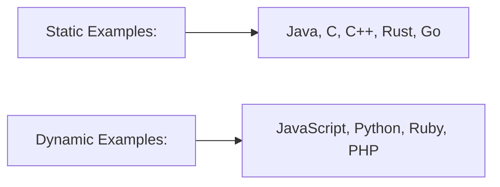

# Typescript

<!-- Brad Traversy media -->
1. TypeScript is an open source language and is a superset of JavaScript
    - Offers additional features to JavaScript including static types
    - Using types is completely optional
    - Compiles down to regular JS
    - Can be used for front-end JS as well as backend with Node.js
    - Includes most features from ES6, ES7 (classes, arrow functions, etc)
    - Types from 3rd party libraries can be added with type definitions


## Dynamic vs Static Typing
In dynamically typed languages, the types are associated with run-time values and not named explicitly in your code
In statically typed languages, you explicitly assign types to variables, function parameters, return values, etc



PROS:  
- More Robust 
- Easily Spot Bugs
- Predictability
- Readability
- Popular

CONS:  
- More Code To Write
- More To Learn
- Required Compilation
- Not True Static Typing

## Compiling Typescript

- TypeScript uses `.ts` and `.tsx` extensions
- **TSC** (TypeScript Compiler) is used to compile `.ts` files down to `JS`
- Can watch files and report errors at compile time
- Many tools include TS compilation by default
- Most IDEs have great support for TS
- The `tsconfig.json` file is used to configure how TypeScript works

## Typescript

1. Define a strict type.
1. Use the same type throughout coding.

type notation  ==>  `: number`

```js
// index.js
let id = 5;
id = 'Salman';  // Salman replaced with 5
```
```ts
// index.ts
let id: number = 5;
id = '5';       // error

let name = 'Salman'; // type inference
name = 25; // error
```

## Watch Typescript

```shell
$ tsc --watch index
```

## Basic Types

```ts
//// TYPESCRIPT AUTOMATICALLY ASSIGNS A TYPE WHEN YOU DEFINE A VARIABLE
let variable = "hello";
variable = "hi";

let age = 18;
// age="eighteen"  // error

//// EXPLICITLY PROVIDING A TYPE
let ageWithType: number = 22;

// ageWithType ="eighteen"
ageWithType = 18;

//// BASIC TYPES
let testString: string;
testString = "hello";

let testBoolean: boolean;
testBoolean = false;
```

## Union 

```tsx
//// MULTIPLE TYPES (UNION TYPES)
let testStringOrNumber: string | number;

testStringOrNumber = 10;
testStringOrNumber = "10";
// testStringOrNumber = []
```

## Arrays

```tsx
//// ARRAYS
let names = ["john", "jane", "tom"];
names.push("mike");
// names.push(3)

let numbers = [11, 22, 35];
numbers.push(92);
// numbers.push(true)

let testStringArray: string[];
testStringArray = ["one", "two", "three"];
// testStringArray = [1,2,3]

let testNumberArray: number[];
testNumberArray = [12, 55, 23];
// testNumberArray = [true, "hi", 23]

let testStringOrNumberArray: (string | number)[];
testStringOrNumberArray = [1, "two", 3];
```

## Objects

1. If you define a type for an object and miss assigning a value to one of its properties, compiler throw an error.
```tsx
//// OBJECTS
let user = {
  username: "john",
  age: 22,
  isAdmin: false,
};

user.username = "jane";

user.age = 29;
// user.age = "eighteen"

user.isAdmin = true;
// user.isAdmin = "no"

// user.phone = "+12345678"   // no property with the name of phone

// OBJECT WITH STRICT TYPE
let userObj: {
  username: string;
  age: number;
  isAdmin: boolean;
};

userObj = {
  username: "john",
  age: 23,
  // isAdmin: true, 
  // isAdmin is missing, and TypeScript will raise an error
};

let userObj2: {
  username: string;
  age: number;
  isAdmin: boolean;
  phone?: string; // '?' indicates,  object property is not required
};

userObj2 = {
  username: "jane",
  age: 43,
  isAdmin: false,
};
```

## Any type

```tsx
//// ANY TYPES ( BE CAREFUL )
let testAny; // let testAny: any;

testAny = 12;
testAny = "Hello";
testAny = true;
testAny = [true];
testAny = {};

let testAnyArray: any[];
testAnyArray = [1, "two", false, []];
```

## Functions

```tsx
//// FUNCTIONS
let sayHi = () => {
  console.log("Hi, welcome");
};

// sayHi = "hi" // once define a function, cannot use any data type

let funcReturnString = (): string => {
  console.log("hi");
  return "lama dev";
};

```
## Function with a Parameter

```tsx
let multiple = (num: number) => { // it convert to any strict type ==> (num: number): any
  return num * 2;
};
multiple(1);

let multiple2 = (num: number): number => {
  return num * 2;
};
multiple2(1);

let multiple3 = (num: number): void => {
  num * 2;
  //Do something, but don't return
};
multiple3(1);

let sum = (num1: number, num2: number, another?: number) => {
  return num1 + num2;
};
sum(2, 3);
```

## Type Aliases

```tsx
//// TYPE ALIASES
/* READABILITY IS HARD
  let func = (user: { username: string; age: number; phone?: string }) => {
    console.log(user.username);
  };
*/

type UserType = {
  username: string;
  age: number;
  phone?: string;
};

let betterFunc = (user: UserType) => {
  console.log(user.username);
};

//FUNCTION SIGNATURES
type myFunc = (a: number, b: string) => void;

let write: myFunc = (num, str) => {
  console.log(num + " times " + str);
};

type UserType2 = {
  username: string;
  age: number;
  phone?: string;
  theme: "dark" | "light";
};

const userWithTheme: UserType2 = {
  username: "john",
  age: 43,
  // theme:"pink"
  theme: "dark",
};

//// INTERFACES
// Be aware no equal sign
interface IUser {
  username: string;
  email: string;
  age: number;
}

interface IEmployee extends IUser {
  employeeId: number;
}

const emp: IEmployee = {
  username: "tom",
  email: "tom@gmail.com",
  age: 43,
  employeeId: 1,
};

const client: IUser = {
  username: "tom",
  email: "tom@gmail.com",
  age: 43,
};

//// GENERICS
interface IAuthor {
  id: number;
  username: string;
}

interface ICategory {
  id: number;
  title: string;
}

interface IPost {
  id: number;
  title: string;
  desc: string;
  extra: IAuthor[] | ICategory[];
}

interface IPostBetter<T> {
  id: number;
  title: string;
  desc: string;
  extra: T[];
}
const testMe: IPostBetter<string> = {
  id: 1,
  title: "post title",
  desc: "post desc",
  extra: ["str", "str2"],
};

interface IPostEvenBetter<T extends object> {
  id: number;
  title: string;
  desc: string;
  extra: T[];
}

const testMe2: IPostEvenBetter<{ id:number }> = {
  id: 1,
  title: "post title",
  desc: "post desc",
  extra: [{ id: 1 }],
};

const testMe3: IPostEvenBetter<IAuthor> = {
  id: 1,
  title: "post title",
  desc: "post desc",
  extra: [{ id: 1, username: "john" }],
};

const testMe4: IPostEvenBetter<ICategory> = {
  id: 1,
  title: "post title",
  desc: "post desc",
  extra: [{ id: 1, title: "cat" }],
};
```